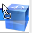

<!--REF #_command_.SET DRAG ICON.Syntax-->**SET DRAG ICON** ( *icon* {; *horOffset* {; *vertOffset*}} )<!-- END REF-->
<!--REF #_command_.SET DRAG ICON.Params-->
| 引数 | 型 |  | 説明 |
| --- | --- | --- | --- |
| icon | Picture | &#8594;  | ドラッグ中に表示するアイコン |
| horOffset | Integer | &#8594;  | カーソルから見てアイコンの左端との水平方向の距離を指定(>0 は左方向に、<0 は右方向に移動) |
| vertOffset | Integer | &#8594;  | カーソルから見てアイコンの上端との垂直方向の距離を指定(>0 は上方向に、<0 は下方向に移動) |

<!-- END REF-->

*このコマンドはスレッドセーフではないため、プリエンプティブなコードには使えません。*


#### 説明 

<!--REF #_command_.SET DRAG ICON.Summary-->**SET DRAG ICON**コマンドは、指定したアイコンを、ドラッグ＆ドロップ中のカーソルと関連付けます。<!-- END REF-->

このコマンドはOn Begin Drag Over のフォームイベント中（ドラッグ中）しか呼び出すことができません([Form event code](form-event-code.md) コマンドを参照のこと)

*icon* 引数にはドラッグ中に表示させたいピクチャを渡します。サイズは最大で 256x256 ピクセルです。 縦か横のどちらかの大きさが256ピクセルを超えていた場合、画像は自動的にリサイズされます。

*horOffset* と *vertOffset* ではオフセットの具合をピクセルで指定できます:

* *horOffset* では、マウスカーソルから見て icon で指定した画像の左端がどれだけ水平方向にオフセットしているかを指定します。正の値を渡すとアイコンが左側に、負の値を渡すとアイコンが右側にずれていきます。
* *vertOffset* では、マウスカーソルから見て icon で指定した画像の上端がどれだけ垂直方向にオフセットしているかを指定します。正の値を渡すとアイコンが上方向に、負の値を渡すとアイコンが下方向にずれていきます。

引数省略時にはカーソルがアイコンの中央に位置するようになります。

#### 例題 

フォーム内で、ユーザーが行をドラッグ＆ドロップするとラベルを生成することができるようにします。この場合リストボックスのオブジェクトメソッドは以下の様になります:

```4d
 If(Form event code=On Begin Drag Over)
    READ PICTURE FILE(Get 4D folder(Current resources folder)+"splash.png";vpict)
    CREATE THUMBNAIL(vpict;vpict;48;48)
    SET DRAG ICON(vpict)
 End if
```

行をドラッグすると、以下のように画像が表示されます:


画像とカーソルの位置関係をずらすこともできます:

```4d
 SET DRAG ICON(vpict;0;0)
```



#### 参照 

[Form event code](form-event-code.md)  