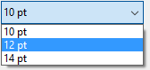

<!--REF #_command_.SET LIST ITEM PARAMETER.Syntax-->**SET LIST ITEM PARAMETER** ( {* ;} *list* ; itemRef | * ; *selector* ; *value* )<!-- END REF-->
<!--REF #_command_.SET LIST ITEM PARAMETER.Params-->
| 引数 | 型 |  | 説明 |
| --- | --- | --- | --- |
| * | 演算子 | &#8594;  | 指定時, listはオブジェクト名 (文字列) 省略時, listはリスト参照番号 |
| list | Integer, Text | &#8594;  | リスト参照番号 (* 省略時), または リストオブジェクト名 (* 指定時) |
| itemRef &#124; * | 演算子, 倍長整数 | &#8594;  | 項目参照番号, または 0: リストに最後に追加された項目, または *: リスト中のカレント項目 |
| selector | Text | &#8594;  | パラメタ定数 |
| value | Text, Boolean, Real | &#8594;  | パラメタ値 |

<!-- END REF-->

#### 説明 

<!--REF #_command_.SET LIST ITEM PARAMETER.Summary-->**SET LIST ITEM PARAMETER**コマンドは、リスト参照またはオブジェクト名を*list*に指定したリスト中、*itemRef*引数で指定した項目の*selector* パラメタを設定するために使用します。<!-- END REF-->

1番目の \* 引数を渡した場合、*list* 引数はフォーム中のリストオブジェクトのオブジェクト名 (文字列) です。この引数を渡さない場合、*list* 引数はリスト参照番号 ([ListRef](# "階層リストへの参照")) です。1つしかフォーム上でリストオブジェクトを使用しない、または2番目の \* を省略してリスト構造を処理対象とする場合、いずれのシンタックスも使用できます。同じリストの複数のリストオブジェクトがフォーム上にあり、2番目の \* を渡してカレントの項目を処理する場合、リストオブジェクトごとにカレント項目が異なるため、オブジェクト名に基づくシンタックスを使用しなければなりません。

*itemRef*には参照番号を渡すことができます。渡した項目参照番号を持つ項目が存在しない場合、コマンドは何も行いません。オプションとして*itemRef*に0を渡し、[APPEND TO LIST](append-to-list.md)コマンドを用いてリストへ最後に追加される項目を指定することができます。  
最後に、*itemRef*には *\** を渡すことができます。この場合、コマンドはリストのカレント項目に対して適用されます。手動で複数のリスト項目が選択されている場合、最後に選択された項目がカレントリスト項目になります。選択された項目が存在しない場合、コマンドは何も行いません。

*selector* には、以下のいづれかを渡すことができます:

* (“*Hierarchical Lists*” テーマ内にある)以下の定数のいづれか一つ:  

| 定数                         | 型   | 値                          | コメント                                                                                                                                            |  
| -------------------------- | --- | -------------------------- | ----------------------------------------------------------------------------------------------------------------------------------------------- |  
| Additional text            | 文字列 | 4D\_additional\_text       | この定数は*itemRef* 参照で参照する項目の右側にテキストを追加するのに使用します。この追加のタイトルは常にリストの右側に表示され、たとえユーザーが水平スクロールカーソルを移動させた場合でも表示されます。この定数を使用する場合、表示されるテキストを*value* 引数に渡します。 |  
| Associated standard action | 文字列 | 4D\_standard\_action\_name | *itemRef* 参照に標準アクションを割り当てます。この場合、*value* 引数に標準アクション名と引数を渡す必要があります。例: "fontSize?value=10pt"。詳細な情報については、*デザインリファレンスマニュアル*の*標準アクション* の章を参照してください。  |
* **カスタムのセレクター**: *selector* 引数にカスタムのテキストを渡し、テキスト、数値、ブール型の値と関連づけることができます。この値はリスト項目に格納され、[GET LIST ITEM PARAMETER](get-list-item-parameter.md) コマンドを使用して取り出すことができます。これにより階層リストに関連づけられたどのようなインタフェースもセットアップできます。例えば顧客名リストにおいて、年齢をリスト項目に関連付け、項目が選択されたときにのみそれを表示させることなどができます。

#### 例題 

階層ポップパップメニューに選択リストを割り当て、標準アクション機能を使用してそのリストでフォントサイズ値の一覧を管理したい場合を考えます:

```4d
 $myList:=New list
 APPEND TO LIST($myList;ak standard action title;1)
 APPEND TO LIST($myList;ak standard action title;2)
 APPEND TO LIST($myList;ak standard action title;3)
 SET LIST ITEM PARAMETER($myList;1;Associated standard action;"fontSize?value=10pt")
 SET LIST ITEM PARAMETER($myList;2;Associated standard action;"fontSize?value=12pt")
 SET LIST ITEM PARAMETER($myList;3;Associated standard action;"fontSize?value=14pt")
 OBJECT SET LIST BY REFERENCE(*;"popup";Choice list;$myList)
```



#### 参照 

[APPEND TO LIST](append-to-list.md)  
[Action info](action-info.md)  
[GET LIST ITEM PARAMETER](get-list-item-parameter.md)  
[GET LIST ITEM PARAMETER ARRAYS](get-list-item-parameter-arrays.md)  
[INSERT IN LIST](insert-in-list.md)  

#### プロパティ

|  |  |
| --- | --- |
| コマンド番号 | 986 |
| スレッドセーフである | &cross; |


