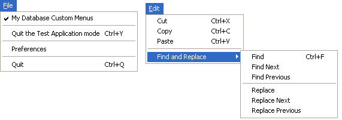

<!--REF #_command_.SET MENU BAR.Syntax-->**SET MENU BAR** ( *menuBar* {; *process*}{; *} )<!-- END REF-->
<!--REF #_command_.SET MENU BAR.Params-->
| 引数 | 型 |  | 説明 |
| --- | --- | --- | --- |
| menuBar | Integer, Text, Text | &#8594;  | メニューバー番号または名前 または メニュー参照 |
| process | Integer | &#8594;  | プロセス参照番号 |
| * | 演算子 | &#8594;  | メニューバーの状態を保存 |

<!-- END REF-->

#### 説明 

<!--REF #_command_.SET MENU BAR.Summary-->SET MENU BAR はカレントプロセスのみのメニューバーを*menuBar*で指定したメニューバーで置き換えます。<!-- END REF-->*menuBar* 引数には、新しいメニューバーの番号または名前を渡します。またメニューID ([MenuRef](# "Unique ID (16-character alphanumeric) of a menu") 型, 16文字の文字列) を渡すこともできます。参照を使用する場合、メニューをメニューバーとして、あるいはその逆として使用できます (の節を参照)。

**Note:** メニューバー名には31文字までを指定でき、ユニークでなければなりません。

オプションの*process* 引数を使用すると、指定したプロセスのメニューバーを*menuBar*に変更します。

**Note:** *menuBar*に[MenuRef](# "Unique ID (16-character alphanumeric) of a menu")を渡した場合、*process* 引数は意味を持たず、無視されます。

オプションの引数 *\** を使用すると、メニューバーの状態を保存できます。この引数が省略された場合、SET MENU BARが実行されたとき、コマンドはメニューバーを再初期化します。

例えばSET MENU BAR(1)を実行したとします。次に[DISABLE MENU ITEM](disable-menu-item.md "DISABLE MENU ITEM")コマンドを使い、いくつかのメニューを使用不可にします。  

SET MENU BAR**(1)**を2度目に実行すると、その実行が同じプロセスからでも別のプロセスからでも、メニューはすべて、元の使用可の状態に戻ります。  

SET MENU BAR**(1;\*)**を実行すると、メニューバーは前と同じ状態を保っており、使用不可にしたメニューは使用不可のままです。

**Note:** *menuBar*に[MenuRef](# "Unique ID (16-character alphanumeric) of a menu")を渡した場合、*\** 引数は意味を持たず、無視されます。

ユーザがアプリケーションモードに移ると、最初のメニューバー（メニューバー#1）が表示されます。データベースを開く際にや個々のユーザ用のStartupメソッドで目的のメニューバーを指定して、メニューバーを変更することができます。

#### 例題 1 

以下の例は、カレントメニューバーをメニューバー#3に変更し、メニューの状態を元に戻します:

```4d
 SET MENU BAR(3)
```

#### 例題 2 

以下の例題は、カレントメニューバーを“FormMenuBar1”という名前のメニューバーに変更し、メニューコマンドの状態を保存します。事前に選択不可に設定されたメニューコマンドは、選択不可のまま表示されます。

```4d
 SET MENU BAR("FormMenuBar1";*)
```

#### 例題 3 

以下の例は、レコードの変更中フォームのメニューバーをメニューバー#3に変更します。レコードの変更が終了すると、メニューの状態を保存してメニューバーをメニューバー#2に戻します:

```4d
 SET MENU BAR(3)
 ALL RECORDS([Customers])
 MODIFY SELECTION([Customers])
 SET MENU BAR(2;*)
```

#### 例題 4 

この包括的な例題では、以下のファイルメニューや編集メニューをプラグラムで作成します: 



```4d
  //File メニューを作成するメソッド
 var FileMenu : Text //FileMenu にはFIleメニュー参照が含まれます
 FileMenu:=Create menu
 INSERT MENU ITEM(FileMenu;-1;"My Database "+Get indexed string(131;29))
 SET MENU ITEM MARK(FileMenu;1;Char(18))
 INSERT MENU ITEM(FileMenu;-1;"(-")
 INSERT MENU ITEM(FileMenu;-1;"Quit the Test Application mode/Y")
 SET MENU ITEM PROPERTY(FileMenu;3;Associated standard action;ak return to design mode)
 INSERT MENU ITEM(FileMenu;-1;"(-")
 INSERT MENU ITEM(FileMenu;-1;"Preferences")
 SET MENU ITEM PROPERTY(FileMenu;5;Associated standard action;ak database settings) //Settings
 INSERT MENU ITEM(FileMenu;-1;"(-")
 INSERT MENU ITEM(FileMenu;-1;Get indexed string(131;30))
 SET MENU ITEM PROPERTY(FileMenu;7;Associated standard action;ak quit) //Quit
 SET MENU ITEM SHORTCUT(FileMenu;7;Character code("Q"))
 
  //Find and Replace メニューを作成するメソッド
 var FindAndReplaceMenu : Text //FindAndReplaceMenu にはFind and Replaceメニュー参照が含まれます
 FindAndReplaceMenu:=Create menu
 APPEND MENU ITEM(FindAndReplaceMenu;"Find;Find Next;Find Previous;(-;Replace;Replace Next;Replace Previous")
 SET MENU ITEM SHORTCUT(FindAndReplaceMenu;1;Character code("F"))
 SET MENU ITEM SHORTCUT(FindAndReplaceMenu;5;Character code("R"))
 SET MENU ITEM METHOD(FindAndReplaceMenu;1;"MyFindMethod")
 
  //Edit メニューを作成するメソッド
 var EditMenu : Text //EditMenu には Edit メニュー参照が含まれます
 EditMenu:=Create menu
 APPEND MENU ITEM(EditMenu;"Cut;Copy;Paste")
 SET MENU ITEM SHORTCUT(EditMenu;1;Character code("X"))
 SET MENU ITEM PROPERTY(EditMenu;1;Associated standard action;ak cut)
 SET MENU ITEM SHORTCUT(EditMenu;2;Character code("C"))
 SET MENU ITEM PROPERTY(EditMenu;2;Associated standard action;ak copy)
 SET MENU ITEM SHORTCUT(EditMenu;3;Character code("V"))
 SET MENU ITEM PROPERTY(EditMenu;3;Associated standard action;ak paste)
 INSERT MENU ITEM(EditMenu;-1;"(-")
 INSERT MENU ITEM(EditMenu;-1;"Find and Replace";FindAndReplaceMenu) //サブメニューを持つアイテム
 
 main_Bar:=Create menu //他のメニューを統合してメニューバーを作成する
 INSERT MENU ITEM(main_Bar;-1;Get indexed string(79;1);FileMenu)
 APPEND MENU ITEM(main_Bar;"Edit";EditMenu)
 
 SET MENU BAR(main_Bar)
```

#### 参照 

*メニューの管理*  

#### プロパティ
|  |  |
| --- | --- |
| コマンド番号 | 67 |
| スレッドセーフである | &check; |
| サーバー上での使用は不可 ||


