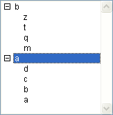

<!--REF #_command_.SORT LIST.Syntax-->**SORT LIST** ( *list* {; > または <} )<!-- END REF-->
<!--REF #_command_.SORT LIST.Params-->
| 引数 | 型 |  | 説明 |
| --- | --- | --- | --- |
| list | Integer | &#8594;  | リスト参照番号 |
| > または < | 演算子 | &#8594;  | 並び順: > 昇順, または < 降順 |

<!-- END REF-->

*このコマンドはスレッドセーフではないため、プリエンプティブなコードには使えません。*


#### 説明 

<!--REF #_command_.SORT LIST.Summary-->SORT LIST コマンドは、*list*引数に渡された参照番号を持つリストをソートします。<!-- END REF-->

昇順にソートするには>を渡し、降順にソートするには<を渡します。ソート順パラメータを省略した場合、SORT LISTコマンドはデフォルトで昇順にソートします。

SORT LISTコマンドは、すべてのレベルのリストをソートします。まずリストの項目をソートし、次にサブリストがあればそれらをソートし、サブリストの中の項目をソートするというようにリストのすべてのレベルに降りていきます。通常、SORT LISTコマンドをフォームに表示されているリストに適用するのはこのためです。サブリストのソートは、上位レベルを呼び出したときに順序が変更されるので、ほとんど意味がありません。

SORT LIST コマンドは、カレントリスト項目またはリストやサブリストの現在の展開または縮小状態を変更しません。ただし、カレント項目が並び替えによって移動されることがあるため、[Selected list items](selected-list-items.md "Selected list items")は並び替えの前と後で異なる位置を返す可能性があります。

#### 例題 

リスト名を*hList*とし、アプリケーションモードで表示します（Windows形式）:


 以下のコードを実行します:

```4d
  // リストを昇順にソート
 SORT LIST(hList;>)
```

リストは以下のようになります:


このコードを実行すると:

```4d
  // リストを降順にソート
 SORT LIST(hList;<)
```

このようになります:



#### 参照 

[Selected list items](selected-list-items.md)  