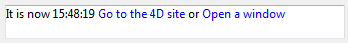

<!--REF #_command_.ST Get plain text.Syntax-->**ST Get plain text** ( {* ;} *object* {; *refMode*} ) : Text<!-- END REF-->
<!--REF #_command_.ST Get plain text.Params-->
| 引数 | 型 |  | 説明 |
| --- | --- | --- | --- |
| * | 演算子 | &#8594;  | 指定時: objectはオブジェクト名 (文字) <br/>省略時: objectは変数またはフィールド |
| object | any | &#8594;  | オブジェクト名 (* 指定時) または <br/>テキストフィールドまたは変数 (* 省略時) |
| refMode | Integer | &#8594;  | Mode for handling references found in the text |
| 戻り値 | Text | &#8592; | タグなしのテキスト |

<!-- END REF-->

#### 説明 

<!--REF #_command_.ST Get plain text.Summary-->**ST Get plain text** コマンドは*\**と*object*引数で指定したテキスト変数やフィールドからスタイルタグを取り除き、プレーンテキストを返します。<!-- END REF-->

##### 

オプションの *\** 引数を渡した場合、*object*引数にはオブジェクト名 (文字列) を渡します。コマンド実行時にオブジェクトにフォーカスがある場合、コマンドは編集中のオブジェクトに関する情報を返します。他方オブジェクトにフォーカスがない場合、コマンドはオブジェクトのデータソース (フィールドや変数) に関する情報を返します。  
*\** 引数を省略した場合、*object* 引数にはフィールドや変数を指定します。この場合文字列ではなくフィールドまたは変数への参照を渡します。コマンドはこのフィールドや変数に関する情報を返します。

##### 

任意の *refMode* 引数は、 *object* 内で見つかった参照の返し方を指定します。*refMode* 引数には、 "*Multistyle Text*" テーマ内にある以下の定数のどれかを渡して下さい(定数は一つ、または複数組み合わせて渡す事ができます):

| 定数                                           | 型    | 値   | コメント                                                                                                                                                     |
| -------------------------------------------- | ---- | --- | -------------------------------------------------------------------------------------------------------------------------------------------------------- |
| ST 4D Expressions as sources                 | 倍長整数 | 2   | 4D式参照のオリジナルの文字列が返されます。                                                                                                                                   |
| ST 4D Expressions as values                  | 倍長整数 | 1   | 4D 式参照は評価された形で返されます(フォーム内のデフォルトの動作)。                                                                                                                     |
| ST References as spaces                      | 倍長整数 | 0   | それぞれの参照は、ノンブレークスペース文字として返されます(他のコマンドで使用されるデフォルトの動作)                                                                                                      |
| ST Tags as plain text                        | 倍長整数 | 64  | タグのラベルは標準テキストとして返されます。例えば、'my picture</img>'というタグの標準テキストは "my picture" となります(フォームでのデフォルトの動作)。                          |
| ST Tags as XML code                          | 倍長整数 | 128 | XMLのコードは標準テキストとして返されます。例えば、'my picture</img>'というタグの標準テキストは 'my picture</img>' となります。 |
| ST Text displayed with 4D Expression sources | 倍長整数 | 86  | テキストは、4D式のオリジナルの文字列とともに、表示されたままの状態が返されます。<br/>既定済みの定数の組み合わせの 2+4+16+64 に対応します。                                                                   |
| ST Text displayed with 4D Expression values  | 倍長整数 | 85  | テキストは、4D式が評価された形で、フォームで表示されたままの形で返されます。<br/>既定済みの定数の組み合わせの 1+4+16+64 に対応します。                                                                     |
| ST URL as labels                             | 倍長整数 | 4   | 「こちらのサイトまでどうぞ」といったようなURLの表示ラベルが返されます(フォームのデフォルトの機能)                                                                                                      |
| ST URL as links                              | 倍長整数 | 8   | "http://www.4d.com" のようにリンクが返されます。                                                                                                                       |
| ST User links as labels                      | 倍長整数 | 16  | ユーザーリンクの表示ラベルが返されます(フォームのデフォルトの機能)                                                                                                                       |
| ST User links as links                       | 倍長整数 | 32  | ユーザーリンクの中身が返されます。                                                                                                                                        |

****Note:** 標準テキストに関しては、 *refMode* 引数にどの値を渡しても(どのモードで扱っても)変化はありません。言い換えると、 *refMode* を使って違いが現れるのはテキストに参照が含まれていた場合のみです。

#### 例題 1 

マルチスタイル付きのテキストフィールドからテキスト"very nice"を探します。値は以下のような形式で保存されています: "The weather is very nice **today**".

```4d
 QUERY BY FORMULA([Comments];ST Get plain text([Comments]Weather)="@very nice@")
```

**Note:** このコンテキストでは、スタイルタグがテキストに含まれるため、以下のコードでは期待通りの結果が得られません:   

```4d
 QUERY([Comments];[Comments]Weather="@very nice@")
```

#### 例題 2 

"MyArea" というマルチスタイルエリア内に以下の様なテキストが入っている場合:

```RAW
It is now   Go to the 4D site or Open a window
```

このテキストは以下の様に表示されます:



以下は、あるコードを実行した場合とそれぞれに対して返ってくる値です:

```4d
 $txt :=ST Get plain text(*;"myArea";ST References as spaces)
  // $txt = "It is now    or " (spaces)
 $txt :=ST Get plain text(*;"myArea";ST 4D Expressions as values)
  // $txt = "It is now 15:48:19  or  "
 $txt :=ST Get plain text(*;"myArea";ST 4D Expressions as sources)
  // $txt = "It is now Current time  or  "
 $txt :=ST Get plain text(*;"myArea";ST URL as links)
  //$txt = "It is now   http://www.4d.com or  "
 $txt :=ST Get plain text(*;"myArea";ST Text displayed with 4D Expression values)
  //$txt = "It is now 15:48:19 Go to the 4D site or Open a window"
 $txt :=ST Get plain text(*;"myArea";ST Text displayed with 4D Expression sources)
  //$txt = "It is now Current time Go to 4D site or Open a window"
 $txt :=ST Get plain text(*;"myArea";ST User links as labels)
  //$txt = "It is now    or Open a window"
 $txt :=ST Get plain text(*;"myArea";ST User links as links)
  //$txt = "It is now    or openW"
```

#### システム変数およびセット 

このコマンド実行後、エラーがなければOKシステム変数に1が設定されます。そうでなければ0が設定されます。これは特にスタイルタグが正しく評価できなかった場合に発生します (正しくない、あるいは失われたタグ)。  

エラーの場合、変数は変更されません。テキストが評価される際に変数にエラーが発生すると、4Dはテキストをプレーンテキストに変換します。結果、"<"、">"、"&"文字はHTML実体参照に変換されます。

#### 参照 

[ST Get text](st-get-text.md)  
[ST SET PLAIN TEXT](st-set-plain-text.md)  
[ST SET TEXT](st-set-text.md)  
[TEXT TO ARRAY](text-to-array.md)  

#### プロパティ
|  |  |
| --- | --- |
| コマンド番号 | 1092 |
| スレッドセーフである | &check; |
| システム変数を更新する | OK |
| サーバー上での使用は不可 ||


