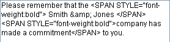

<!--REF #_command_.ST SET PLAIN TEXT.Syntax-->**ST SET PLAIN TEXT** ( {* ;} *object* ; *newText* {; *startSel* {; *endSel*}} )<!-- END REF-->
<!--REF #_command_.ST SET PLAIN TEXT.Params-->
| 引数 | 型 |  | 説明 |
| --- | --- | --- | --- |
| * | 演算子 | &#8594;  | 指定時、objectはオブジェクト名 (文字列)。省略時、オブジェクトは変数またはフィールド |
| object | any | &#8594;  | オブジェクト名 (*指定時)、または変数/フィールド (*省略時) |
| newText | Text | &#8594;  | 挿入するテキスト |
| startSel | Integer | &#8594;  | 選択の開始位置 |
| endSel | Integer | &#8594;  | 選択の終了位置 |

<!-- END REF-->

#### 説明 

<!--REF #_command_.ST SET PLAIN TEXT.Summary-->**ST SET PLAIN TEXT**コマンドは*object*引数で指定されたマルチスタイルテキストや変数に、*newText*引数に渡されたテキストを挿入します。<!-- END REF-->このコマンドは*object*引数のプレーンテキストにのみ適用され、そこに含まれるスタイルタグを変更しません。 

[ST SET TEXT](st-set-text.md)コマンドと異なり、**ST SET PLAIN TEXT**はプレーンテキストのみを挿入します。*newText*にスタイルタグを含めることはできません。もし"<"や">"、"&"文字が含まれる場合、これらは標準の文字として扱われ、HTML実体参照に変換されます:

* '&' -> &amp;
* '<' -> &lt;
* '>' -> &gt;

##### 

オプションの *\** 引数を渡した場合、*object*引数にはオブジェクト名 (文字列) を渡します。コマンド実行時にオブジェクトにフォーカスがある場合、コマンドは編集中のオブジェクトにのみ適用され、(フィールドや変数などの) データソースには適用されません。変更がソース (およびこの同じソースを使用する他のオブジェクト) に転送されるのは、フォーカスが外れるか**Enter**キーが押されて、オブジェクトへの編集が有効化された場合のみです。オブジェクトにフォーカスがない場合、コマンドは直接データソースに適用され、変更は即座に同じソースを使用する他のオブジェクトに転送されます。  
*\** 引数を省略した場合、*object* 引数にはフィールドや変数を指定します。この場合文字列ではなくフィールドまたは変数への参照を渡します。コマンドは直接データソースに適用され、変更は即座に同じソースを使用する他のオブジェクトに転送されます。

##### 

*newText*には挿入するプレーンテキストを渡します。 

オプションの*startSel*と*endSel*引数を使用すると、*object*中で選択するテキストを指定できます。*startSel*と*endSel*の値はプレーンテキストを対象として、スタイルタグは考慮されません。コマンドの動作はオプションの*startSel*と*endSel*引数の値により変化します:

* *startSel*と*endSel*を省略すると、**ST SET PLAIN TEXT**は*object*のすべてのテキストを*newText*で置き換えます。
* *startSel*のみを渡すか、*startSel*と*endSel*の値が同じ場合、**ST SET PLAIN TEXT**は*object*の*startSel*の位置に*newText*を挿入します。
* *startSel*と*endSel*両方を渡すと、**ST SET PLAIN TEXT**はこれらの引数で指定された範囲のプレーンテキストを*newText*で置き換えます。
* *endSel*に0をセットすることで、自動的にテキストの最後を指定(*startSel*に1をセットすることでテキストの最初を指定)できます。

4D では、選択範囲を自動的に指定するために *startSel* 引数と *endSel* 引数に渡す定数を提供しています。これらの定数は "*Multistyle Text*" テーマ内にあります。

| 定数                 | 型    | 値      | コメント                                      |
| ------------------ | ---- | ------ | ----------------------------------------- |
| ST End highlight   | 倍長整数 | \-1001 | オブジェクト内のカレントのテキストセレクションの最後の文字を指定します(\*)   |
| ST End text        | 倍長整数 | 0      | オブジェクトに含まれるテキストの最後の文字を指定します。              |
| ST Start highlight | 倍長整数 | \-1000 | オブジェクト内のテキストのカレントセレクションの最初の文字をを指定します (\*) |
| ST Start text      | 倍長整数 | 1      | オブジェクト内に含まれるテキストの最初の文字を指定します。             |

(\*) この定数を使用する際には、 *object* 引数にオブジェクト名を渡す必要があります。フィールドへの参照または変数を渡した場合、コマンドはオブジェクト内の全てのテキストに適用されます。

置き換えられる最初の文字のスタイルが*newText*のテキスト全体で使用されます。 

*startSel*が*endSel*よりも大きい場合(*endSel*が0の場合を除く・上記参照)、テキストは変更されず、OK変数に0が設定されます。

#### 例題 

リッチテキスト (マルチスタイル) 設定された以下のようなフォーム上の変数があります:


ここに、テキストフィールドに格納されている会社名を挿入したいとします。この名前には例えば"&"のような文字が含まれているかもしれません。この場合**ST SET PLAIN TEXT**コマンドを使用する必要があります:

```4d
 ST SET PLAIN TEXT(myStyledText;[Company]Name;33;34)
```

以下のような結果になります:


変数に格納されているプレーンテキストは以下のようになります:



挿入されたテキストは追加のスタイルタグ中にあることが分かります。このスタイルタグは挿入前の文字に設定されていたスタイルタグに対応します。このメカニズムにより、すべてのケースでリッチテキストエリアが正しく表示されるようになります。

**注:** このケースで [ST SET TEXT](st-set-text.md) コマンドを使用すると、4Dはテキストを挿入できない場合があります。エンコードされていない"&"のような文字が存在す る場合、変数中のスタイルタグの解釈が妨げられるためです。詳細はこのコマンドの説明を参照してください。

#### システム変数およびセット 

このコマンド実行後、エラーが発生しなければOKシステム変数が1に、そうでなければ0に設定されます。エラーは特にスタイルタグが正しく評価できなかった場合に発生します (タグが正しくないあるいはタグが足りない)。   

エラーが発生した場合、変数は変更されません。テキストが評価されるときに変数上でエラーが発生すると、4Dはテキストをプレーンテキストに変換します。結果"<"や">"、"&"文字はHTML実体参照に変換されます。

#### 参照 

[ST Get plain text](st-get-plain-text.md)  
[ST SET TEXT](st-set-text.md)  

#### プロパティ
|  |  |
| --- | --- |
| コマンド番号 | 1136 |
| スレッドセーフである | &check; |
| システム変数を更新する | OK |
| サーバー上での使用は不可 ||


