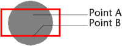

<!--REF #_command_.SVG Find element ID by coordinates.Syntax-->**SVG Find element ID by coordinates** ( {* ;} *pictureObject* ; *x* ; *y* ) : Text<!-- END REF-->
<!--REF #_command_.SVG Find element ID by coordinates.Params-->
| 引数 | 型 |  | 説明 |
| --- | --- | --- | --- |
| * | 演算子 | &#8594;  | 指定時、pictureObjectはオブジェクト名 (文字列) 省略時、pictureObjectはフィールドまたは変数 |
| pictureObject | Picture | &#8594;  | オブジェクト名 (* 指定時) または フィーウドまたは変数 (* 省略時) |
| x | Integer | &#8594;  | X座標 (ピクセル) |
| y | Integer | &#8594;  | Y座標 (ピクセル) |
| 戻り値 | Text | &#8592; | X, Yの位置に見つかった要素のID |

<!-- END REF-->

#### 説明 

<!--REF #_command_.SVG Find element ID by coordinates.Summary-->SVG Find element ID by coordinatesコマンドは、 *pictureObject*引数で指定されたSVGピクチャ内で、*x*, *y*座標により設定された場所で見つかるXML要素のID ("id" または "xml:id" 属性) を返します。<!-- END REF--> このコマンドは特に、SVGオブジェクトを使用してインタラクティブなインタフェースを作成する際に使用します。

**Note:** SVGフォーマットに関する詳細は*XMLユーティリティコマンドの概要*を参照してください。

オプションの *\** 引数を渡すと、*pictureObject* 引数はオブジェクト名 (文字列) であることを示します。この引数を渡さないと、*pictureObject* 引数はフィールドまたは変数であることを示します。この場合文字列ではなくフィールドまたは変数の参照 (フィールドまたは変数のみ) を渡します。

ピクチャがフォームに表示されている必要はないことに留意してください。この場合、"オブジェクト名" を使用するシンタックスは使用できず、フィールドまたは変数を渡さなければなりません。

*x* と *y* 引数に渡す座標は、ピクチャの左上隅(0,0)からの相対位置で示されたピクセル数でなければなりません。フォームに表示されたピクチャのコンテキストでは、 MouseX と MouseY *システム変数*の値を使用できます。これらの変数はフォームイベントのOn Clicked、 On Double Clicked と On Mouse Up および On Mouse Enter と On Mouse Move で更新されます。 

**Note:** ピクチャの座標システムにおいて、ピクチャ表示フォーマットにかかわらず、ピクチャがスクロールやズームされていても、MouseXとMouseYは常にピクチャの同じ場所を指し示します (繰り返しフォーマットを除く) 。

使用されるポイントは最初に見つかったポイントです。例えば以下のケースでは、Point Aが渡されると円のIDが返され、Point Bが渡されると四角のIDが渡されます:

座標が重ね合わせまたは複合オブジェクトに対応する場合、コマンドは必要に応じて親要素の間をさかのぼり、有効なID属性を持つ最初のオブジェクトのIDを返します。

コマンドは以下の場合空の文字列を返します:

* ID属性を見つけられないままrootに達した場合。
* 座標がオブジェクトを指していない場合。
* ID属性値が空の文字列の場合。
**Note:** このコマンドはopacity値 ("fill-opacity" 属性) が0.01より小さいのオブジェクトを検知することはできません。

#### システム変数およびセット 

*pictureObject*が有効なSVGピクチャを含んでいない場合、コマンドは空の文字列を返しOKシステム変数に0が設定されます。コマンドが正しく実行されればOKシステム変数に1が設定されます。 

#### 参照 

[SVG Find element IDs by rect](svg-find-element-ids-by-rect.md)  

#### プロパティ
|  |  |
| --- | --- |
| コマンド番号 | 1054 |
| スレッドセーフである | &check; |
| システム変数を更新する | OK |
| サーバー上での使用は不可 ||

