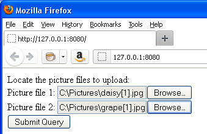

<!--REF #_command_.WEB GET BODY PART.Syntax-->**WEB GET BODY PART** ( *part* ; *contents* ; *name* ; *mimeType* ; *fileName* )<!-- END REF-->
<!--REF #_command_.WEB GET BODY PART.Params-->
| 引数 | 型 |  | 説明 |
| --- | --- | --- | --- |
| part | Integer | &#8594;  | パート番号 |
| contents | Blob, Text | &#8592; | パートを受け取る変数 |
| name | Text | &#8592; | input要素のname属性値 |
| mimeType | Text | &#8592; | ファイルのMIMEタイプ |
| fileName | Text | &#8592; | 送信されたファイルの名前 |

<!-- END REF-->

#### 説明 

<!--REF #_command_.WEB GET BODY PART.Summary-->**WEB GET BODY PART**コマンドはWebプロセスのコンテキストで使用され、マルチパートリクエストのボディ部を解析します。<!-- END REF-->

*part* 引数には解析対象のパート番号を渡します。総パート数は[WEB Get body part count](web-get-body-part-count.md)コマンドで取得できます。

*contents* 引数にはパートのコンテンツが返されます。取得するパートがファイルの場合、BLOB型の引数を渡さなければなりません。Webフォームから送信されるテキストデータの場合、テキスト型の引数を渡すことができます。 

*name* 引数にはフォームのinput 要素のname属性値が返されます。

*mimeType* と *fileName* 引数には、送信されたファイルのMIMEタイプと名前が返されます。*fileName* はフォーム要素 **<input type="file">** を使用してファイルが送信された場合のみ値が返されます。  
*mimeType* と *fileName* はオプションですが、使用する場合はペアで渡さなければなりません。

**注:** マルチパートリクエストのコンテキストでは、[WEB GET VARIABLES](web-get-variables.md)コマンドで取得できる名前配列にはフォームのすべてのパートが含まれます。順番は**WEB GET BODY PART**コマンドと同じです。フォーム中のパートの位置を取得するためにこのコマンドを使用できます。

**警告:** *mimeType* と *fileName* 引数に返される情報は、Webサーバーに送信されたHTTPリクエストに基づくもので、ファイルの内容は検証されません。それらの情報が正当であるかどうかの検証は開発者が行わなければなりません。

#### 例題 

この例題ではWebフォームからHTTPサーバーに画像を何枚かアップロードし、それらを返されたWebページ上に表示します。Webフォームは以下のように表示されます:



HTMLソースは以下の通りです:

```HTML
<body>
        <form enctype="multipart/form-data" action="/4DACTION/GetFile/" method="post">
            アップロードするピクチャーを選択: <br>
            ピクチャーファイル1: <input name="file1" type="file"><br>
            ピクチャーファイル2: <input name="file2" type="file"><br>
            <input type="submit">                    
        </form>     
        <hr/>
    <!--4DSCRIPT/galleryInit-->
    <!--4DLOOP aFileNames-->
        "/>
    <!--4DENDLOOP-->
</body>
```

2つの4Dメソッドがページから呼ばれています:

* ページを送信する際、4DSCRIPタグで呼び出される galleryInit 。このメソッドは指定されたフォルダー内に存在するピクチャー名の配列を作成します。
* ブラウザーからのリクエストを処理する GetFile メソッド。

galleryInitのコードは以下の通りです:

```4d
 var $vDestinationFolder : Text
 ARRAY TEXT(aFileNames;0)
 var $i : Integer
 $vDestinationFolder:=Get 4D folder(HTML Root folder)+"photos"+Folder separator //"WebFolder/photos" フォルダー
 DOCUMENT LIST($vDestinationFolder;aFileNames)
```

GetFileのコードは以下の通りです:

```4d
 var $vPartName;$vPartMimeType;$vPartFileName;$vDestinationFolder : Text
 var $vPartContentBlob : Blob
 var $i : Integer
 $vDestinationFolder:=Get 4D folder(HTML Root folder)+"photos"+Folder separator
 For($i;1;WEB Get body part count) // パートの数だけ繰り返す
    WEB GET BODY PART($i;$vPartContentBlob;$vPartName;$vPartMimeType;$vPartFileName)
    If($vPartFileName#"")
  // ここでファイルの内容を検証すべきです
       BLOB TO DOCUMENT($vDestinationFolder+$vPartFileName;$vPartContentBlob)
    End if
 End for
 WEB SEND HTTP REDIRECT("/")
```

#### 参照 

[WEB Get body part count](web-get-body-part-count.md)  
[WEB GET HTTP BODY](web-get-http-body.md)  
[WEB GET VARIABLES](web-get-variables.md)  