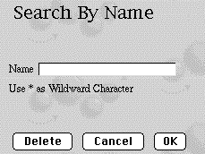

<!--REF #_command_.WEB SEND HTTP REDIRECT.Syntax-->**WEB SEND HTTP REDIRECT** ( *url* {; *} )<!-- END REF-->
<!--REF #_command_.WEB SEND HTTP REDIRECT.Params-->
| 引数 | 型 |  | 説明 |
| --- | --- | --- | --- |
| url | Text | &#8594;  | 新しいURL |
| * | 演算子 | &#8594;  | 指定されている場合 = URLは翻訳されない 省略されている場合 = URLは翻訳される |

<!-- END REF-->

#### 説明 

<!--REF #_command_.WEB SEND HTTP REDIRECT.Summary-->**WEB SEND HTTP REDIRECT**コマンドを使用すると、 URLをほかのURLへ転送することができます。<!-- END REF--> 

引数 *url* は、リクエストをリダイレクトすることができる新しいURLを格納しています。この引数がファイルへのurlである場合、**WEB SEND HTTP REDIRECT** ("/MyPage.HTM") のようにファイルへの参照を保持していなければなりません。

このコマンドは同じメソッド内にあるデータを送るコマンド ([WEB SEND FILE](web-send-file.md)、[WEB SEND BLOB](web-send-blob.md)など) より優先されます。

また、このコマンドを使用すると、リクエストを他のWebサーバーへリダイレクトすることも可能です。

4DはURLの特殊文字を自動的にエンコードします。 *\** を渡すと、4Dはそれらをエンコードしません。

このコマンドが送信するHTTPステータスコードは**302: Moved Temporarily**です。"301 Moved Permanently"ステータスを送信したい場合は、[WEB SET HTTP HEADER](web-set-http-header.md)を使用して、"*X-STATUS"フィールドに”301”*を設定します。 

#### 例題 

このコマンドを使用して、4D上でスタティックページを用いてカスタムリクエストを実行します。以下の要素をスタティックなHTMLページに設定するとします。



**注:** POSTアクション "/4DCGI/rech" は、テキストエリアと**OK**と**Cancel**ボタンに連携されています。

[QR SET DESTINATION](qr-set-destination.md)に以下のコードを挿入します。

```4d
 Case of
    :($1="/4DCGI/rech") // 4DがこのURLを受信したら
  // OKボタンが使用され、 ‘name’ フィールドにValueがある場合
       If((bOK="OK")&(name#""))
  // 同じメソッド内のはるか下に置かれた検索コードを
  // 実行するためにURLを変更する
          WEB SEND HTTP REDIRECT("/4dcgi/rech?"+name)
       Else
  // そうでなければ、始めのページに戻る
          WEB SEND HTTP REDIRECT("/page1.htm")
       End if
       ...
    :($1="/4DCGI/rech?@") // URLがリダイレクトされたら
       ... // 検索コードをここに入れる
 End case
```


#### プロパティ
|  |  |
| --- | --- |
| コマンド番号 | 659 |
| スレッドセーフである | &check; |
| サーバー上での使用は不可 ||


