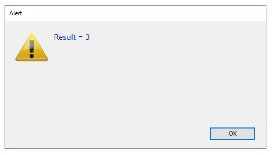

<details><summary>履歴</summary>

| リリース  | 内容                                                                       |
| ----- | ------------------------------------------------------------------------ |
| 20 R3 | *context* パラメーターをサポート                                                    |
| 17 R6 | 名称変更 (New formula from string -> Formula from string) |
| 17 R3 | 追加                                                                       |

</details>

<!-- REF #_command_.Formula from string.Syntax -->**Formula from string**( *formulaString* : Text ) : 4D.Function<br/>**Formula from string**( *formulaString* : Text ; *context* : Longint ) : 4D.Function<!-- END REF -->

<!-- REF #_command_.Formula from string.Params -->

| 引数            | 型                           |     | 説明                                                                                            |
| ------------- | --------------------------- | :-: | --------------------------------------------------------------------------------------------- |
| formulaString | Text                        |  →  | オブジェクトとして返されるフォーミュラ文字列                                                                        |
| context       | Number                      |  →  | `sk execute in current database` (デフォルト) または `sk execute in host database` |
| 戻り値           | 4D.Function |  ←  | フォーミュラを格納しているネイティブなオブジェクト                                                                     |

<!-- END REF -->

#### 説明

`Formula from string` コマンドは、<!-- REF #_command_.Formula from string.Summary -->*formulaString* と任意の *context* 引数に基づいた `4D.Function` オブジェクトを作成します<!-- END REF -->。  *formulaString* には単一の値のようにシンプルなものから、引数を持つプロジェクトメソッドのように複雑なものまで指定することができます。

このコマンドは [`Formula`](formula.md) に似ていますが、テキストに基づいたフォーミュラを扱う点と、実行コンテキストを定義できる点が異なります。 元となるフォーミュラがテキストとして表現されている場合 (例: 外部の JSON ファイルに保存されていた場合など)、または、コンポーネントから `Formula from string` を呼び出してホストデータベースにフォーミュラを作成したい場合を除いて、通常は `Formula` コマンドの使用が推奨されます。 なお、このコマンドでは、トークンを使ったシンタックスの使用が強く推奨されます。

> ローカル変数の中身はコンパイル済みモードでは名前によるアクセスが不可能なため、*formulaString* 引数内で使用することはできません。 `Formula from string` コマンドを使用してローカル変数にアクセスを試みた場合、エラー(-10737) が生成されます。

フォーミュラがコンポーネント内で作成されている場合、 *context* 引数を使うことができます。 デフォルトでは、フォーミュラは作成されたコンテキストにおいて実行されるため、ホストデータベースの変数や関数、共有されていないメソッドを呼び出すことはできません。 この場合、`sk execute in host database` 定数を *context* パラメーターに渡すことで、ホストデータベースのコンテキストで `4D.Function` オブジェクトを実行することができます。 以下の定数を使用することができます:

| 定数                               | 型       | 説明                                                       |
| -------------------------------- | ------- | -------------------------------------------------------- |
| `sk execute in current database` | Integer | (デフォルト) フォーミュラは作成されたコンテキストにおいて実行されます。 |
| `sk execute in host database`    | Integer | フォーミュラは、ホストデータベースのコンテキストで実行されます。                         |

#### 例題

以下のコードは、テキストフォーマットのフォーミュラを受け入れるダイアログを作成し、:

```4d
 var $textFormula : Text
 var $f : 4D.Function
 $textFormula:=Request("Please type a formula")
 If(ok=1)
    $f:=Formula from string($textFormula)
    ALERT("Result = "+String($f.call()))
 End if
```


そのフォーミュラを実行します:



#### 参照

[Formula](formula.md)\
[Parse formula](../commands-legacy/parse-formula.md)
