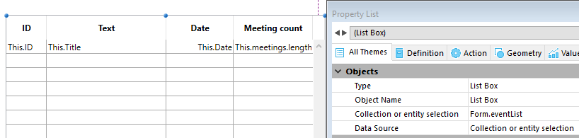

<!--REF #_command_.This.Syntax-->**This** : Object<!-- END REF-->

<!--REF #_command_.This.Params-->

| 引数  | 型      |   | 説明               |
| --- | ------ | - | ---------------- |
| 戻り値 | Object | ← | カレントの要素またはオブジェクト |

<!-- END REF-->

#### 説明

`This` コマンドは<!--REF #_command_.This.Summary-->現在処理中のオブジェクトへの参照を返します<!-- END REF-->。

`This` の値は、呼ばれ方によって決まります。 <code>This</code> の値は実行時に代入により設定することはできません。また、呼び出されるたびに違う値となりえます。

このコマンドは以下で説明するように、異なるコンテキストで使用することができます。 これらのコンテキストの中においては、**This.<*propertyPath*\>** を通してオブジェクト/コレクションの要素プロパティやエンティティの属性にアクセスすることができます。 例えば、*This.name* や*This.employer.lastName* はオブジェクト、要素やエンティティプロパティへの有効なパスとなります。

これら以外のコンテキストにおいては、コマンドは**Null** を返します。

#### クラス関数

[クラスコンストラクター](#class-constructor) 関数が [`new()`](API/ClassClass.md#new) 関数により使用された場合、その内部の `This` はインスタンス化される新規オブジェクトを指します。

```4d
// クラス: ob

Class Constructor  

 // This のプロパティを
 // 代入によって作成します

 This.a:=42
```

```4d
// 4Dメソッドにて 
$o:=cs.ob.new()
$val:=$o.a //42
```

> コンストラクター内で [Super](#super) キーワードを使ってスーパークラスのコンストラクターを呼び出す場合、必ず `This` より先にスーパークラスのコンストラクターを呼ぶ必要があることに留意してください。順番を違えるとエラーが生成されます。 こちらの [例題](#例題-1) を参照ください。 こちらの [例題](super.md#例題-1) を参照ください。

基本的に、`This` はメソッドの呼び出し元のオブジェクトを指します。

```4d
//Class: ob

Function f() : Integer
 return This.a+This.b
```

この場合、プロジェクトメソッド内には次のように書けます:

```4d
$o:=cs.ob.new()
$o.a:=5
$o.b:=3
$val:=$o.f() //8

```

この例では、変数 $o に代入されたオブジェクトは *f* プロパティを持たないため、これをクラスより継承します。 *f* は $o のメソッドとして呼び出されるため、メソッド内の `This` は $o を指します。 *f* は $o のメソッドとして呼び出されるため、メソッド内の `This` は $o を指します。

#### フォーミュラオブジェクト

[Formula](formula.md) あるいは [Formula from string](formula-from-string.md) コマンドで作成されたフォーミュラオブジェクトの実行コンテキストにおいては、`This` はフォーミュラによって現在処理されているオブジェクトへの参照を返します。

例えば、プロジェクトをオブジェクトのカプセル化されたフォーミュラとして使用したい場合を考えます:

```4d
 var $person : Object := New object
 $person.firstName:="John"
 $person.lastName:="Smith"
 $person.greeting:=Formula(Greeting)
 $g:=$person.greeting("hello") // "hello John Smith" を返す
 $g:=$person.greeting("hi") // "hi John Smith" を返す
```

*Greeting* プロジェクトメソッドの中身は以下のようになっています:

```4d
 #DECLARE($greeting : Text) : Text
 return $greeting+" "+This.firstName+" "+This.lastName
```

#### リストボックス

コレクションまたはエンティティセレクションに割り当てられたリストボックスのコンテキストにおいては、[`On Display Detail`](../Events/onDisplayDetail.md) あるいは [`On Data Change`](../Events/onDataChange.md) イベントの最中において、は現在の行を表示するためにリストボックス割り当てられたコレクション要素またはエンティティへの参照を返します。

:::note

スカラー値のコレクションをリストボックスに対して使用した場合、4D はそれぞれの要素に対して、単一のプロパティ**value** を持つオブジェクトを作成します。 Thus, the element value is returned by the **This.value** non-assignable expression.

:::

#### 例題 1

A collection of objects, each with this structure:

```json
{  
"ID": 1234
"name": "Xavier",  
"revenues": 47300,  
"employees": [  
             "Allan",  
             "Bob", 
             "Charlie"  
            ] 
},{  
"ID": 2563
"name": "Carla",  
"revenues": 55000,  
"isFemale": true
"employees": [  
             "Igor",  
             "Jane"  
            ] 
},...
 
```

In the list box, each column refers to one of the properties of the object, either directly (This.name), indirectly (This.employees.length), or through an expression (*getPicture*) in which can be used directly. The list box looks like:


The *GetPicture* project method is automatically executed during the **On display detail** event:

```4d
  //GetPicture Method
 #DECLARE -> $genderPict : Picture
 If(This.isFemale)
    $genderPict:=Form.genericFemaleImage
 Else
    $genderPict:=Form.genericMaleImage
 End if
```

Once the form is executed, you can see the result:


#### 例題 2

You want to display entities from the following structure in a list box:


You build a list box of the "Collection or entity selection" type with the following definition:



注:

- *This.ID*, *This.Title* and *This.Date* directly refers to the corresponding attributes in the ds.Event dataclass.
- *This.meetings* is a related attribute (based upon the One To Many relation name) that returns an entity selection of the ds.Meeting dataclass.
- **Form.eventList** is the entity selection that is attached to the list box. The initialization code can be put in the on load form event:

```4d
 Case of  
    :(Form event code=On Load)  
       Form.eventList:=ds.Event.all() //returns an entity selection with all entities  
 End case  
```

Once the form is executed, the list box is automatically filled with the entity selection:


#### 参照

[Self](../commands-legacy/self.md)\
[Super](super.md)
