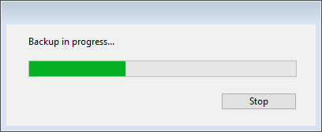

4D では、次の 3つの方法でバックアップを開始することができます:

- 手動による方法: 4D の **ファイル** メニューから **バックアップ...** コマンドを使用します。または、[Maintenance & Security Center (MSC)](MSC/backup.md) の **バックアップ** ボタンをクリックします。
- 自動的に行う方法: ストラクチャー設定からスケジューラーを使用します。
- プログラムによる方法: `BACKUP` コマンドを使用します。

> 4D Server: リモートマシンから `BACKUP` を呼び出すメソッドを使用して、手動でバックアップを開始することができます。 いかなる場合でも、このコマンドはサーバー上で実行されます。

## 手動バックアップ

1. 4D の **ファイル** メニューから **バックアップ...** を選択します。
   バックアップウインドウが表示されます:
   
   "バックアップファイルの保存先" エリアの隣のポップアップメニューを使用して、バックアップファイルの保存場所を確認することができます。 この場所はデータベース設定の **バックアップ/設定** ページにて、設定されています。

- 4D の [Maintenance & Security Center (MSC)](MSC/overview.md) を開いて、[バックアップページ](MSC/backup.md) から操作することもできます。

**データベースプロパティ...** ボタンをクリックすると、ストラクチャー設定のバックアップ/設定ページが表示されます。

2. **バックアップ** をクリックし、現在のパラメーターを用いてバックアップを開始します。

## 定期的な自動バックアップ

自動バックアップは指定されたスケジュールに基づいて自動的に実行されます。 バックアップの周期は、**ストラクチャー設定** の **バックアップ/スケジューラー** ページにて設定します。

ユーザーが一切操作しなくても、このページで指定された時間にバックアップが自動実行されます。 このダイアログボックスに関する詳細は、[バックアップ設定のスケジューラー](settings.md#スケジューラー) の項目を参照してください。

## BACKUP コマンド

任意のメソッドにて `BACKUP` 4Dランゲージコマンドを実行すると、ストラクチャー設定に定義されている現在のパラメーターを用いてバックアップを開始します。 バックアッププロセスを処理するため、`On Backup Startup` および `On Backup Shutdown` データベースメソッド使用することができます (詳細は、*4Dランゲージリファレンス* マニュアルを参照ください)。

## バックアップ処理の管理

バックアップが開始すると 4Dは、バックアップの進捗状況を知らせるサーモメーターのあるダイアログボックスを表示します:



MSC を使用している場合、この進捗インジケーターは [MSC のバックアップページ](MSC/backup.md) に表示されます。

**中止** ボタンをクリックすると、いつでもバックアップを中断することができます ([バックアップ中に問題が発生した場合](backup.md#バックアップ中に問題が発生した場合) 参照)。

前回のバックアップの結果 (成功または不成功) は、[MSC のバックアップページ](MSC/backup.md) の "前回のバックアップの情報" エリア、または 4D Server の **メンテナンスページ** で確認できます。 また、データベースの **バックアップジャーナル** (Backup Journal.txt) にも記録されます。

### バックアップ中のアプリケーションへのアクセス

バックアップ実行中のアプリケーションへのアクセスは、4D によって制限されます。 4D は、バックアップに含まれたファイルタイプに関連するプロセルはすべてロックします: プロジェクトファイルだけがバックアップされている場合、ストラクチャーにはアクセスできませんが、データにはアクセス可能です。

反対に、データだけがバックアップされているのであれば、ストラクチャーへのアクセスは許可されます。 この場合に、アプリケーションへのアクセスが可能かどうかを次に示します:

- シングルユーザー版の 4D の場合、アプリケーションは読み込み、書き込みともにロックされ、すべてのプロセスが停止します。 実行できるアクションはありません。
- 4D Server の場合、アプリケーションへの書き込みだけがロックされ、クライアントマシンはデータを照会することができます。 クライアントマシンからサーバーへ追加・削除・変更のリクエストが送信されると、ウィンドウが表示され、バックアップの終了まで待機するよう要求されます。 アプリケーションが保存されるとウィンドウが閉じられ、要求したアクションが実行されます。 バックアップの終了まで待機せずに、処理中のリクエストをキャンセルするには、**処理をキャンセル** ボタンをクリックします。 ただし、バックアップ前に開始したメソッドから要求されたアクションが実行待機中である場合、このアクションをキャンセルすべきではありません。この場合、実行すべき残りの処理だけがキャンセルされてしまうためです。 しかも、メソッドの一部は実行済みなので、データにおいて論理上の不整合が生じる可能性があります。

> 実行待機中のアクションが、メソッドから要求されたものである場合に、ユーザーが **処理をキャンセル** ボタンをクリックすると、4D Server はエラー -9976 (データベースのバックアップが進行中なので、このコマンドは実行されません) を返します。

### バックアップ中に問題が発生した場合

バックアップが正常に実行されない場合もあります。 バックアップが不成功に終わる原因としては、ユーザーによる中断、添付ファイルが見つからない場合、保存先ディスクのトラブル、不完全なトランザクションなど、いくつか考えられます。4D は原因に応じて問題に対処します。

すべての場合において、前回のバックアップのステータス (成功または不成功) は、[MSC のバックアップページ](MSC/backup.md)の "前回のバックアップの情報" エリア、4D Server の **メンテナンスページ**、および **バックアップジャーナル** (Backup Journal.txt) に表示されます。

- **ユーザーによる中断**: 進捗ダイアログボックスの **中止** ボタンをクリックすると、いつでもバックアップを中断することができます。 この場合、各項目のコピーが中止されてエラー 1406 が生成されます。 このエラーは `On Backup Shutdown` データベースメソッドで遮ることができます。
- **添付ファイルが見つからない**: 添付ファイルが見つからない場合、4D はバックアップを部分的に実行し (アプリケーションファイルおよびアクセス可能な添付ファイルのバックアップ)、エラーを返します。
- **バックアップ不可能** (ディスクフル、ディスクの書き込み保護、ディスクが見つからない、ディスク障害、不完全なトランザクション、定期的な自動バックアップ時にアプリケーションが起動されていない、など): 初回のエラーの場合には、4D はもう一度バックアップの実行を試みます。 この 2回のバックアップ間の待機時間は、ストラクチャー設定の **バックアップ/バックアップ＆復旧** ページで指定します。
  再試行にも失敗した場合、システムの警告ダイアログボックスが表示されてエラーが生成されます。 このエラーは `On Backup Shutdown` データベースメソッドで遮ることができます。

## バックアップジャーナル

バックアップの追跡や検証を容易にするため、バックアップモジュールは実行された各処理の概要を特別なファイルに書き込みます。このファイルは、いわゆる活動記録のようなものです。 処理が定期的または手動のいずれでおこなわれていても、すべてのデータベース操作 (バックアップ、復元、ログファイルの統合) がこのファイルに、日誌のごとく記録されます。 これらの処理が実行された日付と時刻もこのジャーナルに記述されます。

バックアップジャーナルには "Backup Journal[001].txt"という名前が付けられ、プロジェクトの "Logs" フォルダーに配置されます。 バックアップジャーナルは、任意のテキストエディターで開くことができます。

#### バックアップジャーナルのサイズ管理

バックアップ方法によっては、バックアップジャーナルのサイズがすぐに大きくなってしまうことがあります (たとえば、添付ファイルが一緒にバックアップされる場合)。 このサイズを管理するには、2つの方法があります:

- **自動バックアップ**: 4D はバックアップを実行する前にカレントバックアップジャーナルファイルのサイズを確認します。 10MB よりも大きい場合、カレントファイルはアーカイブされ、[xxx] の番号がインクリメントされた新しいファイルを作成します (例: "Backup Journal[002].txt”)。 ファイル番号が 999 を超えると、ナンバリングは 1 に戻り、既存ファイルが置換されます。
- **記録する情報量を削減する**: このためには、プロジェクトの *backup.4DSettings* ファイルの `VerboseMode` キーの値を変更します。 デフォルトでは、true の値が設定されています。 この値を false に変更すると、バックアップジャーナルには主要な情報のみが記録されます (スタート時の日付と時刻、そしてエラーの有無)。 バックアップ設定に使われる XMLキーについての説明は [バックアップ設定ファイル](https://doc.4d.com/4Dv18/4D/18/4D-XML-Keys-Backup.100-4673706.ja.html) マニュアルを参照ください。

## backupHistory.json

最新のバックアップと復元処理についての情報はすべて、アプリケーションの **backupHistory.json** ファイルに記録されます。 記録されるのは、保存されたファイル (添付含む) のパスのほか、回数、日付、時刻、所要時間、各処理のステータスです。 ファイルサイズを制限するため、バックアップ＆復旧ページの一般設定にある "最新のバックアップのみ保存 X バックアップファイル" に指定した数と同じ分だけ、処理のログを保持します。

**backupHistory.json** ファイルはカレントのバックアップ保存先フォルダーに作成されます。 以下のコードを実行することで、このファイルの実際のパスを取得することができます:

```4d
$backupHistory:=Get 4D file(Backup history file)
```

> **警告**:
> **backupHistory.json** ファイルを削除または移動した場合、次のバックアップ番号はリセットされるという点に注意してください。

> **backupHistory.json** ファイルは 4D用にフォーマットされています。 バックアップ処理のレポートを直接読んで確認するには、バックアップジャーナルの方が適切です。
