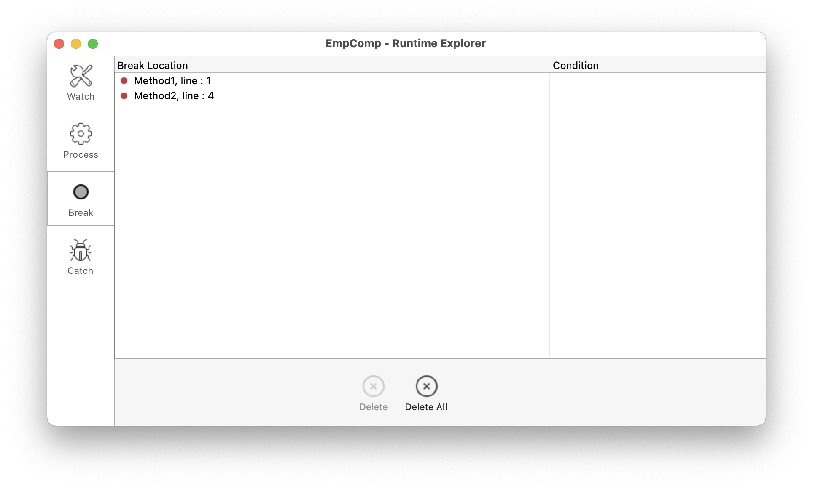

## 概要

ブレークポイントとキャッチコマンドは、非常に効率的なデバッグ手法です。 どちらも、コードの実行を任意のステップで一時停止させる (まだ表示されていない場合はデバッガーウィンドウを表示させる) という同じ効果があります。

ブレークポイントは、実行を一時停止させたいコードの任意の行に設定します。 ブレークポイントには条件を関連付けることができます。

キャッチコマンドは、特定のコマンドが呼び出された時点で、呼び出し元プロセスの実行をトレース開始することができます。

## ブレークポイント

ブレークポイントを設定するには、デバッガーまたはコードエディターのソースコードエリアの左マージン内をクリックします。

In the following example, a break point (the red bullet) has been set, in the debugger, on the line `If (Value type(request.reponse.headers...`:

上の状態で [**トレース終了**](./debugger.md/#トレース終了) ボタンをクリックすると、ブレークポイントが設定された行まで実行が再開されます。 その後、ブレークポイントで示された行は実行されずに、トレースモードへ 戻ります。 プログラムカウンターより下方の (後に実行される) 行にブレークポイントを設定し、**トレース終了** ボタンをクリックすると、ブレークポイントまでのメソッドをスキップすることができます。

赤色の点をクリックすると、ブレークポイントは削除されます。

### ブレークポイントプロパティ

ブレークポイントプロパティウィンドウを使って、ブレークポイントのふるまいを変更することができます:

このウィンドウはコードエディターおよびデバッガーの [ソースコードエリア](debugger.md#ソースコードエリア) からアクセスします。 次のことが可能です:

- 任意の行を右クリックして、コンテキストメニューから **ブレークポイントを編集...** を選択する。
- 左マージン内で `Alt+クリック` (Windows) または `Option+クリック` (macOS) を実行する。

ブレークポイントが既に存在する場合、そのブレークポイントについてのウィンドウが表示されます。 それ以外の場合は、ブレークポイントが新規作成され、そのブレークポイントに関するウィンドウを表示します。

プロパティは、次の通りです:

- **場所**: メソッド名とブレークポイントが設定されている行番号を示します。
- **次の式が真のときブレーク**: `True` または `False` を返す 4Dフォーミュラを入力することによって、**条件付きブレークポイント** を作成することができます。 たとえば、`Records in selection(\[aTable])=0` と入力すると、テーブル \[aTable] のレコードが選択されていない場合に限ってブレークが発生します。 ブレークポイントの条件は、[ブレークリスト](#ブレークリスト)の **条件** カラムでも確認できます。
- **ブレークの前にスキップする回数**: ループ構造 (While、Repeat、For) 内、またはループから呼び出されているサブルーチンや関数内のコード行にブレークポイントを設定することができます。
- **ブレークポイントが無効です**: ブレークポイントが現在は必要でないものの、後で必要になるかもしれない場合には、一時的に無効にしておくことができます。 無効なブレークポイントは、点 (･) ではなくダッシュ記号 (-) で表示されます。

### リモートデバッグでのブレークポイント

ブレークポイントの一覧はローカルに保存されています。 リモートデバッグモードでは、起動したデバッガーがリモート4D だった場合、デバッグセッションの間はリモートのブレークポイント一覧がサーバーのブレークポイント一覧を一時的に置き換えます。

サーバーのブレークポイント一覧は、サーバー上でデバッガーが起動した場合には自動的に復元され使用されます。

### ブレークリスト

ブレークリストは、デバッガーウィンドウ又はコードエディターで作成したブレークポイントを管理することが出来るランタイムエクスプローラのページです。 ランタイムエクスプローラーの詳細については、[デザインリファレンスマニュアル](https://doc.4d.com/4Dv19/4D/19/Runtime-Explorer.200-5416614.ja.html) を参照ください。

ブレークリストのページを開くには:

1. **実行** メニューから **ランタイムエクスプローラー...** を選択します。

2. **ブレーク** タブをクリックして、ブレークリストを表示させます:

このウィンドウを使用して、以下のことが可能です:

- ブレークポイントの **条件** を設定する。
- マージンの赤い点をクリックして、ブレークポイントをそれぞれ有効・無効化する。 無効化されたブレークポイントは透明な (薄い赤の) 点で表されます。
- `Delete` または `Backspace` キーを押すか、リスト下の**削除** ボタンをクリックして、ブレークポイントを削除する。
- ブレークポイントをダブルクリックして、対象メソッドをエディターで開く。

このウィンドウから新しいブレークポイントを追加することはできません。 ブレークポイントは、デバッガーウィンドウかコードエディターでのみ設定できます。

## コマンドのキャッチ

**キャッチ** コマンドリストは、4Dコマンドの呼び出しを捕捉し、デバッガーウィンドウを表示するよう指示することができるランタイムエクスプローラのページです。 特定メソッドの特定行に効果が限定されるブレークポイントとは異なり、キャッチコマンドは、すべてのプロセスおよびメソッドが対象となります。

キャッチコマンド (コマンド捕捉) は、各所にブレークポイントを設定することなく、大きな範囲でトレースをおこなえる便利な方法です。 たとえば、いくつかのプロセスを実行した後に、削除すべきでないレコードが削除されてしまう場合には、`DELETE RECORD` や `DELETE SELECTION` といったコマンドの処理をキャッチすることにより、調査の範囲を狭めることができます。 キャッチ対象のコマンドが呼び出されるたびにデバッガーが起動されるので、問題のレコードが削除されてしまう経緯を調べ、コードの誤った箇所を突き止めることができます。

ブレークポイントとキャッチコマンドは組み合わせて使うことができます。

キャッチコマンドページを開くには:

1. **実行** メニューから **ランタイムエクスプローラ...** を選択します。

2. **キャッチ** タブをクリックすると、キャッチコマンドリストが表示されます:

このページは、実行中にキャッチされるコマンドをリスト表示します。 リストは 2つの列で構成されています:

- 左の列には、キャッチするコマンドの有効/無効状況と、コマンド名が表示されます。
- 右の列には、コマンドに関連する条件 (あれば) が表示されます。

キャッチするコマンドを新しく追加するには:

1. リスト下部にある **新規キャッチを追加** ボタン (＋) をクリックします。 `ALERT` コマンドをデフォルトとして新しいエントリーが追加されます。
2. 次に **ALERT** ラベルをクリックし、キャッチしたいコマンドの名前を入力します。入力したら、**Enter**キーを押して選択を確定させます。

キャッチコマンドを無効、あるいは有効にするには、コマンドラベルの前にある点 (•) をクリックします。
透明な (薄い赤の) 点は、キャッチが無効化されていることを表します。

> コマンドキャッチの無効化は、削除するのとほぼ同等の効果があります。 実行中、デバッガーはほぼ全くと言っていいほどエントリーに時間を使いません。 エントリーを無効化することの利点は、それが再び必要になったとき一から作り直さなくて良いという点です。

キャッチコマンドを削除するには:

1. リスト中のコマンド選択します。
2. **Backspace** または **Delete** キーを押すか、リスト下部にある **削除** ボタンをクリックします。キャッチコマンドをすべて削除するには、**すべてを削除** ボタンをクリックします。

### キャッチコマンドに条件を設定する

1. エントリーの右の列をクリックします。
2. ブール値を返す 4Dフォーミュラ (式、コマンドやプロジェクトメソッド) を入力する。

> 条件を削除するにはフォーミュラを削除します。

条件の設定により、コマンド呼び出し時に特定の条件が満たされている場合にのみ、実行を中止する事ができます。 たとえば、`DELETE SELECTION` コマンドのキャッチに `Records in selection(\[Emp]>10)` という条件を設定した場合、\[Emp]テーブルのカレントセレクションが 9レコード以下の場合には `DELETE SELECTION` コマンドの呼び出しで実行が中断されません。

例外のたびに条件を評価することになるため、キャッチコマンドに条件を追加すると実行速度は遅くなります。 その一方で、条件を追加するとデバッグプロセスは早くなります。条件に合致しないオカレンスを、4D が自動的にスキップしていくからです。
