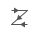
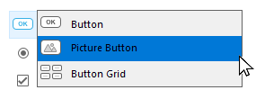
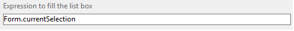
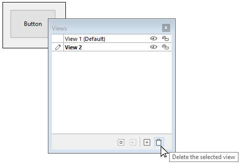
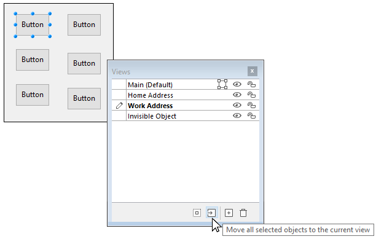
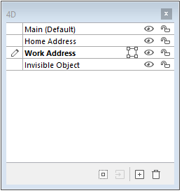

4D が提供するフォームエディターを使用して、必要とされる機能に達するまでフォームを完全にカスタマイズできます。 フォームエディターでは、オブジェクトの作成や削除、操作、フォームやオブジェクトのプロパティの設定がおこなえます。

## インターフェース

フォームエディターは各JSONフォームを個別のウィンドウに表示し、ウィンドウごとにオブジェクトバーとツールバーがあります。 複数のフォームを同時に開くことができます。

### 表示オプション

フォームのカレントページの大部分のインタフェース要素は、表示したり非表示にしたりすることができます。

- **継承されたフォーム**: 継承されたフォームオブジェクト ([継承されたフォーム](forms.md#継承フォーム) が存在する場合)
- **ページ0**: [ページ0](forms.md#フォームのページ) のオブジェクト。 このオプションで、フォームのカレントページのオブジェクトとページ0 のオブジェクトを区別することができます。
- **用紙**: 印刷ページの用紙境界を示す灰色の線。 この要素は、[印刷用](properties_FormProperties.md#フォームタイプ) タイプのフォームでのみデフォルトで表示できます。
- **ルーラー**: フォームエディターウィンドウのルーラー。
- **マーカー**: フォームのエリアを識別する出力コントロールラインとマーカー。 この要素は、[リストフォーム](properties_FormProperties.md#フォームタイプ) タイプのフォームでのみデフォルトで表示できます。
- **マーカーラベル**: マーカーラベル。 これは出力コントロールラインが表示されている場合のみ有効です。 この要素は、[リストフォーム](properties_FormProperties.md#フォームタイプ) タイプのフォームでのみデフォルトで表示できます。
- **境界**: フォームの境界。 このオプションが選択されていると、アプリケーションモードで表示されるとおりに、フォームがフォームエディターに表示されます。 これによりアプリケーションモードに移動しなくてもフォームを調整しやすくなります。

> [**サイズを決めるもの**](properties_FormSize.md#サイズを決めるもの)、[**水平マージン**](properties_FormSize.md#水平マージン) そして [**垂直マージン**](properties_FormSize.md#垂直マージン) フォームプロパティ設定はフォーム境界に影響します。 これらの設定を使用すると、フォーム上のオブジェクトに基づいて境界を設定できます。 フォームの境界を決定する位置にオブジェクトを配置したり、サイズを変更したりすると、境界も変更されます。

#### デフォルト表示

エディターでフォームを開いたとき、インターフェース要素は、以下に応じてデフォルトで表示または非表示になります:

- 環境設定で設定された **新フォームにデフォルトで表示** オプション - チェックされていないオプションはデフォルトでは表示されません。
- カレントの [フォームタイプ](properties_FormProperties.md#フォームタイプ):
  - リストフォームでは、マーカーとマーカーラベルはデフォルトで常に表示されます。
  - 用紙は "印刷用" のフォームの場合、デフォルトで表示されます。

#### 要素の表示/非表示

**フォーム** メニューまたはフォームエディターのコンテキストメニューから **表示** を選択すると、フォームエディターのカレントウィンドウ内でいつでも要素の表示/非表示を切り替えることができます。


### ルーラー

右と下にあるルーラーが、オブジェクトの配置を手助けします。 これらは、[表示または非表示](#表示オプション) にすることができます。

**フォーム** メニューの **ルーラー定義...** を選択すると、単位を変更して、インチ、センチ、ピクセルのいずれかで表示させることができます。

### ツールバー

フォームエディターのツールバーはフォームを操作・更新するための一連のツールを提供します。 ウィンドウごとに固有のツールバーを持ちます。


ツールバーには以下の要素があります:

| アイコン                                             | 名称                                    | 説明                                                                                                                                                        |
| ------------------------------------------------ | ------------------------------------- | --------------------------------------------------------------------------------------------------------------------------------------------------------- |
|          | フォーム実行                                | フォームの実行をテストするために使用します。 このボタンをクリックすると、4D は新しいウィンドウを開き、そのコンテキストでフォームを表示します (リストフォームの場合レコードリスト、詳細フォームの場合カレントレコード)。 フォームはメインプロセスで実行されます。   |
|        | [選択ツール](#オブジェクトの選択)                   | フォームオブジェクトの選択・移動・リサイズをおこないます。<p>**注**: テキストやグループボックスタイプのオブジェクトが選択されている場合、**Enter**キーで編集モードになります。</p>                                      |
|           | [入力順](#データの入力順)                       | "入力順" モードに切り替わり、フォームの現在の入力順を表示・変更できます。 入力順は、バッジを使用して確認することもできます。                                                                                          |
|           | [移動](#オブジェクトの移動)                      | "移動" モードに移行し、ウィンドウ中をドラッグ＆ドロップすることで素早くフォームの表示部分を移動することができます。 このモードでカーソルは手の形になります。 このモードは、フォームを拡大表示している時に特に便利です。                                            |
|             | [拡大](#拡大)                             | フォーム表示の拡大/縮小率を変更できます (デフォルトで100%)。 "拡大/縮小" モードにするには虫眼鏡をクリックするか、拡大/縮小率バーをクリックします。 この機能は前節で説明しています。                                      |
|        | [整列](#オブジェクトの整列)                      | このボタンには、フォーム中でオブジェクトを均等に配置するためのメニューがリンクされています。 このボタンは選択されているオブジェクトに応じて有効/無効になります。<br/>選択オブジェクトの位置が CSSプロパティによりロックされている場合は無効です。                            |
|     | [均等配置](#オブジェクトの均等配置)                  | このボタンには、フォーム中でオブジェクトの並びを揃えるためのメニューがリンクされています。 このボタンは選択されているオブジェクトに応じて有効/無効になります。<br/>選択オブジェクトの位置が CSSプロパティによりロックされている場合は無効です。                             |
|            | [レベル](#オブジェクトを重ねる)                    | このボタンには、フォーム上のオブジェクトの階層を変更するためのメニューが関連付けられています。 このボタンは選択されているオブジェクトに応じて有効/無効になります。                                                                        |
|            | [グループ化/グループ解除](#オブジェクトのグループ化)         | このボタンには、フォーム上の選択オブジェクトのグループ化やグループ解除をおこなうためのメニューが関連付けられています。 このボタンは選択されているオブジェクトに応じて有効/無効になります。                                                            |
|    | [表示とページ管理](forms.html#フォームのページ)       | このエリアを使用して、フォームページ間の移動やページの追加ができます。 フォームページを移動するには矢印ボタンをクリックするか、または中央のエリアをクリックすると現われるメニューから表示したいページを選択します。 最終ページが表示されている状態で、右矢印ボタンをクリックすると、4D はページを追加します。 |
|   | [CSSプレビュー](#cssプレビュー)                 | このボタンで、使用する CSSモードを選択します。                                                                                                                                 |
|            | [ビュー管理](#オブジェクトビュー)                   | このボタンは、ビューパレットの表示や非表示をおこないます。 この機能については "オブジェクトビューを使用する" で説明しています。                                                                                        |
|         | [バッジ表示](#バッジ)                         | このボタンをクリックするたびに、すべてのタイプのフォームバッジが順に表示されます。 また、このボタンには、表示するバッジタイプを直接選択できるメニューが関連付けられています。                                                                   |
|          | [定義済みオブジェクトライブラリ](objectLibrary.html) | このボタンは定義済みオブジェクトライブラリを表示します。 このライブラリは定義済みのプロパティを持つオブジェクトを多数提供します。                                                                                         |
|  | [リストボックスビルダー](#リストボックスビルダー)           | このボタンは、新しいエンティティセレクション型リストボックスを作成します。                                                                                                                     |
|     | [フィールドを挿入](#フィールドを挿入)                 | このボタンは、テーブルフォームにおいて、親テーブルの全フィールド (オブジェクト型と BLOB型を除く) をインターフェース標準に従ってラベル付きで挿入します。                                                       |

### オブジェクトバーを使用する

オブジェクトバーには、4Dフォーム上で使用できるアクティブオブジェクトや非アクティブオブジェクトがすべて含まれています。 一部のオブジェクトは、テーマ別にまとめられています。 各テーマでは、複数の項目のなかから選択することができます。 オブジェクトバーにフォーカスがある場合、キーボードのキーを使用してボタンを選択できます。 以下の表で利用可能なオブジェクトグループとショートカットを示します。

| ボタン                                        | グループ                                                                                                                                                                                                                                               |  キー |
| ------------------------------------------ | -------------------------------------------------------------------------------------------------------------------------------------------------------------------------------------------------------------------------------------------------- | :-: |
|       | [テキスト](FormObjects/text.md) / [グループボックス](FormObjects/groupBox.md)                                                                                                                                                                                  |  T  |
|      | [入力](FormObjects/input_overview.md)                                                                                                                                                                                                                |  F  |
|    | [階層リスト](FormObjects/list_overview.md) / [リストボックス](FormObjects/listbox_overview.md)                                                                                                                                                                 |  L  |
|      | [コンボボックス](FormObjects/comboBox_overview.md) / [ドロップダウンリスト](FormObjects/dropdownList_Overview.md) / [ピクチャーポップアップメニュー](FormObjects/picturePopupMenu_overview.md)                                                                                     |  P  |
|     | [ボタン](FormObjects/button_overview.md) / [ピクチャーボタン](FormObjects/pictureButton_overview.md) / [ボタングリッド](FormObjects/buttonGrid_overview.md)                                                                                                          |  B  |
|      | [ラジオボタン](FormObjects/radio_overview.md)                                                                                                                                                                                                            |  R  |
|   | [チェックボックス](FormObjects/checkbox_overview.md)                                                                                                                                                                                                       |  C  |
|  | [進捗インジケーター](FormObjects/progressIndicator.md) / [ルーラー](FormObjects/ruler.md) / [ステッパー](FormObjects/stepper.md) / [スピナー](FormObjects/spinner.md)                                                                                                    |  I  |
|  | [四角](FormObjects/shapesOverview.html#四角) / [線](FormObjects/shapesOverview.html#線) / [楕円](FormObjects/shapesOverview.html#楕円)                                                                                                                       |  S  |
|   | [スプリッター](FormObjects/splitters.md) / [タブコントロール](FormObjects/tabControl.md)                                                                                                                                                                         |  D  |
|     | [プラグインエリア](FormObjects/pluginArea_overview.md) / [サブフォーム](FormObjects/subform_overview.md) / [Webエリア](FormObjects/webArea_overview.md) / [4D Write Pro](FormObjects/writeProArea_overview.md) / [4D View Pro](FormObjects/viewProArea_overview.md) |  X  |

任意のオブジェクトタイプを描画するには、該当するボタンを選択してから、フォーム上でそのオブジェクトを描きます。 オブジェクトを作成した後でも、プロパティリストを用いてオブジェクトのタイプを変更することができます。 強制的にオブジェクトを規則正しい形で描画するには、**Shift**キーを押しながらオブジェクトを作成します。 この場合、線は水平方向、45度、または垂直方向に引かれます。また、四角は正方形に、楕円は正円に固定されます。

そのテーマで現在選択されているオブジェクトがフォームに挿入されます。 ボタンの右側をクリックすると、バリエーションメニューが表示されます:



ボタンを 2回クリックすると、フォーム上にオブジェクトを描画した後も、そのボタンが選択されたままになります (連続選択)。 この機能により、同じタイプのオブジェクトを複数連続して作成しやすくなります。 連続選択を解除したい場合は、別のオブジェクトやツールをクリックします。

### プロパティリスト


フォームおよびフォームオブジェクトはプロパティを持ち、フォームへのアクセスやフォームの外観、およびフォーム使用時の動作が制御されます。 フォームプロパティには、たとえばフォーム名、メニューバー、フォームサイズなどがあります。 またオブジェクトプロパティには、たとえばオブジェクト名、オブジェクトサイズ、背景色、フォントなどがあります。

プロパティリストを使用して、フォームおよびオブジェクトプロパティを表示・変更できます。 エディター上でオブジェクト選択していればそのプロパティが、オブジェクトを選択していない場合はフォームのプロパティがプロパティリストに表示されます。

プロパティリストを表示/非表示にするには、**フォーム** メニュー、またはフォームエディターのコンテキストメニューから **プロパティリスト** を選択します。 さらに、フォームの空のエリアをダブルクリックすることでも表示させることができます。

#### ショートカット

プロパティリストでは、以下のショートカットを使用できます:

- **矢印キー** ↑ ↓: あるセルから別のセルへ移動します。
- **矢印キー** ← →: テーマを展開/縮小するか、入力モードに入ります。
- **PgUp** と **PgDn**: プロパティリスト内をスクロールします。
- **Home** と **End**: プロパティリストの最初または最後のセルを表示するようスクロールします。
- イベント上で **Ctrl+クリック** (Windows) または **Command+クリック** (macOS) : クリックしたイベントの最初の状態に応じて、リストの各イベントを選択/選択解除します。
- テーマレベル上で **Ctrl+クリック** (Windows) または **Command+クリック** (macOS) : リストのすべてのテーマを展開/縮小します。
- **太字** で表示されているプロパティ値を **Ctrl+click** (Windows) または **Command+click** (macOS): プロパティをデフォルト値にリセットします。

## フォームオブジェクトの操作

### オブジェクトの追加

フォームにオブジェクトを追加する方法は複数あります:

- オブジェクトバーでオブジェクトタイプを選択し、フォームエディター上で直接それを描画する ([オブジェクトバーを使用する](#オブジェクトバーを使用する) 参照)。
- オブジェクトバーからオブジェクトをドラッグ＆ドロップする。
- 定義済み [オブジェクトライブラリ](objectLibrary.md) から選択したオブジェクトをドラッグ＆ドロップあるいはコピー/ペーストする。
- 他のフォームからオブジェクトをドラッグ＆ドロップする。
- エクスプローラー (フィールド) やデザインモードの他のエディター (リストやピクチャー等) からオブジェクトをドラッグ＆ドロップする。

オブジェクトをフォームに配置したら、フォームエディターを使用してそのオブジェクトのプロパティを編集できます。

フォームでは 2つのタイプのオブジェクトを扱います:

- **スタティックオブジェクト** (線、枠、背景ピクチャー等): これらは一般的に、フォームのアピアランスやラベル、グラフィックインターフェースを設定するために使用されます。 これらはフォームエディターのオブジェクトバーから利用できます。 プロパティリストを使用して、これらのグラフィック属性 (サイズ、カラー、フォント等)  やリサイズオプションも指定できます。 アクティブオブジェクトと異なり、スタティックオブジェクトには変数や式が割り当てられません。 しかし、スタティックオブジェクトにダイナミックオブジェクトを挿入することは可能です。

- アクティブオブジェクト: この種のオブジェクトはインターフェース中でタスクや機能を実行します。 フィールド、ボタン、リストボックスなど様々な種類があります。 各アクティブオブジェクトにはフィールドまたは変数が割り当てられます。

### オブジェクトの選択

オブジェクトの操作 (線幅やフォントの変更など) をおこなう前に、対象のオブジェクトを選択する必要があります。

ツールバーを使用してオブジェクトを選択するには:

1. ツールバーの矢印ツールをクリックします。<p></p>

<p>マウスカーソルをフォームエリアに移動すると、カーソルは標準の矢印の形をしたポインターに変わります</p>。

2. 選択したいオブジェクトをクリックします。 サイズ変更ハンドルが表示され、オブジェクトが選択されたことを表わします。<p></p>

プロパティリストを使用してオブジェクトを選択するには:

1. プロパティリストの一番上にあるオブジェクトリストドロップダウンリストからオブジェクト名を選択します。 この方法では、他のオブジェクトの下に隠れているオブジェクトや、カレントウィンドウの表示領域外に置かれているオブジェクトを選択することができます。
   オブジェクトの選択を解除するには、オブジェクト境界の外側をクリックするか、またはオブジェクト上で **Shift+クリック** します。
   \> "デザインモードを検索" の結果ウィンドウでオブジェクトをダブルクリックして選択することもできます。

> "デザインモードを検索" の結果ウィンドウでオブジェクトをダブルクリックして選択することもできます。

### 複数オブジェクトの選択

複数のフォームオブジェクトに関して同じ操作を適用したい場合があります。 たとえば、オブジェクトの移動や整列、外観の変更をおこなう場合などです。 4D では一度に複数のオブジェクトを選択することができます。 複数のオブジェクトを選択する方法はいくつかあります:

- 編集メニュ－から **すべてを選択** を選択して、すべてのオブジェクトを選択する。
- オブジェクト上で右クリックし、コンテキストメニューから **同じ種類のオブジェクトを選択** コマンドを選択する。
- **Shift**キーを押しながら、選択したいオブジェクトをクリックする。
- 選択したいオブジェクトグループの外側から各オブジェクトを囲むようにマーキー (選択矩形とも呼ばれます) を描画する。 マウスボタンを離すと、マーキー内及びマーキーに重なるオブジェクトが選択されます。
- **Alt**キー (Windows) または、**Option**キー (macOS) を押しながら、マーキーを描画します。 マーキーに完全に囲まれたオブジェクトが選択されます。

次の図はマーキーが描画され、2つのオブジェクトが選択されている様子を示しています:


一連の選択オブジェクトから任意のオブジェクトを除外するには、**Shift**キーを押しながらそのオブジェクトをクリックします。 この場合、他のオブジェクトは選択されたままになります。 選択されているオブジェクトをすべて選択解除するには、いずれのオブジェクトの境界にもかからない場所をクリックします。

### オブジェクトの複製

アクティブオブジェクトを含む任意のオブジェクトをフォーム上で複製できます。 アクティブオブジェクトのコピーはオブジェクト名を除き、変数名、型、標準アクション、表示フォーマット、オブジェクトメソッドなどすべてのプロパティが保持されます。

ツールパレットの複製ツールを使用してオブジェクトを直接複製するか、"行列を指定して複製" ダイアログボックスでオブジェクトを複数一気に作成できます。 このダイアログでは、2つのコピー間の間隔も指定できます。

オブジェクトを複製するには:

1. 複製したいオブジェクトを選択します。
2. **編集** メニューから **複製** を選択します。 4D は選択されたオブジェクトのコピーを作成し、オリジナルオブジェクトの基点から右下に配置します。複製されたコピーはオリジナルの前面におかれます。　
3. コピーを適切な場所に配置します。
   ここで複製メニュー項目を再び選択すると、4D はもう一つコピーを作成し、最初のコピーと元のオブジェクトの間との同じ距離同じ方向に配置します。 これを活かし、オブジェクトのコピーをあるライン上に配置する必要がある場合は、以下の手順でおこないます。 元のオブジェクトを複製し、そのコピーをフォーム内の別の場所に移動させてから、コピーを複製します。 1つ目のコピーと元のオブジェクトの位置関係を再現する形で、2つ目のコピーも 1つ目のコピーに対して、自動的に配置されます。 後続のコピーも、それぞれのコピー元オブジェクトと同じ位置関係に配置されます。 以下の図は、この相対的なコピーの配置が動作する様子を示しています:


#### 行列を指定して複製

"行列を指定して複製" ダイアログボックスは、**オブジェクト** メニューから **行列を指定して複製...** コマンドを選択すると表示されます。


- 上のエリアには、作成したいオブジェクトの列数と行数を入力します。 たとえば、3列 2行のオブジェクトを作成したい場合、列に 3 を、行に 2 を入力します。 横に 3つの新しいコピーを作成したい場合は、列欄に 4 を入力し、行はデフォルトの 1 のままにします。

- 列と行それぞれに、コピー間のオフセットを指定できます。 値はポイント単位で指定します。 オフセットは、元のオブジェクトに対して相対的に、コピー毎に適用されます。たとえば、元のオブジェクトの高さが 50ポイントである場合、オブジェクトごとに 20ポイント縦オフセットするには、列の "オフセット" エリアに 70 を入力します。

- 格子状に変数を作成したい場合、**変数に番号設定** オプションを選択し、番号を振る方向を行または列から選択します。
  選択したオブジェクトが変数の場合にのみ、このオプションは有効になります。 詳細は _デザインリファレンス_ で [**グリッド上にオブジェクト作成**](https://doc.4d.com/4Dv19/4D/19/Duplicating-on-a-matrix.300-5416673.ja.html) を参照ください。

### オブジェクトの移動

テンプレートで作成されたフィールドやオブジェクトを含め、フォーム上のグラフィックやアクティブオブジェクトはすべて移動可能です。 オブジェクトを移動するには、次のような方法があります:

- オブジェクトをドラッグして移動する。
- 矢印キーを使用して、オブジェクトを 1ピクセルずつ移動する。
- Shiftキーと矢印キーを使用して、オブジェクトを 1ステップずつ移動する (デフォルトで 1ステップ=20ピクセル)。

選択したオブジェクトのドラッグを開始すると、ハンドルが消えます。 4D はルーラーにオブジェクトの座標を示すマーカーを表示するので、適切な位置にオブジェクトを配置することができます。 このとき、ハンドルをドラッグしないようにしてください。 ハンドルをドラッグすると、オブジェクトのサイズが変更されます。 **Shift**キーを押しながらドラッグすると、制約付きの移動になります。

[マグネティックグリッド](#マグネティックグリッドを使用する) が有効な場合、グリッドに吸着するようにオブジェクトが移動されます。

オブジェクトを 1ピクセルずつ移動するには:

- 移動したいオブジェクトを選択し、キーボード上の矢印キーを使用してオブジェクトを移動します。 矢印キーを押すたびに、矢印の方向へオブジェクトが 1ピクセルずつ移動します。

オブジェクトを 1ステップずつ移動するには:

- 移動したいオブジェクトを選択し、**Shift**キーを押しながらキーボード上の矢印キーを使用して、オブジェクトを移動します。 デフォルトで 1ステップにつき 20ピクセル移動します。 このピクセル数は、環境設定のフォームページで変更できます。

### オブジェクトのグループ化

4D ではオブジェクトをグループ化して、そのグループを一つのオブジェクトとして選択・移動・変更することができます。 グループ化されたオブジェクト同士の相対位置は保持されます。 一般的には、フィールドとそのラベル、透明ボタンとそのアイコン等をグループ化するでしょう。

グループの大きさを変更すると、そのグループ内の全オブジェクトのサイズが同じ比率で変更されます (テキストエリアは除きます。 テキストエリアのサイズは、そのフォントサイズに合わせて変更されます)。

グループ化を解除すると、再び個々にオブジェクトを扱えるようになります。

グループ化されたアクティブオブジェクトのプロパティやメソッドにアクセスするには、グループ化を解除しなければなりません。 しかし、グループに属するオブジェクトを、グループ化を解除せずに選択することは可能です。 これには、オブジェクトを **Ctrl+クリック** (Windows) または **Command+クリック** (macOS) します (グループはあらかじめ選択されている必要があります)。

グループ化はフォームエディター上でのみ意味を持ちます。 フォームの実行中は、グループ化されたすべてのオブジェクトが、グループ化されていないのと同じに動作します。

> 手動でオブジェクトサイズを変更する場合も、このマグネティックグリッドの影響を受けます。

オブジェクトをグループ化するには:

1. グループ化したいオブジェクトを選択します。
2. オブジェクトメニューから **グループ化** を選択します。 <br/>または<br/>フォームエディターのツールバーでグループ化ボタンをクリックします。<p></p>
   4D は、新たにグループ化されたオブジェクトの境界をハンドルで表わします。 グループ内の各オブジェクトの境界にはハンドルが表示されません。 これ以降、グループ化されたオブジェクトを編集すると、グループを構成する全オブジェクトが変更されます。

オブジェクトのグループ化を解除するには:

1. グループ化を解除したいグループオブジェクトを選択します。
2. **オブジェクト** メニューから **グループ化解除** を選択します。<br/>または<br/>フォームエディターのツールバーで **グループ化解除** ボタン (**グループ化** ボタンのサブ項目) をクリックします。<p>**グループ化解除** が選択不可の場合、選択したオブジェクトはグループに属していないことを意味します。</p>4D は個々のオブジェクトの境界をハンドルで表わします。

### オブジェクトの整列

フォーム上のオブジェクトを互いに整列させたり、または透明グリッドを用いて揃えることができます。

- オブジェクト同士を整列させる場合、オブジェクトの上端、下端、側面で揃えたり、または別のオブジェクトの縦や横の中心線に沿って揃えることができます。 整列ツールを使用して選択オブジェクトを直接揃えたり、または整列アシスタントを用いてさらに詳細な整列を適用することも可能です。 整列アシスタントを使用した場合、たとえば、整列の基準となるオブジェクトを選択したり、整列を適用する前にフォーム上の整列状態をプレビューできるようになります。
- その際、移動中のオブジェクトが別のオブジェクトに接近すると、"目に見える" 位置ガイドとして点線が表示され、これに基づいて各オブジェクトの整列を実行することができます。

#### 即時整列ツールを使用する

ツールバーの整列ツール、またはオブジェクトメニューの整列サブメニューを使用して、選択したオブジェクトを瞬時に揃えることができます。


4D がオブジェクトを揃える場合、選択オブジェクトのうち 1つを定位置に置いたまま、そのオブジェクトを基準に残りのオブジェクトを整列させます。 この基準オブジェクトが "アンカー" となります。 整列をおこなう方向で最も離れた位置にあるオブジェクトがアンカーとして使用され、他のオブジェクトはこのオブジェクトに合わせられます。 たとえば、一連のオブジェクトに対して右揃えを実行したい場合、一番右側に位置するオブジェクトがアンカーとして使用されます。
次の図は整列なし、左揃え、縦中央揃え、右揃えの状態を示しています:


#### 整列アシスタントを使用する

整列アシスタントを使用すると、オブジェクトに関するあらゆるタイプの整列や均等配置を実行することができます。


このダイアログボックスを表示するには、揃えたいオブジェクトを選択し、**オブジェクト** メニュー、またはエディターのコンテキストメニューの **整列** サブメニューから **整列...** コマンドを選択します。

- "左/右整列" や "上/下整列" エリアで、実行しようとする整列に対応する整列アイコンをクリックします。<p>見本エリアには、選択結果が表示されます。</p>

- 標準のアンカー方式による整列を実行するには、**プレビュー** または **適用** をクリックします。 この場合、整列をおこなう方向で最も離れた位置にあるオブジェクトがアンカーとして使用され、他のオブジェクトはこのオブジェクトに合わせられます。 たとえば、一連のオブジェクトに対して右揃えを実行したい場合、一番右側に位置するオブジェクトがアンカーとして使用されます。 または:<p>特定のオブジェクトを基準にオブジェクトを揃えるには、**整列** オプションを選択し、整列基準としたいオブジェクトを一覧から選択します。 この場合、基準オブジェクトの位置は変わりません。</p>

**プレビュー** ボタンをクリックすると、整列の結果をプレビューすることができます。 するとフォームエディター上のオブジェクトは見かけ上整列しますが、ダイアログボックスが表示されたままなので、この整列のキャンセルや適用をおこなうことができます。

> このダイアログボックスでは、整列と均等配置を合わせて実行することができます。 整列に関する詳細は [オブジェクトの整列](#オブジェクトの整列) を参照ください。

#### マグネティックグリッドを使用する

フォームエディターには仮想的なマグネティックグリッド機能があります。 オブジェクトのマグネティック整列は、オブジェクト同士の相対位置に基づいておこなわれます。 マグネティックグリッドは、2つ以上のオブジェクトがフォーム上に存在する場合のみ使用可能です。

フォーム上のあるオブジェクトを移動する際、4D は他のフォームオブジェクトとの相対的な位置関係に基づき、このオブジェクトの位置候補を示します。 次のような場合に候補が示されます: 次のような場合に候補が示されます:

- 水平方向に 2つのオブジェクトの端または中央が同じ位置になる場合。
- 垂直方向に 2つのオブジェクトの端が同じ位置になる場合。

この状況になると、4D はその位置にオブジェクトを配置し、そこが候補位置であることを示す赤いラインを表示します:


オブジェクトを均等配置する場合、4D はインターフェース標準に基づいてオブジェクト間の距離を提示します。 マグネティック整列と同様に、配置が決定した時点で、その間隔が赤いラインで表わされます。


この処理は、あらゆるタイプのフォームオブジェクトに対して適用されます。 **フォーム** メニューまたはエディターのコンテキストメニューの **マグネティックグリッド** コマンドを使用して、マグネティック機能をいつでも有効または無効に設定できます。 また、**環境設定** の **フォーム** ページにおいて、この機能をデフォルトで有効に設定しておくことも可能です (**デフォルトで自動揃えを有効にする** オプション)。 **Ctrl**キー (Windows) または **Control**キー (macOS) を押してオブジェクトを選択すると、手動でマグネティックグリッドが有効/無効に設定されます。

> 複数のオブジェクトが重なっている場合、<strong x-id="1">Ctrl+Shift+クリック</strong> / <strong x-id="1">Command+Shift+クリック</strong> ショートカットを使用して、クリックするたびに下のレイヤーにあるオブジェクトを選択できます。

### オブジェクトの均等配置

各オブジェクトが同じ間隔で配置されるように、オブジェクトを均等配置することができます。 これには、ツールパレットまたは整列アシスタントの均等配置ツールを用います。 整列アシスタントを使用すると、1回の操作でオブジェクトの整列や均等配置をおこなえます。

> 入力順は、`FORM SET ENTRY ORDER` および `FORM GET ENTRY ORDER` コマンドを使用することでランタイムで変更することができます。

同じ間隔を空けてオブジェクトを配置するには:

1. 3つ以上のオブジェクトを選択し、希望する均等配置ツールをクリックします。

2. 適用したい均等配置に対応する整列ツールをツールバー上で選択します。<p></p>または<p>**オブジェクト** メニュー、またはエディターのコンテキストメニューの **整列** サブメニューから均等揃えメニューコマンドを選択します。</p>4D は各オブジェクトを均等に配置します。 各オブジェクトの中心までの間隔、および隣接する 2つのオブジェクトの間隔のうち最も広い間隔が基準として用いられます。

"整列と均等配置" ダイアログボックスを用いてオブジェクトを均等に配置するには:

1. 均等配置したいオブジェクトを選択します。

2. **オブジェクト** メニュー、またはエディターのコンテキストメニューの **整列** サブメニューから **整列...** コマンドを選択します。 次のダイアログボックスが表示されます: 

3. "左/右整列" や "上/下整列" エリアで、標準の均等配置アイコンをクリックします: <p>(標準の横均等揃えアイコン)</p>見本エリアには、選択結果が表示されます。

4. 標準の均等配置を実行するには、**プレビュー** または _適用_ をクリックします。<p>この場合、4D は標準の均等配置を実行し、オブジェクトは等間隔で配置されます。</p>または:<p>特定の均等配置を実行するには、**均等配置** オプションを選択します (たとえば各オブジェクトの右辺までの距離をもとにしてオブジェクトを均等に配置したい場合)。 このオプションはスイッチのように機能します。 均等配置チェックボックスが選択されていると、このオプションの下にあるアイコンは異なる動作をおこないます:</p>

- 左/右整列の場合、各アイコンは次の均等配置に対応します: 選択オブジェクトの左辺、中央 (横)、 右辺で均等に揃えます。
- 上/下整列の場合、各アイコンは次の均等配置に対応します: 選択オブジェクトの上辺、中央 (縦)、 下辺で均等に揃えます。

**プレビュー** ボタンをクリックすると、この設定による結果をプレビューすることができます。 この表示はフォームエディター上で実行されますが、ダイアログボックスは前面に表示されたままです。 この後、変更の **キャンセル** または **適用** をおこなうことができます。

> 整列アシスタントを使用すると、1回の操作でオブジェクトの整列や均等配置をおこなえます。 オブジェクトを均等配置する方法についての詳細は、[オブジェクトの均等配置](#オブジェクトの均等配置) を参照ください。

### オブジェクトを重ねる

フォーム上で他のオブジェクトを隠しているオブジェクトの配置を調整する必要が生じることもあります。 たとえば、フォーム上のフィールドの背景にグラフィックを配置したい場合です。 4D には **前面へ**、**背面へ**、**一つ上のレベルへ**、**一つ下のレベルへ** という 4つのメニュー項目があり、これらのコマンドを使用してフォーム上のオブジェクトを "重ねる (レイヤー)" ことができます。 この重なりは、デフォルトの入力順も規定します (下の データの入力順 参照)。 次の図は、他のオブジェクトの前面/背面に置かれたオブジェクトを示しています:


選択したオブジェクトのレベルを変更するには、以下のいずれかの作業をおこないます:

- オブジェクトメニューから **前面へ**、**背面へ**、**レベルを上げる**、**レベルを下げる** のいずれかを選択します。
- エディターのコンテキストメニューの **レベルに移動** サブメニュー内のコマンドのいずれかを選択します。
- ツールバーのレベル管理ボタンに割り当てられたコマンドのいずれかを選択します。


> オブジェクトに対して大きすぎるフォントサイズがスタイルシートまたは JSON で定義されている場合、オブジェクトは自動的にフォントに合わせてレンダリングされますが、オブジェクトのサイズは変更されません。

レベルの順序を考えるにあたって、4D は常に背面から全面へと進みます。 したがって、前・次で表現した場合、"前レベル" は 1つ背面のレベルのことになります。 "次レベルは" 1つ前面のレベルのことです。

### データの入力順

データ入力順とは、入力フォームで **Tab**キーや **改行**キーを押したときに、フィールドやサブフォーム、その他のアクティブオブジェクトが選択される順番のことです。 **Shift+Tab** や **Shift+改行**キーを押すことで、フォーム内を逆方向 (逆の入力順) に移動することもできます。

> オブジェクトをコピーまたは複製すると、CSS参照 (あれば) と JSON値のみがコピーされます。

フォーカス可プロパティをサポートするすべてのオブジェクトが、デフォルトでデータ入力順序に含まれます。

JSONフォームの入力順序の設定は、[`entryOrder`](properties_JSONref.md) プロパティで行います。

独自の入力順を指定しない場合、4D はオブジェクトの階層に従い、"背面から前面" へ向けてデフォルトの入力順を決定します。 したがって、標準の入力順はフォーム上でのオブジェクトの作成順になります。

フォームでは度々、独自の入力順が必要になります。 たとえば、次の図ではフォームの作成後に、住所に関連するフィールドが追加されています。 この結果、標準の入力順が意味をなさなくなり、扱いづらい順番でデータを入力しなければなりません:


このようなケースでは、独自のデータ入力順を指定すると、より理にかなった順序でデータを入力できるようになります:


#### データ入力順の表示と変更

"入力順" バッジまたは "入力順" モードを使用して、現在の入力順を表示することができます。 しかし、入力順を変更するには、"入力順" モードを使用しなければなりません。

この節では "入力順" モードを用いて、入力順の表示と変更をおこなう方法について説明します。 バッジを用いた入力順の表示についての詳細は、[バッジを使用する](#バッジを使用する) を参照ください。

入力順モードに切り替え、入力順を変更するには:

1. **フォーム** メニューから **入力順** を選択するか、ツールバーの入力順ボタンをクリックします:<p></p>

   ポインターが入力順ポインターに変わり、4D はフォーム上に線を引いて、データ入力時にオブジェクトが選択される順序を示します。 ツールパレット上の他のツールをクリックするまでは、入力順序の表示と変更操作しかおこなえません。

2. データ入力順を変更するには、フォームオブジェクト上にポインターを置き、マウスボタンを押したまま、次の入力順に設定したいオブジェクトまでポインターをドラッグします。<p></p>これに応じて、4D はデータ入力順を調整します。

3. 入力順を設定したいだけ、ステップ2 を繰り返します。

4. 入力順の設定が終了したら、ツールバーの他のツールをクリックするか、**フォーム** メニューから **入力順** を選択します。 4Dは、フォームエディターの通常操作に戻ります。

> フォームのカレントページの入力順だけが表示されます。 フォームのページ0 や継承フォームに入力可オブジェクトが含まれている場合、デフォルトの入力順は次のようになります: 継承フォームのページ0 のオブジェクト→ 継承フォームのページ1 のオブジェクト→ 開かれているフォームのページ0 のオブジェクト→ 開かれているフォームのカレントページのオブジェクト。

#### データ入力グループを使用する

入力順序を変更する際に、フォーム上のオブジェクトグループを選択し、そのグループ内のオブジェクトに対して標準の入力順序を適用することも可能です。 これにより、フィールドがグループや列に分かれているフォーム上で、データ入力順序を簡単に設定することができます。

データ入力グループを作成するには:

1. **フォーム** メニューから _入力順_ を選択するか、ツールバーの入力順ボタンをクリックします。
2. データ入力用のグループに指定したいオブジェクトの周囲をマーキーで囲みます。

マウスボタンを放すと、マーキーに囲まれているオブジェクトや、その矩形に接しているオブジェクトが標準入力順に設定されます。 それ以外のオブジェクトのデータ入力順は、必要に応じて調整されます。

#### フィールドを入力順から除外する

デフォルトでは、すべてのフォーカス可オブジェクトが入力順に組み込まれています。 任意のオブジェクトを入力順から除外するには:

1. 入力順モードに切り替えます。

2. オブジェクト上で **Shift+クリック** します。<br />
   または

3. オブジェクト上で右クリックし、コンテキストメニューから **入力順から削除する** を選択します。

## CSSプレビュー

フォームエディターでは、CSSの値を適用した状態、または適用しない状態でフォームを表示することができます。

[スタイルシート](createStylesheet.md) が定義されている場合、フォーム (継承フォームとサブフォームを含む) はデフォルトで、現在の OS の CSSプレビューモードで開かれます。

### CSSプレビューモードの選択

フォームエディターのツールバーには、スタイル付きオブジェクトを表示するための CSSボタンがあります:


メニューから、以下のプレビューモードのいずれかを選択します:

| ツールバーアイコン                               | CSSプレビューモード | 説明                                                               |
| --------------------------------------- | ----------- | ---------------------------------------------------------------- |
|   | なし          | CSS の値はフォームに適用されず、CSS の値やアイコンはプロパティリストに表示されません。                  |
|  | Windows     | Windowsプラットフォーム用の CSS値がフォームに適用されます。 プロパティリストに CSSの値とアイコンが表示されます。 |
|  | macOS       | macOSプラットフォーム用の CSS値がフォームに適用されます。 プロパティリストに CSSの値とアイコンが表示されます。   |

> アプリケーション環境設定のフォームページで、デフォルトで表示するバッジを設定できます。

CSSプレビューモードは、[JSON vs スタイルシート](stylesheets.html#json-vs-スタイルシート) の項で定義した、スタイルシートと JSON属性に適用される優先順位を反映します。

CSSプレビューモードを選択すると、オブジェクトは自動的にスタイルシートで定義されたスタイル (あれば) で表示されます。

> 選択したオブジェクトは異なるビューに属していることがあります。

### プロパティリストの CSSサポート

CSSプレビューモードでは、スタイルシートで属性値が定義されている場合、その属性名が表示され、その横に CSSアイコンが表示されます。 たとえば、このスタイルシートで定義されている属性値は:

```4d
.myButton {
font-family: comic sans;
font-size: 14;
stroke: #800080;
}
```

プロパティリストに CSSアイコンとともに表示されます:


スタイルシートで定義された属性値は、JSONフォームの記述でオーバーライドすることができます (ただし、CSS に `!important` 宣言が含まれている場合は除きます。 後述参照)。 この場合、プロパティリストでは、JSONフォームの値が **太字** で表示されます。 **Ctrl+クリック** (Windows) または **Command+クリック** (macOs) のショートカットで、値をスタイルシートの定義に戻すことができます。

> [カレントビュー](#ビューを使い始める前に) は太字で表示されます。

#### プロパティリスト CSSアイコン

| アイコン                                          | 説明                                                                                   |
| --------------------------------------------- | ------------------------------------------------------------------------------------ |
|       | 属性値がスタイルシートで定義されていることを示します                                                           |
|  | 属性値がスタイルシートで `!important` 宣言とともに定義されていることを示します                                       |
|  | グループまたは複数のオブジェクトの選択項目のうち、少なくとも 1つのオブジェクトについて、スタイルシートで定義された属性値が他のオブジェクトと異なる場合に表示されます。 |

## リストボックスビルダー

**リストボックスビルダー** を使用して、エンティティセレクション型リストボックスを素早く作成することができます。 作成したリストボックスは、すぐに使用することも、フォームエディターで編集することもできます。

リストボックスビルダーでは、いくつかの簡単な操作で、エンティティセレクション型リストボックスの作成と入力ができます。

### リストボックスビルダーを使用する

1. フォームエディターツールバーのリストボックスビルダーアイコンをクリックします:


リストボックスビルダーが表示されます:


2. **テーブル** ドロップダウンリストからテーブルを選択します:


3. **フィールド** エリアで、リストボックスに表示するフィールドを選択します:


デフォルトでは、すべてのフィールドが選択されています。 フィールドは個別に選択/選択解除するか、**Ctrl+クリック** (Windows) または **Cmd+クリック** (macOS) で一括に選択/選択解除することができます。

また、フィールドをドラッグ＆ドロップすることで、フィールドの順番を変更することができます。

4. リストボックスをエンティティセレクションと紐づけるための式があらかじめ入力されています:



この式は必要に応じて変更できます。

5. **コピー** ボタンをクリックすると、全レコードをメモリに読み込む式が初期化用にコピーされます。


6. **ウィジェットをビルド** ボタンをクリックすると、リストボックスが作成されます。


結果のリストボックスです:


## フィールドを挿入

**フィールドを挿入** ボタンは、テーブルフォームにおいて、親テーブルの全フィールド (オブジェクト型と BLOB型を除く) をインターフェース標準に従ってラベル付きで挿入します。 このウィザードは、基本的な入力フォームやリストフォームを作成するためのショートカットです。

**フィールドを挿入** ボタンは、テーブルフォームでのみ利用可能です。

結果のレイアウトは、フォームタイプによって異なります:

- **詳細フォーム**: **フィールドを挿入** ボタンをクリックすると、ページデザインのフォームが生成されます:


- **リストフォーム**: **フィールドの挿入** ボタンをクリックすると、リストフォームデザインのフォームが生成されます (フィールドが 1行に並べられ、エリアマーカーが表示されます):


## バッジ

フォームエディターではバッジを使用してオブジェクトプロパティの表示を容易にできます。 バッジは、フォームのツールバーで選択します:


この機能は次のように動作します: 各バッジは特定のプロパティに対応しています (たとえば、**カレントビュー** は、当該オブジェクトがカレントビュー内にあることを示します)。 バッジを有効にすると、4D はバッジとして選択されたプロパティが割り当てられているフォームオブジェクトの左上に小さなアイコン (バッジ) を表示します。


### バッジを使用する

バッジを有効にするには、希望するバッジが選択されるまでツールバーの _バッジ_ ボタンをクリックします。 また、ボタンの右側をクリックして表示されるメニューから、バッジの種類を直接選択することもできます。

バッジを表示したくない場合は、**バッジなし** を選択します。

> <a href="#ビューを使い始める前に">カレントビュー</a> は非表示にできません。

### 各バッジの説明

各バッジの説明は以下の通りです:

| アイコン                                            | 名称                          | 表示                                                                                                                   |
| ----------------------------------------------- | --------------------------- | -------------------------------------------------------------------------------------------------------------------- |
|    | オブジェクトメソッド                  | オブジェクトメソッドが割り当てられたオブジェクト                                                                                             |
|  | 標準アクション                     | 標準アクションが割り当てられたオブジェクト                                                                                                |
|        | リサイズ                        | リサイズプロパティが 1つ以上割り当てられたオブジェクトについて、カレントプロパティの組み合わせを表します                                                                |
|      | 入力順                         | 入力可能なオブジェクトの入力順を表示します                                                                                                |
|      | カレントビュー                     | カレントビュー内にあるオブジェクト                                                                                                    |
|       | [スタイルシート](stylesheets.html) | 1つ以上の属性値がスタイルシートにより上書きされたオブジェクト                                                                                      |
|          | フィルター                       | 入力フィルターが割り当てられた入力可オブジェクト                                                                                             |
|         | ヘルプTips                     | ヘルプTips が割り当てられたオブジェクト                                                                                               |
|       | ローカライズ済み                    | ラベルに参照が割り当てられたオブジェクト (“:”で始まるラベル)。 参照はリソース (STR#) または XLIFFタイプ |
|       | バッジなし                       | バッジは表示されません                                                                                                          |

## オブジェクトビュー

フォームエディターでは、必要に応じて表示/非表示が可能な異なるビューにそれぞれオブジェクトを配置することで、複雑なフォーム作成が容易になります。

たとえば、タイプごと (フィールド、変数、スタティックオブジェクト等) にオブジェクトを異なるビューに分けることができます。 サブフォームやプラグインエリアを含むすべてのタイプのオブジェクトをビューに含めることができます。

フォームごとのビューの数に制限はありません。 必要なだけ、ビューを作成することができます。 それぞれのビューごとに、表示/非表示とロックが切り換えられます。

ビューの管理はビューパレットを使用しておこないます。


### ビューパレットの表示

ビューパレットを表示するには、次の 3つの方法があります:

- **ツールバー**: フォームエディターのツールバーにあるビューボタンをクリックする。 (1つ以上のオブジェクトがデフォルトビュー以外のビューに属している場合、このアイコンは塗り潰し表示されます)。

|                        デフォルトビューのみ                       |                        追加のビューあり                       |
| :-----------------------------------------------------: | :---------------------------------------------------: |
|  |  |

- **コンテキストメニュー** (フォームまたはオブジェクト): フォームエディターまたはオブジェクト上で右クリックし、**カレントビュー** を選択する。


選択中のビューにはチェックマークが付いています (_例_: 上の画像では "Work Address" ビューが選択中です)

- **フォームメニュー**: **フォーム** メニューから **ビューリスト** を選択する。


### ビューを使い始める前に

ビューを使用する前に知っておくべき重要なことをいくつか紹介します:

- **利用のコンテキスト**: ビューは純粋に表示ツールであり、フォームエディター上のみ効果があります。 プログラムからビューにアクセスしたり、アプリケーションモードで使用したりすることはできません。

- 異なるビューに属するオブジェクトをグループ化することはできず、カレントビューに属するオブジェクトのみをグループ化することができます ([オブジェクトビュー](#オブジェクトビュー) 参照)。

- **ビューとレベル**: ビューはオブジェクトレベルから独立しています。 異なるビューの間で表示上の階層はありません。

- **ビューとグループ**: カレントビューに属するオブジェクト同士のみをグループ化できます。

- **カレント/デフォルトビュー**: デフォルトビューはフォームの最初のビューで、削除することはできません。 カレントビューは編集中のビューで、名前が太字で表示されます。

### ビュー管理

#### ビューの作成

フォーム内で作成されたオブジェクトは、そのフォームの最初のビュー ("View 1") に配置されます。 最初のビューは **常に** デフォルトビューで、名前の後に (Default) と表示されます。 このビューの名前は変更することができますが ([ビューの名称変更](#ビューの名称変更) 参照)、デフォルトビューであることに変わりはありません。


ビューを追加するには 2つの方法があります。

- ビューパレットの下部にある **新しいビューを追加** ボタンをクリックする。


- 既存のビューを右クリックして **ビューを追加** を選択する:


ビューの数に制限はありません。

#### ビューの名称変更

デフォルトでは、ビューの名前は "View" + ビュー番号となっていますが、可読性のためまたは必要性に応じて、これらの名前を変更することができます。

ビューを削除するには、以下のいずれかの方法があります:

- ビュー名を直接ダブルクリックする (ビューが選択されます)。 すると、名前が編集可能になります:


- ビューの名前を右クリックする。 すると、名前が編集可能になります:


#### ビューの並べ替え

ビューパレット内のビューをドラッグ＆ドロップすることで、ビューの表示順を変更することができます。

ただし、デフォルトのビューは変更されません:


#### ビューの削除

ビューを削除するには、以下のいずれかの方法があります:

- ビューパレットの下部にある **選択したビューを削除** ボタンをクリックする。



- 既存のビューを右クリックして **ビューを削除** を選択する:


> <a href="#ビューを使い始める前に">カレントビュー</a> はロックできません。

### ビューを使用する

ビューを作成したら、ビューパレットを使用して以下のことがおこなえます:

- ビューにオブジェクトを追加する。
- オブジェクトを他のビューに移動する。
- 同じビュー内の全オブジェクトを 1クリックで選択する。
- ビューごとに表示/非表示を切り替える。
- ビューのオブジェクトをロックする。

#### ビューにオブジェクトを追加する

1つのオブジェクトは、1つのビューにのみ属することができます。

他のビューにオブジェクトを作成するには、ビューパレットで目的のビューをクリックし、あらかじめ選択しておきます ([カレントビュー](#ビューを使い始める前に) に編集アイコンが表示され、名前が太字で表示されます)。


#### ビュー間のオブジェクト移動

1つ以上のオブジェクトを他のビューに移動することもできます。 これをおこなうには、ビューを変更したいオブジェクトをフォーム上で選択します。 それらのオブジェクトが属するビューが、ビューリスト上に記号で示されます:


> 選択したオブジェクトは異なるビューに属していることがあります。

次に移動先のビューを選択し、右クリックして **移行先** を選択します。


OR

次に移動先のビューを選択し、ビューパレットの下部にある **選択された全てのオブジェクトをカレントのビューに移動** ボタンをクリックします。



選択されているオブジェクトは新しいビューに移動されます:



また、オブジェクトのコンテキストメニューから、オブジェクトを別のビューに移動することもできます。 オブジェクトを右クリックして **ビューに移動** を選択し、利用可能なビューのリストから移動先を選択します。


> [カレントビュー](#ビューを使い始める前に) は太字で表示されます。

#### ビューの全オブジェクトを選択する

フォームのカレントページ上で、同じビューに属するすべてのオブジェクトを選択できます。 一連のオブジェクトに同じ変更を適用する場合に、この機能は便利です。

これをおこなうにはビュー上で右クリックし、**ビュー内の全オブジェクトを選択** をクリックします:


ビューパレットの下部にある <strong x-id="1">カレントビューの全てのオブジェクトを選択</strong> ボタンを使用することもできます。


#### ビューのオブジェクトを表示/非表示にする

フォームのカレントページ上で、ビューに属するオブジェクトの表示/非表示を切り替えることができます。 この方法で、フォームの特定オブジェクトに集中して操作することができます。

デフォルトですべてのビューが表示されていて、ビューごとの _表示／非表示_ アイコンで示されています:


ビューを隠すにはこのアイコンをクリックします。 アイコンがグレーになり、そのビューに属するオブジェクトが非表示となります:


> [カレントビュー](#ビューを使い始める前に) は非表示にできません。

非表示のビューを表示にするには、ビューを選択するか、_表示/非表示_ アイコンをクリックします。

#### ビューのオブジェクトをロックする

ビューのオブジェクトをロックすることができます。 ロックされたオブジェクトは選択・変更・削除できなくなります。 また、クリックやマウスドラッグ、**同じ種類のオブジェクトを選択** コマンドで選択することもできません。 この機能は、操作ミスを防ぐのに役立ちます。

デフォルトでは、すべてのビューがロックされていない状態です。 これは、ビューごとの _ロック_ アイコンで示されています:


ビューをロックするにはこのアイコンをクリックします。 南京錠が閉まり、ビューがロックされます:


> [カレントビュー](#ビューを使い始める前に) はロックできません。

ビューのロックを解除するには、ビューを選択するか、_ロック_ アイコンをクリックします。

## 拡大

カレントフォームを拡大/縮小表示することができます。 これをおこなうにはツールバーの虫眼鏡をクリックするか、拡大率を直接クリックします。拡大/縮小率は 50%, 100%, 200%, 400% そして 800%です。


- 虫眼鏡ボタンをクリックすると、カーソルも虫眼鏡に変わります。 フォーム中をクリックすれば拡大表示され、Shiftキーを押しながらクリックすれば縮小表示されます。
- 拡大率バーをクリックすると、即座に表示が変更されます。

拡大/縮小表示中もフォームエディターの機能は利用できます (\*)。

(\*) 技術的な理由から、フォームエディターがズームモードの時にはリストボックスの要素 (ヘッダー、カラム、フッター) を選択することはできません。
