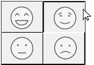

ボタングリッドは透明なオブジェクトであり、画像の最前面に配置されます。 おもに、列と行の配列を表現する画像との組み合わせで使用します。 ユーザーがグラフィック上でクリックすると、そこが凹んだように描画されます。

ボタングリッドのオブジェクトを使用すると、グラフィック上でユーザーがクリックした場所を判別することができます。 オブジェクトメソッドでは `On Clicked` イベントを使用し、クリックされた場所に応じて適切な動作を実行します。

## ボタングリッドの作成

ボタングリッドを作成するには、背景グラフィックをフォームに追加し、その最前面にボタングリッドを配置します。 "行列数" テーマの [行](properties_Crop.md#行) と [列](properties_Crop.md#列)
に行数と列数を指定します。

4D では、カラーパレットにボタングリッドが使用されています:

## ボタングリッドの使用

グリッド上のボタンには、左上から右下に向けて番号が振られます。 上の例で、グリッドは 16列×16行で構成されています。 左上にあるボタンはクリックされると 1 を返します。 2行目の右端にある赤いボタンが選択されると、ボタングリッドは 32 を返します。
選択されたボタンがなければ、0が返されます。

### ページ指定アクション

ボタングリッドにページ指定用の `gotoPage` [標準アクション](https://doc.4d.com/4Dv17R5/4D/17-R5/Standard-actions.300-4163633.ja.html)を割り当てることができます。 この標準アクションを設定すると、4D はボタングリッドで選択されたボタンの番号に相当するフォームページを自動的に表示します。 たとえばグリッド上の 10 番目のボタンを選択すると、4D は現在のフォームの 10 ページ目を表示します (存在する場合)。

## プロパティ一覧

[タイプ](properties_Object.md#タイプ) -
[オブジェクト名](properties_Object.md#オブジェクト名) -
[変数あるいは式](properties_Object.md#変数あるいは式) -
[CSSクラス](properties_Object.md#cssクラス) -
[行](properties_Crop.md#行) -
[列](properties_Crop.md#列) -
[左](properties_CoordinatesAndSizing.md#左) -
[上](properties_CoordinatesAndSizing.md#上) -
[右](properties_CoordinatesAndSizing.md#右) -
[下](properties_CoordinatesAndSizing.md#下) -
[幅](properties_CoordinatesAndSizing.md#幅) -
[高さ](properties_CoordinatesAndSizing.md#高さ) -
[横方向サイズ変更](properties_ResizingOptions.md#横方向サイズ変更) -
[縦方向サイズ変更](properties_ResizingOptions.md#縦方向サイズ変更) -
[表示状態](properties_Display.md#表示状態) -
[境界線スタイル](properties_BackgroundAndBorder.md#境界線スタイル) -
[ヘルプTips](properties_Help.md#ヘルプtips) -
[標準アクション](properties_Action.md#標準アクション)
