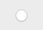

ボタンとは、ユーザーのクリック操作に応じて実行されるアクション (_例_ データベースタスクやインターフェース機能) を割り当てることのできるアクティブオブジェクトです。


割り当てられたスタイルやアクションに応じて、ボタンはさまざまな役割を果たします。 たとえば、ユーザーがアンケートやフォーム内を移動したり、選択したりといった操作を可能にします。 設定によって、ボタンをワンクリックすることでコマンド実行することもできれば、複数回クリックすることで望む結果を得られるようにすることもできます。

## ボタンの使用

ボタンには、あらかじめ設定されている [標準アクション](properties_Action.md#standard-action) またはオブジェクトメソッドを割り当てることができます。 典型的なアクションの例は、レコードの受け入れ・削除・編集キャンセルのほか、データのコピー / ペースト、複数ページあるフォームにおけるページ移動、サブフォームのレコード操作、テキストエリアのフォント属性の操作、などです。

フォーム実行時、標準アクションが設定されたボタンは必要に応じてグレー表示されます。 たとえば、あるテーブルの1番目のレコードが表示されていると、先頭レコード (`firstRecord`) 標準アクションがついたボタンはグレー表示されます。

標準アクションとして提供されていない動作をボタンに実行させたい場合には、標準アクションのフィールドは空欄にしておき、ボタンのアクションを指定するオブジェクトメソッドを書きます オブジェクトメソッドの作成や割り当て方法についての詳細は [オブジェクトメソッドを使用する](https://doc.4d.com/4Dv18/4D/18/Using-object-methods.300-4575722.ja.html) を参照ください。
通常は、イベントテーマで `On Clicked` イベントを有効にして、ボタンのクリック時にのみメソッドを実行します。 どのタイプのボタンにもメソッドを割り当てることができます。

ボタンに関連付けられた変数 ([variable](properties_Object.md#変数あるいは式) 属性) は、デザインモードやアプリケーションモードでフォームが初めて開かれるときに自動で **0** に初期化されます。 ボタンをクリックすると、変数の値は **1** になります。

> ボタンには標準アクションとメソッドの両方を割り当てることもできます。 この場合、標準アクションによってボタンが無効化されていなければ、標準アクションより先にメソッドが実行されます。

## ボタンスタイル

ボタンスタイルは、ボタンの外観を制御すると同時に、提供されるプロパティをも決定します。 ボタンには、あらかじめ定義されたスタイルやポップアップメニューを割り当てることができます。 これらのプロパティや動作を組み合わせることで、多数のバリエーションが得られます。

スタイルによって [提供されるプロパティ](#プロパティ一覧) は異なりますが、大多数のボタンは _構造上_ 同じです。 違いは、関連づけられた変数の処理にあります。

次の既定スタイルが提供されています:

### 通常

通常スタイルのボタンは、標準的なシステムボタンで (長方形にラベルが付いたもの)、ユーザークリックに応じてコードを実行します。


通常ボタンは、明るいグレーの背景に中央配置のラベルがデフォルトで付いています。 Windowsの場合は、通常ボタンの上にマウスオーバーすると、境界線色と背景色が変わります。 また、プラットフォームによって表現が異なりますが、クリック時にも背景色が変わるなどして、物理的なボタンを模倣します。

#### JSON 例:

```4d

"myButton": {
  "type": "button",   // オブジェクトタイプ
  "style":"regular",  // ボタンスタイル
  "defaultButton":"true"  // デフォルトボタン
  "text": "OK",   // タイトル
  "action": "Cancel", // アクション
  "left": 60,  // フォーム上の座標 (左)
  "top": 160, // フォーム上の座標 (上)
  "width": 100,  // 幅
  "height": 20 // 高さ
  }
```

[デフォルトボタン](properties_Appearance.md#デフォルトボタン) プロパティが提供されているのは、通常スタイルとフラットスタイルのみです。

### フラット

フラットスタイルのボタンは、標準的なシステムボタンで (長方形にラベルが付いたもの)、ユーザークリックに応じてコードを実行します。


フラットボタンは、白の背景に中央配置のラベルがデフォルトで付いており、角が丸くなっています。 フラットボタンのグラフィック的な装飾は最小限であるため、印刷されるフォームでの使用に適しています。

#### JSON 例:

```4d

	"myButton": {
                "type": "button",	
                "style":"flat",	
                "defaultButton":"true"	
                "text": "OK",	
                "action": "Cancel", 
                "left": 60,			
                "top": 160,			
                "width": 100,	
                "height": 20	
                }
```

[デフォルトボタン](properties_Appearance.md#デフォルトボタン) プロパティが提供されているのは、通常スタイルとフラットスタイルのみです。

### ツールバー

ツールバースタイルのボタンは、主としてツールバーで使用するためのものです。 このスタイルには、複数の選択肢を提示するためのポップアップメニュー (逆三角形で示されます) を追加するオプションがあります。

ツールバーボタンは、透明の背景に中央配置のラベルがデフォルトで付いています。 ボタンにマウスオーバーしたときの表示は OS によって異なります:

- _Windows_ - ボタンがハイライト表示されます。"ポップアップメニューあり" プロパティを使用ていると、ボタンの右側中央に三角形が表示されます。


- _macOS_ - ボタンはハイライト表示されません。 "ポップアップメニューあり" プロパティを使用していると、ボタンの右側に三角形が表示されます。

#### JSON 例:

```4d
	"myButton": {
                "type": "button",	
                "style":"toolbar",	
                "text": "OK",		
                "popupPlacement":"separated"	
                "action": "Cancel", 	
                "left": 60,				
                "top": 160,				
                "width": 100,			
                "height": 20		
                }
```

### ベベル

ベベルスタイルは [通常](#通常) スタイルの外観 (四角にラベル) に [ツールバー](#ツールバー) スタイルのポップアップメニューを追加可能にしたものです。

ベベルボタンは、明るいグレーの背景に中央配置のラベルがデフォルトで付いています。 ボタンにマウスオーバーしたときの表示は OS によって異なります:

- _Windows_ - ボタンがハイライト表示されます。 "ポップアップメニューあり" プロパティを使用していると、ボタンの右側に三角形が表示されます。


- _macOS_ - ボタンはハイライト表示されません。 "ポップアップメニューあり" プロパティを使用していると、ボタンの右側に三角形が表示されます。

#### JSON 例:

```4d
	"myButton": {
                "type": "button",
                "style":"bevel",	
                "text": "OK",		
                "popupPlacement":"linked"	
                "action": "Cancel", 
                "left": 60,		
                "top": 160,		
                "width": 100,	
                "height": 20	
                }
```

### 角の丸いベベル

角の丸いベベルスタイルは [ベベル](#ベベル) スタイルとほぼ同一ですが、OSによっては角が丸く表示されます。 ベベルスタイルと同様に、角の丸いベベルスタイルは [通常](#通常) スタイルの外観 (四角にラベル) に [ツールバー](#ツールバー) スタイルのポップアップメニューを追加可能にしたものです。

角の丸いベベルボタンは、明るいグレーの背景に中央配置のラベルがデフォルトで付いています。 ボタンにマウスオーバーしたときの表示は OS によって異なります:

- _Windows_ - ベベルボタンと同じです。 "ポップアップメニューあり" プロパティを使用していると、ボタンの右側に三角形が表示されます。


- _macOS_ - 角が丸くなっています。 "ポップアップメニューあり" プロパティを使用していると、ボタンの右側に三角形が表示されます。

#### JSON 例:

```4d
	"myButton": {
                "type": "button",
                "style":"roundedBevel",	
                "text": "OK",	
                "popupPlacement":"none"	/
                "action": "Cancel", 
                "left": 60,			
                "top": 160,	
                "width": 100,	
                "height": 20	
                }
```

### OS Xグラデーション

OS Xグラデーションスタイルは [ベベル](#ベベル) スタイルとほぼ同一です。 ベベルスタイルと同様に、OS Xグラデーションスタイルは [通常](#通常) スタイルの外観 (四角にラベル) に [ツールバー](#ツールバー) スタイルのポップアップメニューを追加可能にしたものです。

OS Xグラデーションボタンは、明るいグレーの背景に中央配置のラベルがデフォルトで付いています。 ボタンにマウスオーバーしたときの表示は OS によって異なります:

- _Windows_ - ベベルボタンと同じです。 "ポップアップメニューあり" プロパティを使用していると、ボタンの右側に三角形が表示されます。


- _macOS_ - 2トーンのシステムボタンです。 "ポップアップメニューあり" プロパティを使用していると、ボタンの右側に三角形が表示されます。

#### JSON 例:

```4d
	"myButton": {
                "type": "button",	
                "style":"gradientBevel",
                "text": "OK",	
                "popupPlacement":"linked"
                "action": "Cancel", 	
                "left": 60,		
                "top": 160,	
                "width": 100,	
                "height": 20	
                }
```

### OS Xテクスチャー

OS Xテクスチャースタイルは [ベベル](#ベベル) スタイルとほぼ同一ですが、サイズがより小さいです (最大サイズは macOS の標準的なシステムボタンのサイズです)。 ベベルスタイルと同様に、OS Xテクスチャースタイルは [通常](#通常) スタイルの外観 (四角にラベル) に [ツールバー](#ツールバー) スタイルのポップアップメニューを追加可能にしたものです。

デフォルトで、OS Xテクスチャーボタンの外観は次の通りです:

- _Windows_ - 明るいブルーの背景に中央配置のラベルが付いた標準のシステムボタンです。 Vistaにおいては透明になる特別機能を持っています。


- _macOS_ - 灰色のグラデーションを表示する標準のシステムボタンです。 高さは定義済みで、変更できません。

#### JSON 例:

```4d
	"myButton": {
                "type": "button",	
                "style":"texturedBevel",	
                "text": "OK",	
                "popupPlacement":"separated"	
                "action": "Cancel", 
                "left": 60,			
                "top": 160,		
                "width": 100,	
                "height": 20	
                }
```

### Office XP

ベベルスタイルと同様に、Office XPスタイルは [通常](#通常) スタイルの外観 (四角にラベル) に [ツールバー](#ツールバー) スタイルの透過性を加え、ポップアップメニューを追加可能にしたものです。

Office XPボタンの反転表示と背景のカラーはシステムカラーに基づいています。 ボタンにマウスオーバーしたときの表示は OS によって異なります:

- _Windows_ - マウスオーバー時にのみ背景が表示されます。


- _macOS_ - 背景は常に表示されます。

#### JSON 例:

```4d
	"myButton": {
                "type": "button",	
                "style":"office",
                "text": "OK",
                "popupPlacement":"none"	
                "action": "Cancel", 
                "left": 60,		
                "top": 160,	
                "width": 100,
                "height": 20	
                }
```

### ヘルプ

このスタイルはシステム標準のヘルプボタンを表示するために使用します。 デフォルトで、ヘルプボタンは丸の中に表示されたハテナマーク (疑問符) です。


#### JSON 例:

```4d
	"myButton": {
                "type": "button",
                "style":"help",		
                "text": "OK",	
                "dropping": "custom", 
                "left": 60,	
                "top": 160,		
                "width": 100,	
                "height": 20	
                }
```

> ヘルプスタイルは、[状態の数](properties_TextAndPicture.md#number-of-states)、[ピクチャーパス名](properties_TextAndPicture.md#picture-pathname)、および [タイトル/ピクチャー位置](properties_TextAndPicture.md#titlepicture-position) などの基本的なプロパティをサポートしません。

### サークル

サークルスタイルのボタンは、円形のシステムボタンとして表示されます。 このボタンスタイルは macOS 用に用意されています。



Windows の場合、サークルは表示されません。

#### JSON 例:

```
	"myButton": {
                "type": "button",	
                "style":"circular",	
                "text": "OK",	
                "dropping": "custom", 
                "left": 60,	
                "top": 160,		
                "width": 100,
                "height": 20	
                }
```

### カスタム

カスタムスタイルのボタンは、背景ピクチャーを使用できるほか、さまざまな追加パラメーターを管理することができます (アイコンオフセットやマージン)。


#### JSON 例:

```code
	"myButton": {
                "type": "button",	
                "style":"custom",	
                "text": "",	
                "customBackgroundPicture": "/RESOURCES/bkgnd.png",
                "icon": "/RESOURCES/custom.png",  
                "textPlacement": "center",
                "left": 60,	
                "top": 160,		
                "width": 100,	
                "height": 20
                }
```

## プロパティ一覧

すべてのボタンは次の基本プロパティを共有します:

[Bold](properties_Text.md#bold) - [Border Line Style](properties_BackgroundAndBorder.md#border-line-style) - [Bottom](properties_CoordinatesAndSizing.md#bottom) - [Button Style](properties_TextAndPicture.md#button-style) - [Class](properties_Object.md#css-class) - [Droppable](properties_Action.md#droppable) - [Focusable](properties_Entry.md#focusable) - [Font](properties_Text.md#font) - [Font Color](properties_Text.md#font-color) - [Font Size](properties_Text.md#font-size) - [Height](properties_CoordinatesAndSizing.md#height) - [Help Tip](properties_Help.md#help-tip) - [Horizontal Alignment](properties_Text.md#horizontal-alignment) - [Horizontal Sizing](properties_ResizingOptions.md#horizontal-sizing) - [Italic](properties_Text.md#italic) - [Image hugs title](properties_TextAndPicture.md#image-hugs-title)(1) - [Left](properties_CoordinatesAndSizing.md#left) - [Not rendered](properties_Display.md#not-rendered) - [Number of States](properties_TextAndPicture.md#number-of-states)(1) - [Object Name](properties_Object.md#object-name) - [Picture pathname](properties_TextAndPicture.md#picture-pathname)(1) - [Right](properties_CoordinatesAndSizing.md#right) - [Shortcut](properties_Entry.md#shortcut) - [Standard action](properties_Action.md#standard-action) - [Title](properties_Object.md#title) - [Title/Picture Position](properties_TextAndPicture.md#titlepicture-position)(1) - [Top](properties_CoordinatesAndSizing.md#top) - [Type](properties_Object.md#type) - [Underline](properties_Text.md#underline) - [Variable or Expression](properties_Object.md#variable-or-expression) - [Vertical Sizing](properties_ResizingOptions.md#vertical-sizing) - [Visibility](properties_Display.md#visibility) - [Width](properties_CoordinatesAndSizing.md#width) - [With pop-up menu](properties_TextAndPicture.md#with-pop-up-menu)(2)

> (1) [ヘルプ](#ヘルプ) スタイルではサポートされていません。<br/>
> (2) [ヘルプ](#ヘルプ)、[フラット](#フラット) および [通常](#通常) スタイルではサポートされていません。

[ボタンスタイル](#ボタンスタイル) に応じて、次の追加プロパティが使用できます:

- Custom: [Background pathname](properties_TextAndPicture.md#background-pathname) - [Horizontal Margin](properties_TextAndPicture.md#horizontal-margin) - [Icon Offset](properties_TextAndPicture.md#icon-offset) - [Vertical Margin](properties_TextAndPicture.md#vertical-margin)
- 通常、フラット: [デフォルトボタン](properties_Appearance.md#デフォルトボタン)
