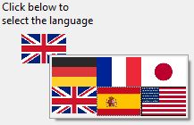

ピクチャーポップアップメニューは、画像の二次元配列を表示するポップアップメニューです。 ピクチャーポップアップメニューを使用して、[ピクチャー ボタン](pictureButton_overview.md) を置き換えることができます。 ピクチャーポップアップメニューで使用するピクチャーの作成方法は、ピクチャーボタン用のピクチャーと似ています。 その概念は [ボタングリッド](buttonGrid_overview.md) と同じですが、グラフィックがフォームオブジェクトではなくポップアップメニューとして使用される点が異なります。

## ピクチャーポップアップメニューの使用

ピクチャーポップアップメニューを作成するには、[画像を参照](properties_Picture.md#パス名) する必要があります。 次の例は、ピクチャーポップアップメニューからインタフェース言語を選ぶことができます。 各言語は対応する国旗で表わされています:

### プログラミング

ピクチャーポップアップメニューは、メソッドを使用して管理できます。 [ボタングリッド](buttonGrid_overview.md) と同様、ピクチャーポップアップメニューに割り当てられた変数に、選択された要素の値が代入されます。 項目が選択されなければ、この値は 0 になります。 各ピクチャーには上の行から順に左から右へと番号が振られます。

### ページ指定アクション

ピクチャーポップアップメニューにページ指定 (`gotoPage`) [標準アクション](https://doc.4d.com/4Dv19R4/4D/19-R4/Standard-actions.300-5736871.ja.html) を割り当てることができます。 このアクションを選択すると、4D はピクチャー配列で選択されたピクチャー位置に相当するフォームのページを自動的に表示します。 要素は左から右、上から下に向かって番号が割り当てられます。

たとえば、ユーザーが3番目の要素をクリックすると、4D はカレントフォームの 3ページ目 (存在する場合) を表示します。
クリックをプログラムから管理したい場合は "動作なし" を選択します。

## プロパティ一覧

[タイプ](properties_Object.md#タイプ) -
[オブジェクト名](properties_Object.md#オブジェクト名) -
[変数あるいは式](properties_Object.md#変数あるいは式) -
[CSSクラス](properties_Object.md#cssクラス) -
[パス名](properties_Picture.md#パス名) -
[行](properties_Crop.md#行) -
[列](properties_Crop.md#列) -
[左](properties_CoordinatesAndSizing.md#左) -
[上](properties_CoordinatesAndSizing.md#上) -
[右](properties_CoordinatesAndSizing.md#右) -
[下](properties_CoordinatesAndSizing.md#下) -
[幅](properties_CoordinatesAndSizing.md#幅) -
[高さ](properties_CoordinatesAndSizing.md#高さ) -
[横方向サイズ変更](properties_ResizingOptions.md#横方向サイズ変更) -
[縦方向サイズ変更](properties_ResizingOptions.md#縦方向サイズ変更) -
[表示状態](properties_Display.md#表示状態) -
[境界線スタイル](properties_BackgroundAndBorder.md#境界線スタイル) -
[太字](properties_Text.md#太字) -
[ヘルプTips](properties_Help.md#ヘルプtips) -
[標準アクション](properties_Action.md#標準アクション)
