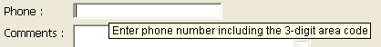

## ヘルプTips

このプロパティで、フォーム上のアクティブオブジェクトにヘルプTip を付加することができます。 ランタイムにおいてマウスがオブジェクト上にあるとき、ヘルプメッセージが Tip として表示されます:

> - The display delay and maximum duration of help tips can be controlled using the `Tips delay` and `Tips duration` selectors of the **[SET DATABASE PARAMETER](../commands-legacy/set-database-parameter.md)** command.
> - Help tips can be globally disabled or enabled for the application using the Tips enabled selector of the [**SET DATABASE PARAMETER**](../commands-legacy/set-database-parameter.md) command.

これには、次の二つの方法があります:

- 4D の [ヘルプTipエディター](https://doc.4d.com/4Dv18/4D/18/Help-tips.200-4575424.ja.html) であらかじめ作成したヘルプTip を指定します。
- または、プロパティリストに直接 Tip を文字列として入力します。 この方法では、XLIFF アーキテクチャーを利用することができます。 XLIFF参照を指定することで、アプリケーションの言語に応じたメッセージを表示させることができます (XLIFF についての詳細は [付録 B: XLIFFアーキテクチャー](https://doc.4d.com/4Dv18/4D/18/Appendix-B-XLIFF-architecture.300-4575737.ja.html) を参照ください)。 また、4D 参照を使用することもできます ([スタティックテキスト中で参照を使用する](https://doc.4d.com/4Dv18/4D/18/Using-references-in-static-text.300-4575714.ja.html) 参照)。

> macOS においては、Pop up window (32) 型のウィンドウはヘルプTips の表示ができません。

#### JSON 文法

|    名称   | データタイプ | とりうる値       |
| :-----: | :----: | ----------- |
| tooltip |  テキスト  | ユーザー用のヘルプ情報 |

#### 対象オブジェクト

[Button](button_overview.md) - [Button Grid](buttonGrid_overview.md) - [Check Box](checkbox_overview.md)  - [Drop-down List](dropdownList_Overview.md) - [Combo Box](comboBox_overview.md) - [Hierarchical List](list_overview.md) - [List Box Header](listbox_overview.md#list-box-headers) - [List Box Footer](listbox_overview.md#list-box-footers) - [Picture Button](pictureButton_overview.md) - [Picture Pop-up menu](picturePopupMenu_overview.md) - [Radio Button](radio_overview.md)

#### 追加のヘルプ機能

オブジェクトにヘルプTip を関連付ける方法は他にも 2通りあります:

- データベースストラクチャーレベルにおいて設定することができます (フィールドのみ)。 この場合、当該フィールドが表示されるすべてのフォームにおいて、このヘルプTip が表示されます。 詳細については [フィールドプロパティ](https://doc.4d.com/4Dv18/4D/18/Field-properties.300-4575567.ja.html#3367486) のヘルプTip の章を参照してください)。
- using the **[OBJECT SET HELP TIP](../commands-legacy/object-set-help-tip.md)** command, for the current process.

同じオブジェクトに対して複数の Tip が関連づけられている場合には、次の優先順位に従って表示されます:

1. ストラクチャーレベル (最低優先度)
2. フォームエディターレベル
3. **[OBJECT SET HELP TIP](../commands-legacy/object-set-help-tip.md)** command (highest priority)

#### 参照

[プレースホルダー](properties_Entry.md#プレースホルダー)
