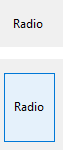

ラジオボタンは、ボタングループの中から1つを選択することができるオブジェクトです。

ラジオボタンは通常、小さな目玉状の円とテキストを表示します。 しかし、ラジオボタンに [それ以外の外観](#ボタンスタイル) を設定することもできます。

ラジオボタンを選択するには二つの方法があります:

- ラジオボタンをクリックする
- ラジオボタンにフォーカスがあるときに **スペース** キーを押す

## ラジオボタンの設定

ラジオボタンは組織的な集合の中で使用されます。その集合のなかから一度にひとつのボタンしか選択できません。 一連のラジオボタンが連携した状態で動作するためには、それらには同じ [ラジオグループ](properties_Object.md#ラジオグループ) プロパティが設定されていなくてはなりません。

ラジオボタンの結果はメソッドを用いて管理します。 あらゆるボタンと同様に、フォームが初めて開かれる時ラジオボタンは 0 に初期化されています。 ラジオボタンが選択されると、ラジオボタンに割り当てられたメソッドが実行されます。 次の例では、ビデオ収集データベースでラジオボタンを使用し、レコーディングの速さ (SP、LP、EP) を入力します:

グループのなかから 1つのラジオボタンを選択すると、そのボタンには 1 が代入され、グループ内の他のすべてのボタンには 0 が代入されます。 一度に1つのラジオボタンしか選択できません。

> ラジオボタンには [ブール型の式](properties_Object.md#変数あるいは式) を設定することができます。 この場合、グループ内で選択されたラジオボタンの変数には true が代入され、残りのラジオボタンの変数には false が代入されます。

ラジオボタンオブジェクトに格納された値は (ブールフィールドの場合を除き) 自動保存されません。変数に格納されたラジオボタンの値はメソッドで管理しなければなりません。

## ボタンスタイル

ラジオ [ボタンスタイル](properties_TextAndPicture.md#ボタンスタイル)は、ラジオボタンの外観を制御すると同時に、提供されるプロパティをも決定します。 ラジオボタンには、あらかじめ定義されたスタイルを割り当てることができます。 しかし、ラジオボタンが適切に動作するには、同じグループに所属するラジオボタンはすべて同じボタンスタイルに設定されている必要があります。

次の既定スタイルが提供されています:

### 通常

通常スタイルのラジオボタンは、標準的なシステムボタンで (小さな目玉状の円とテキストを表示したもの)、ユーザークリックに応じてコードを実行します。

通常スタイルのラジオボタンにマウスオーバーすると、"目玉" の色が変化します。

### フラット

フラットスタイルのラジオボタンは、標準的なシステムボタンで (小さな目玉状の円とテキストを表示したもの)、ユーザークリックに応じてコードを実行します。

フラットスタイルでは、装飾が最小限に抑えられています。 フラットボタンのグラフィック的な装飾は最小限であるため、印刷されるフォームでの使用に適しています。

### ツールバー

ツールバースタイルのラジオボタンは、主としてツールバーで使用するためのものです。

ツールバーボタンは、透明の背景に中央配置のラベルがデフォルトで付いています。 ボタンにマウスオーバーしたときの表示は OS によって異なります:

- _Windows_ - ボタンがハイライト表示されます。

- _macOS_ - ボタンはハイライト表示されません。

### ベベル

ベベルスタイルは [ツールバー](#ツールバー) スタイルと似た動作をしますが、薄いグレーの背景にグレーの枠が描画されます。 ボタンにマウスオーバーしたときの表示は OS によって異なります:

- _Windows_ - ボタンがハイライト表示されます。

- _macOS_ - ボタンはハイライト表示されません。

### 角の丸いベベル

角の丸いベベルスタイルは [ベベル](#ベベル) スタイルとほぼ同一ですが、OSによっては角が丸く表示されます。

- Windows 上では、このスタイルは [ベベル](#ベベル) スタイルと同じです。

- _macOS_ - 角が丸くなっています。
  

### OS Xグラデーション

OS Xグラデーションスタイルは [ベベル](#ベベル) スタイルとほぼ同一ですが、OSによっては異なる点があります。

- Windows 上では、このスタイルは [ベベル](#ベベル) スタイルと同じです。

- _macOS_ - 2トーンのシステムボタンです。

### OS Xテクスチャー

OS Xテクスチャースタイルは [ツールバー](#ツールバー) スタイルとほぼ同一ですが、OSによってはマウスオーバー時の変化がないほか、外観の異なる点があります。

デフォルトで、OS Xテクスチャーボタンの外観は次の通りです:

- _Windows_ - ツールバースタイルのようなボタンに中央配置のラベルが付き、背景は常に表示されます。

- _macOS_ - 灰色のグラデーションを表示する標準のシステムボタンです。 高さは定義済みで、変更できません。

### Office XP

Office XPスタイルは通常ボタン (標準のシステムボタン) ような外観に、[ツールバーボタン](#ツールバーボタン) スタイルの動作を組み合わせたものです。

Office XPボタンの反転表示と背景のカラーはシステムカラーに基づいています。 ボタンにマウスオーバーしたときの表示は OS によって異なります:

- _Windows_ - マウスオーバー時にのみ背景が表示されます。

- _macOS_ - 背景は常に表示されます。

### 折りたたみ/展開

このスタイルは標準の折りたたみ/展開アイコンを表示するのに使用します。 これらは階層リストで使用されます。 Windows では [+] または [-] のように表示されます。macOS では、右や下を指す三角として表示されます。

:::info

折りたたみ/展開 スタイルは、[ボタンスタイル JSON 文法](properties_TextAndPicture.md#ボタンスタイル)では "disclosure" という名称です。

:::

### 開示ボタン

開示ボタンスタイルが適用されると、詳細情報の表示/非表示にするのに使われる標準的な開示ボタンとして描画されます。 値が 0 のときにはボタンの矢印が下向き、値が 1 のときは上向きになります。

:::info

開示ボタンスタイルは、[ボタンスタイル JSON 文法](properties_TextAndPicture.md#ボタンスタイル)では "roundedDisclosure" という名称です。

:::

### カスタム

The Custom radio button style accepts a personalized background picture and allows managing additional parameters such as [icon offset](properties_TextAndPicture.md#icon-offset) and [margins](properties_TextAndPicture.md#horizontal-margin).

## プロパティ一覧

すべてのラジオボタンは次の基本プロパティを共有します:

[Bold](properties_Text.md#bold) - [Bottom](properties_CoordinatesAndSizing.md#bottom) - [Button Style](properties_TextAndPicture.md#button-style) - [Class](properties_Object.md#css-class) - [Expression Type](properties_Object.md#expression-type) - [Focusable](properties_Entry.md#focusable) - [Font](properties_Text.md#font) - [Font Color](properties_Text.md#font-color) - [Height](properties_CoordinatesAndSizing.md#height) - [Help Tip](properties_Help.md#help-tip) - [Horizontal Alignment](properties_Text.md#horizontal-alignment)(1) - [Horizontal Sizing](properties_ResizingOptions.md#horizontal-sizing) - [Image hugs title](properties_TextAndPicture.md#image-hugs-title)(2) - [Italic](properties_Text.md#italic) - [Left](properties_CoordinatesAndSizing.md#left) - [Number of States](properties_TextAndPicture.md#number-of-states)(2) - [Method](properties_Action.md#method) - [Object Name](properties_Object.md#object-name) - [Radio Group](properties_Object.md#radio-group) - [Picture pathname](properties_TextAndPicture.md#picture-pathname)(2) - [Right](properties_CoordinatesAndSizing.md#right) - [Save value](properties_Object.md#save-value) - [Shortcut](properties_Entry.md#shortcut) - [Title](properties_Object.md#title) - [Title/Picture Position](properties_TextAndPicture.md#titlepicture-position)(2) - [Top](properties_CoordinatesAndSizing.md#top) - [Type](properties_Object.md#type) - [Underline](properties_Text.md#underline) - [Variable or Expression](properties_Object.md#variable-or-expression) - [Vertical Sizing](properties_ResizingOptions.md#vertical-sizing) - [Visibility](properties_Display.md#visibility) - [Width](properties_CoordinatesAndSizing.md#width)

> (1) [通常](#通常) および [フラット](#フラット) スタイルではサポートされていません。 
> (2) [通常](#通常)、[フラット](#フラット)、[開示ボタン](#開示ボタン) および [折りたたみ/展開](#折りたたみ展開) スタイルではサポートされていません。

[ボタンスタイル](#ボタンスタイル) に応じて、次の追加プロパティが使用できます:

- Custom: [Background pathname](properties_TextAndPicture.md#background-pathname) - [Horizontal Margin](properties_TextAndPicture.md#horizontal-margin) - [Icon Offset](properties_TextAndPicture.md#icon-offset) - [Vertical Margin](properties_TextAndPicture.md#vertical-margin)
