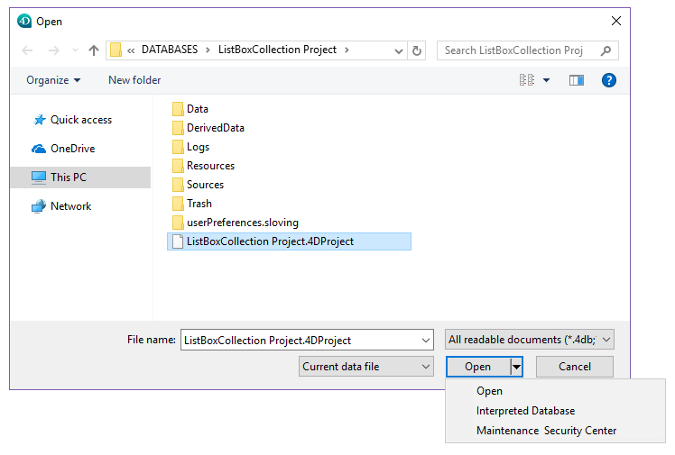

Maintenance & Security Center (MSC) は、データとストラクチャーファイルを検証、保守、バックアップそして圧縮および暗号化するツールを提供します。 MSC ウィンドウは、すべての 4Dアプリケーション (4Dシングルユーザー、4D Server、4D Desktop) から利用できます。

**注**: MSC は 4Dリモート接続ではご利用いただけません。

MSCウィンドウを開く方法は幾つかあります。 アクセスの方法により、"メンテナンス" モードまたは "標準" モードのいずれによってアプリケーションを開くかが決定されます。 メンテナンスモードの場合、4D はプロジェクトを開かず、その参照だけが MSC に供給されます。 標準モードの場合、4D はプロジェクトを開きます。

## メンテナンスモードでの表示

メンテナンスモードでは、MSCウィンドウだけが表示されます (4Dアプリケーションはプロジェクトを開きません)。 つまり、損傷が激しいため 4D が標準モードで開けないプロジェクトにもアクセスできるということです。 さらに、特定の操作 (圧縮、修復など) はプロジェクトをメンテナンスモードで開くことを要求します ([アクセス権](#アクセス権) 参照)。

次の 2つの場所から、MSC をメインテナンスモードで開くことができます:

- **標準の開くダイアログボックス**
  標準のプロジェクトを開くダイアログボックスには **開く** ボタンに関連付けられているメニューに **Maintenance & Security Center** オプションが含まれます:
  
- **ヘルプ ＞ メンテナンス＆セキュリティセンター (MSC)** メニュー、または、ツールバーの **MSC** ボタンの使用 (プロジェクトが開かれていない状態で)\
  \
  この機能を呼び出すと、標準のファイルを開くダイアログボックスが表示され、検査する _.4DProject_ または _.4dz_ ファイルを指定できます。 プロジェクトは開かれません。

## 標準モードでの表示

標準モードではプロジェクトが開いています。 このモードでは、特定の保守機能を使用できません。 この場合に MSCウィンドウを開く方法は幾つかあります。

- **ヘルプ＞メンテナンス＆セキュリティセンター (MSC)** メニュー、または、ツールバーの **MSC** ボタンの使用:\
  
- メニューコマンドやフォームオブジェクトに割り当てることのできる "msc" 標準アクションを使用する。
- `OPEN SECURITY CENTER` ランゲージコマンドを使用する。

## アクセス権

特定の MSC機能は、MSC が開かれたモードによっては利用できません:

- バックアップ機能は、プロジェクトが開かれている状態でしか利用できません (MSC は標準モードで開かれている必要があります)。
- データの圧縮、ロールバック、復元、修復、および暗号化の機能は、開いていないデータファイルでのみ使用できます (MSC はメンテナンスモードで開かれていなければなりません) 。 プロジェクトが標準モードで開かれている時にこれらの機能を試みた場合は、メンテナンスモードでアプリケーション再起動を促すダイアログボックスが表示されます。
- 暗号化されたデータベースにおいては、暗号化されたデータまたは .journal ファイルへのアクセスには有効なデータキーが提供されている必要があります ([暗号化ページ](encrypt.md) 参照)。 提供されていない場合、暗号化されたデータは見ることができません。
