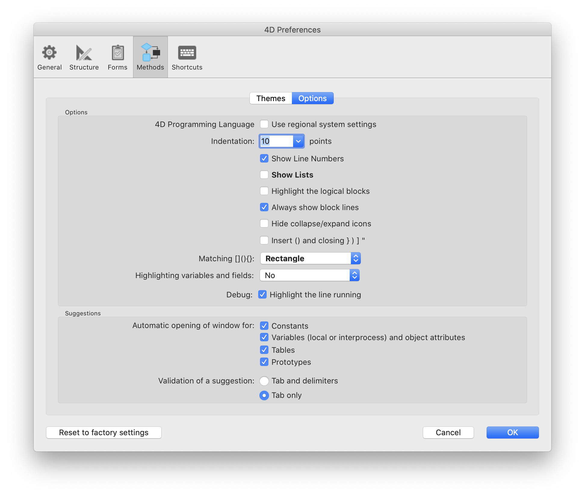
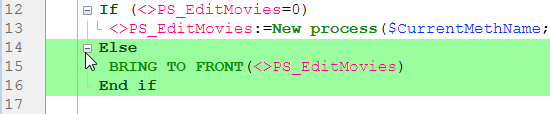

このページでは、コードエディターのインターフェースやデフォルトの表示、および動作に関するオプションを設定します。 ページはテーマとオプションという 2つのタブに分けられています。

## テーマ

このページでは、コードエディターのテーマを選択・作成・設定することができます。 テーマは、コードエディターに表示される項目のフォント、フォントサイズ、カラー、スタイルを定義します。

### テーマリスト

このリストでは、コードエディターに適用するテーマを選択します。 利用可能なテーマがすべて表示され、カスタムテーマがある場合はそれも表示されます。 4D はデフォルトで 2つのテーマを用意しています:

- **デフォルトのLightテーマ**
- **デフォルトのDarkテーマ**

> デフォルトのテーマは変更や削除ができません。

以前の 4Dリリースで、コードエディターのスタイルをカスタマイズしていた場合、**myTheme** テーマが自動的に追加されます。

### カスタムテーマの作成

完全にカスタマイズ可能なテーマを作成することができます。 テーマを作成するには、既存のテーマを選択して、テーマリストの下部にある **+** をクリックします。 また、`4D Editor Themes` フォルダー内のテーマファイルをコピーして、カスタマイズしたテーマを追加することもできます (後述参照)。

### カスタムテーマファイル

カスタムテーマは、それぞれ別の _themeName.json_ という JSONファイルに格納されます。カスタムテーマの JSONファイルは、4D [preferences](overview.md#ストレージ) ファイルと同じ階層にある `4D Editor Themes` フォルダーに格納されます。

カスタムテーマでキー値が定義されていない場合は、_デフォルトのLightテーマ_ の値がデフォルトとなります。 JSONテーマファイルが無効な場合、_デフォルトのLightテーマ_ が読み込まれ、エラーが発生します。

> 外部エディターでテーマファイルを変更した場合は、変更内容を反映させるために 4Dを再起動する必要があります。

## テーマの定義

テーマを定義するとは、以下のことを意味します:

- コードエディター全体のグローバルフォントとフォントサイズを設定する。
- 4D のランゲージ要素 (フィールド、テーブル、変数、引数、SQL など)、SQL のランゲージ要素 (キーワード、関数など)、そして背景色のそれぞれにスタイルと色を割り当てる。

異なる色やスタイルを組み合わせることは、コードのメンテナンス目的に特に便利です。

### フォントとフォントサイズ

**フォント** と **フォントサイズ** のメニューで、すべてのカテゴリーのコードエディターの入力エリアで使用するフォント名とサイズを選択できます。

### 4D ランゲージと SQL ランゲージ

ランゲージ要素の種類ごとに、異なるフォントスタイルやカラー (フォントカラーや背景色) を設定できます。 カスタマイズする要素は、カテゴリーリストで選択できます。

### その他のスタイル

これらのオプションは、コードエディターとデバッガーインターフェースで使用される様々なカラーを設定します。

|                      | 説明                                                                                 |
| -------------------- | ---------------------------------------------------------------------------------- |
| **背景色**              | コードエディターウィンドウの背景色。                                                                 |
| **デバッガ内の実行行の境界線**    | [オプション](#オプション) ページで "実行行をハイライト" オプションが有効になっている場合、デバッガーで現在実行中の行を囲む境界線の色。           |
| **カーソル行背景色**         | カーソルのある行の背景色。                                                                      |
| **実行行背景色**           | デバッガーで実行中の行の背景色。                                                                   |
| **検索で見つかった単語のハイライト** | 検索して見つかった単語のハイライト色。                                                                |
| **カッコのハイライト**        | 対応するカッコのハイライト色 (カッコのペアがハイライト表示される時に使用されます。[オプション](#オプション) 参照)。  |
| **ブロックのハイライト**       | [オプション](#オプション) で "論理ブロックを強調" オプションが有効化されていた場合の、選択された論理ブロックのハイライト色。                |
| **同じ変数やフィールドのハイライト** | [オプション](#オプション) で "変数とフィールドを強調" オプションが有効になっている場合、同じ変数またはフィールドテキストの他の出現箇所のハイライトカラー。 |
| **デバッガ内の実行行のハイライト**  | [オプション](#オプション) で "実行行をハイライト" が有効になっている場合、デバッガーで現在実行中の行のハイライトカラー。                  |
| **選択範囲の背景色**         | 選択範囲の背景色。                                                                          |
| **サジェストテキスト**        | コードエディターで表示されるオートコンプリートテキストの色。                                                     |

## オプション

このページでは、コードエディターの表示オプションを設定します。

### オプション

#### 4Dプログラミングランゲージ (リージョンシステム設定を使う)

ローカル4Dアプリケーション用の "国際的な" コード設定を有効化/無効化することができます。

- **チェック無し** (デフォルト): 4Dメソッドにおいて English-US設定と英語でのプログラミングランゲージが使用されます。
- **チェック有り**: リージョン設定が使用されます。

> このオプションを変更した場合、変更を反映するには 4Dアプリケーションを再起動する必要があります。

#### インデント

コードエディターで、4Dコードが使用するインデントの値を設定します。 値はポイントで設定します (デフォルトは 10)。

4D は構造を明確にするために自動でコードをインデントします:

アルゴリズムが複雑になり、階層レベル数が増えた場合に、この値を変更すると便利な場合があります。 具体的には、この値を減らすことで水平スクロールを減らすことができます。

#### 行番号を表示

コードエディターで、行番号をデフォルト表示するかどうかを設定します。 コードエディターにて、直接の行番号を表示/非表示設定することもできます。

#### リスト表示

コードエディターウィンドウを開いたときに、オブジェクト (コマンド、テーブル、フィールド等)  のリストをデフォルトで表示するかどうかを設定します。 コードエディターで直接このリストを表示/非表示にすることもできます。

#### クリップボード表示

コードエディターに複数のクリップボードを表示するかどうかを選択できます。

これらのクリップボードが非表示の場合でも、対応する [クリップボードショーカット](https://doc.4d.com/4Dv19R3/4D/19-R3/Writing-a-method.300-5612559.ja.html#3977166) は有効です。

#### 論理ブロックを強調

チェックされている場合、展開されたノードの上にマウスを置いたときに論理ブロック(たとえば If/End if など) に含まれているコードがすべてハイライトされます:

ハイライトカラーは [テーマ](#テーマの定義) ページにて設定が可能です。

#### ブロック行を常に表示

垂直のブロック線を常に非表示にできます。 ブロック線はノードを視覚的に繋ぐためのものです。 デフォルトでは、これらは常に表示されています (ただし展開/折りたたみアイコンが非表示の場合は除きます。以下参照)。

#### 折りたたみ/展開アイコンを隠す

コードを表示する際に、展開/折りたたみアイコンをデフォルトで非表示にすることができます。 このオプションがチェックされているとき、ノードアイコン (とブロック線。前述参照)は、マウスがノードの上に置かれた際にのみ一時的に表示されます:

#### () と対応する閉じる } ) ] " を自動で挿入

コード入力中に () と、閉じるカッコを自動的に挿入するようにします。 このオプションでは 2つの自動機能を管理します:

- **()カッコのペア**: 4Dコマンド、キーワード、プロジェクトメソッドが提案リストあるいは補完リストから挿入される時、その挿入要素が一つ以上の引数を必須としている場合に追加されます。 たとえば、"C_OB" と入力して Tabキーを押すと、4D は自動的に "C_OBJECT()" と表示し、カーソルを () の内部に設定します。

- **閉じる }, ), ], "**: {, (, [, あるいは " などの開くカッコを入力した時に、対応する閉じるカッコが追加されます。 この機能により、カーソル位置に、あるいは選択されたテキストを囲むように、対応するカッコ記号を挿入できるようになります。 たとえば、文字列をハイライトして単一の " を入力すると、選択された文字列全体が "" で囲まれます:

\

#### 括弧のマッチング

コード中での対応する括弧を強調する方法を設定します。 この強調は、括弧 (大カッコ[]、中カッコ{}、小カッコ()) が選択されたときに表示されます。
次のオプションから選択することができます:

- **なし**: 強調なし
- **四角** (デフォルト): 括弧が黒い四角で囲まれます。
- **背景色**: 括弧がハイライトされます (色は [テーマ](#テーマの定義) ページで設定します)。
- **太字**: 括弧が太字で表示されます。

#### 変数とフィールドを強調

開かれたメソッドウィンドウ内で、同じ変数やフィールド等のオカレンスをすべてハイライトします。

- **しない**(デフォルト): ハイライトなし
- **カーソル上のみ**: テキストがクリックされた際にのみハイライトされます。
- **選択範囲上のみ**: テキストが選択された際にのみハイライトされます。

ハイライトカラーは [テーマ](#テーマの定義) ページにて設定が可能です。

#### デバッグ (実行行をハイライト)

通常の黄色の矢印インジケーターに加え、デバッガーで実行中の行をハイライトするかどうかを設定します。

このオプションの選択を解除すると、黄色の矢印のみが表示されます。

### 提案

このエリアでは、コードエディターの自動補完メカニズムを設定して、作業習慣に合わせることができます。

|             | 説明                                                                                                                                                                                                                                                                                                                                                                                                                                                                                                                                                                                           |
| ----------- | -------------------------------------------------------------------------------------------------------------------------------------------------------------------------------------------------------------------------------------------------------------------------------------------------------------------------------------------------------------------------------------------------------------------------------------------------------------------------------------------------------------------------------------------------------------------------------------------- |
| ウィンドウを自動で開く | 次の要素に関する提案ウィンドウを自動で開くかを指定します:<ul><li>定数</li><li>変数(ローカルまたはインタープロセス)あるいはオブジェクト属性</li><li>テーブル</li><li>プロトタイプ (例: クラス関数)</li></ul>
たとえば、"変数(ローカルまたはインタープロセス)あるいはオブジェクト属性" オプションがチェックされている場合、$ 文字を入力すると提案されるローカル変数のリストが表示されます:

 対応するオプションのチェックを外すことで、要素ごとにこの機能を無効にできます。                                                                                                                                               |
| 提案の決定       | コードエディターで、自動補完ウィンドウに表示されたカレントの提案を受け入れるための、入力コンテキストを設定します。<ul><li>**タブと区切り文字** このオプションが選択されていると、タブキーまたは現在のコンテキストに関連する区切り文字で、現在選択されている提案を決定することができます。  たとえば "ALE" と入力して "(" を入力すると、4Dは自動で "ALERT(" とエディターに書き込みます。 区切り文字は以下の通りです:  ( ; : = < [ {</li><li>**タブのみ** このオプションが選択されていると、現在の提案はタブキーを押したときにのみ受け入れられます。  これは特に ${1} のように、要素名に区切り文字を入力することを容易にします。**注記**: ウィンドウ内をダブルクリックするか、改行キーを押すことで提案を受け入れることもできます。</li></ul> |
