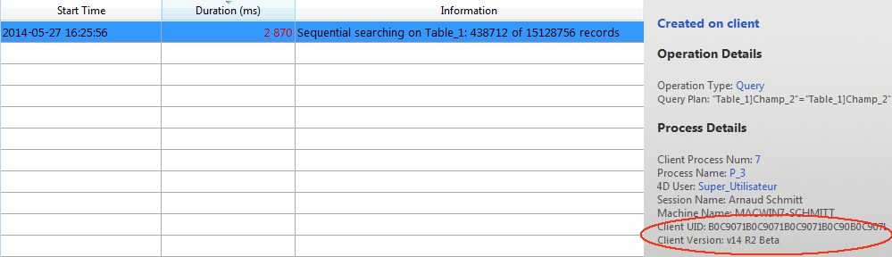

リアルタイムモニターは、アプリケーションによって実行された、"長い" オペレーションの状態をリアルタイムでモニターします。 これらのオペレーションとは、たとえばシーケンシャルクエリやフォーミュラの実行などです:

> このページは、サーバーマシンの管理ウィンドウにありますが、リモートの 4Dマシンからも見られます。 リモートマシンの場合は、サーバーマシン上で実行されている操作のデータを表示します。

データに対して実行されている長い処理は、それぞれに行が割り当てられます。 操作が完了すると、この行は消えます (**オペレーションを最低5秒間表示する** オプションをチェックすることで、短いオペレーションでも 5秒間表示したままにできます。

各行について、以下の情報が表示されます:

- **開始時刻**: 操作の開始時刻が、"dd/mm/yyyy - hh:mm:ss" というフォーマットで表示されます。
- **経過時間** (秒): 進行中の操作の経過時間が秒単位で表示されます。
- **情報**: 操作の説明。
- **詳細**: このエリアには、選択したオペレーションのタイプに応じて、その詳細な情報が表示されます。 具体的には以下の情報が表示されます:
  - **作成された場所**: そのオペレーションがクライアントアクションの結果か (クライアント上で作成)、ストアドプロシージャ―または "サーバー上で実行" オプションを使用した結果か (サーバー上で作成) を表示します。
  - **オペレーション詳細**: オペレーションタイプと、(クエリオペレーションに対しては) クエリプランを表示します。
  - **サブオペレーション** (あれば): 選択したオペレーションに従属するオペレーションを表示します (例:親レコードの前にリレートレコードを削除する)
  - **プロセス詳細**: テーブル、フィールド、プロセスやクライアントに関する追加情報が表示されます。

> Real-time monitoring page uses the [`ACTIVITY SNAPSHOT`](https://doc.4d.com/4dv19/help/command/en/page1277.html) command internally. 詳細については、コマンドの説明を参照ください。

このページは表示後すぐにアクティブになり、恒久的に更新され続けます。 ただし、この処理によって、アプリケーションの実行を極端に遅くさせる可能性があることに注意してください。 以下の方法を用いて更新を一時的に停止させることが可能です:

- **停止** ボタンをクリックする
- リストの中をクリックする
- スペースバーを押す

ページを停止させると一時停止のメッセージが表示され、ボタンの表示が **再開** に変わります。
モニタリング停止操作と同じ操作をすることでモニタリングを再開させることができます。

## 詳細モード

必要であれば、RTMページはオペレーションごとに追加の情報を表示することができます。

オペレーションのアドバンスドモードにアクセスするには、**Shift**キーを押しながら、情報を取得したいオペレーションを選択します。 All available information is then displayed in the "Process Details" area without any filtering (as returned by the `ACTIVITY SNAPSHOT` command). 表示される情報は、選択したオペレーションによって異なります。

標準モードで表示される情報の例です:

アドバンスドモード (オペレーションを **Shift+クリック**) では、さらなる情報が表示されます:

## スナップショットボタン

**コピー** ボタンを使用すると、RTMパネルに表示されている全オペレーションと、それに関連する詳細 (プロセスとサブオペレーション情報) がクリップボードへとコピーされます:

## オペレーションを最低5秒間表示する

**オペレーションを最低5秒間表示する** オプションをチェックすると、表示されたオペレーションはどれも (実行が終了した後も) 最低5秒間は表示されたままになります。 このオプションが適用されたオペレーションは、オペレーションリスト中に灰色で表示されます。 この機能は、とても早く終わってしまうオペレーションの情報を取得したい場合に有効です。
