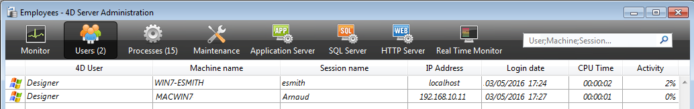
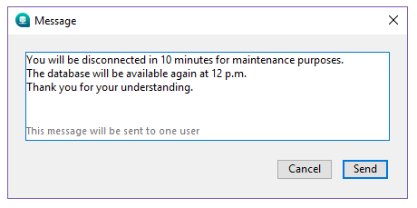

**ユーザー** ページには、サーバーに接続しているユーザーが表示されます:

"ユーザー" ボタンには、データベースに接続中のユーザ数が括弧内に表示されます (この番号は、ウィンドウに適用される表示フィルターを考慮しません)。 このページには、動的な検索エリアやコントロールボタンもあります。 ヘッダーエリアをドラッグ＆ドロップして、列の順番を入れ替えることができます。

また、ヘッダーをクリックすると、リストの値が並べ替えられます。 クリックするごとに昇順/降順が入れ替わります。

## ユーザーリスト

サーバーに接続したユーザーごとに、以下の情報がリストに表示されます:

- システム: クライアントマシンのシステム (macOS/Windows)。
- **4Dユーザー**: 4Dユーザー名、またはユーザーマシン上で [`SET USER ALIAS`](https://doc.4d.com/4dv19/help/command/ja/page1666.html) コマンドで設定されていればエイリアス。 パスワードシステムが有効になっていない場合、かつエイリアスも設定されていなければ、すべてのユーザーは "Designer" となります。
- **マシン名**: リモートマシンの名前。
- **セッション名**: リモートマシン上で開かれたセッション名。
- **IP アドレス**: リモートマシンの IPアドレス。
- **ログイン日**: リモートマシンが接続した日付と時刻。
- **CPU時間**: 接続してからこのユーザーが消費した CPU の時間
- **Activity**: 4D Server がこのユーザーのために使用する時間の割合 (動的表示)。 リモートマシンがスリープモードに切り替わっている場合には "スリープ中" と表示 (以下参照)。

### スリープ中ユーザーの管理

4D Server は、サーバーマシンへのアクセスがアクティブである間にスリープモードへと切り替わってしまった 4Dリモートアプリケーションを実行しているマシンについて、特別な管理をします。 この場合、接続されている 4Dリモートアプリケーションはこの急な切断を 4D Server へと自動的に知らせます。 サーバー側では、接続しているユーザーのアクティビティステータスを **スリープ中** へと変更されます:

このステータスはサーバー側のリソースを一部解放します。 これに加え、4Dリモートアプリケーションはスリープモードから復帰したときに自動的に 4D Server へと再接続します。

サポートされるシナリオは、以下の様なものです: たとえばお昼休みなどでリモートユーザーが作業を中断するも、サーバーとの接続は開いたままにしたとします。 マシンはスリープモードへと切り替わります。 ユーザーが戻ってきてマシンをスリープから復帰させると、4Dリモートアプリケーションは自動的にサーバーへの接続を復元するとともにセッションコンテキストも復元します。

> スリープ状態のリモートセッションは、48時間活動しないとサーバーから自動的に切断されます。 このデフォルトのタイムアウトを変更するには、[`SET DATABASE PARAMETER`](https://doc.4d.com/4dv19/help/command/ja/page642.html) コマンドの `Remote connection sleep timeout` セレクターを使用します。

## 検索/フィルターエリア

この機能を使用して、検索エリアに入力されたテキストに対応する行だけをリストに表示させ、行数を減らすことができます。 エリアには、どの列に対して検索/フィルターが実行されるかが表示されています。 ユーザーページでは、4D ユーザー、マシン名、そしてセッション名です。

エリアにテキストが入力されると、リストはリアルタイムで更新されます。 値をセミコロンで区切ることで、一つ以上の値を使用して検索をおこなうことができます。 この場合 `OR` タイプの演算がおこなわれます。 たとえば、"John;Mary;Peter" と入力すると、John または Mary または Peter が対象となる列にある行のみが表示されます。

## 管理ボタン

このページには 3つのコントロールボタンがあります。 これらのボタンは、最低 1つの行が選択されているときに有効になります。 **Shift**キーを押しながらクリックして連続した行を、あるいは **Ctrl** (Windows) / **Command** (macOS) キーを押しながらクリックして連続しない行を複数選択できます。

### メッセージ送信

このボタンを使用して、ウィンドウで選択した 4Dユーザーにメッセージを送信できます。 ユーザーが選択されていないと、ボタンを使用できません。 ボタンをクリックするとダイアログボックスが表示され、メッセージを入力できます。 ダイアログにはメッセージを受信するユーザーの数が表示されます:

クライアントマシン上でこのメッセージは警告メッセージとして表示されます。

> [`SEND MESSAGE TO REMOTE USER`](https://doc.4d.com/4dv19/help/command/ja/page1632.html) コマンドを使用することでも、リモートユーザーに対して同じアクションを実行することができます。

### プロセス監視

このボタンをクリックすると、選択されたユーザーのプロセスを、管理ウィンドウの [**プロセス** ページ](processes.md) に直接表示させることができます。 ボタンをクリックすると、4D Server はプロセスページに移動し、このページの検索/フィルターエリアに選択されたユーザー名を入力します。

### ユーザーをドロップ

このボタンは、選択したユーザーの接続を強制的に解除するために使用します。 このボタンをクリックすると警告ダイアログが表示され、接続解除を実行するかキャンセルするか選択できます。確認ダイアログなしに選択ユーザーの接続を解除するには、**Alt**キーを押しながら、**ユーザーをドロップ** ボタンをクリックします。

> [`DROP REMOTE USER`](https://doc.4d.com/4dv19/help/command/ja/page1633.html) コマンドを使用することでも、リモートユーザーに対して同じアクションを実行することができます。
