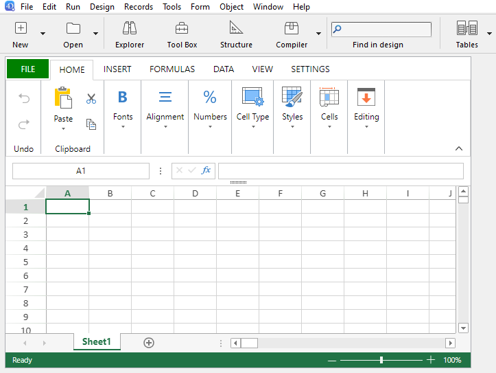

4D View Pro は、[4D フォームエリア](FormObjects/viewProArea_overview.md) と専用の [コマンド](commands.md) が含まれる [4Dコンポーネント](Concepts/components.md) です。 これにより、先進的なスプレッドシート機能をプロジェクトに埋め込むことが可能です。



スプレッドシートとは、セルのグリッドを格納したアプリケーションのことで、これらのセルに情報を入力したり、計算を実行させたり、あるいはピクチャーを表示したりすることができます。 4D View Proは、4Dに統合された [SpreadJS スプレッドシートソリューション](https://developer.mescius.com/spreadjs) に基づいて動作します。<br />
(4D View Pro のツールバー等のインターフェースは SpreadJS 提供のものです。インターフェース上で "テーブル" という用語が使用されますが、4D でテーブルといえばデータベーステーブルを指すため、当マニュアルではこれを便宜上 "表組み" あるいは "表" と呼んで区別します）

フォームに 4D View Pro エリアを埋め込むことで、4D View Pro コマンドを使ってスプレッドシートドキュメントを読み込んだり書き出したりすることができます。

## インストールとアクティベーション

4D View Pro 機能は 4D に直接含まれているため、配布と運用が容易です。 追加のインストールは必要ありません。

しかしながら、4D View Pro はライセンスを必要とします。 これらの機能を使用するには、アプリケーションにおいて当該ライセンスを有効化しておく必要があります。 4D View ライセンスがインストールされていない場合、4D View Pro 機能を必要とするオブジェクトのコンテンツはランタイムでは表示されず、エラーメッセージだけが表示されます:


## 4D View Pro エリアを挿入する

4D View Pro ドキュメントは 4D View Pro という名前の [4Dフォームオブジェクト](FormObjects/viewProArea_overview.md) 内に表示され、手動で編集されます。 このオブジェクトを選択するには、オブジェクトバーの最後のツールをクリックします:


また、[オブジェクトライブラリ](FormEditor/objectLibrary.md) であらかじめ設定された 4D View Pro エリアを選択することもできます。

> 4D View Pro エリアは、[オフスクリーンでも作成・使用する](commands/vp-run-offscreen-area.md) ことができます。

[エリアの設定](configuring.md) は、プロパティリストと 4D View Pro コマンドを使っておこないます。

## セレクション、入力、およびナビゲージョンの基本

スプレッドシートは行と列から構成されています。 各行には番号が割り当てられています。 各列には文字 (アルファベットの文字数を超えた場合には文字のグループ) が割り当てられています。 行と列の交差する場所がセルと呼ばれます。 セルを選択したり、そのコンテンツを編集したりすることができます。

### セル、列、および行の選択

- セルを選択するには、単にセルをクリックするか、キーボードの矢印キーを使用します。 その中身 (あるいは式) がセル内に表示されます。

- 複数の連続したセルを選択するには、マウスをセレクションの端から端へとドラッグします。 また、Shiftキーを押しながらセレクションの二つの端をクリックすることでも選択可能です。

- スプレッドシート内のセルをすべて選択するには、エリアの左上端にあるセルをクリックします:
  

- 列を選択するには、対応する文字 (アルファベット) をクリックします。

- 行を選択するには、対応する番号をクリックします。

- 連続していないセルを複数選択するには、**Ctrl**キー (Windows) あるいは **Command**キー (macOS) を押しながら、選択したいセルをそれぞれクリックします。

- セルの選択を解除するには、スプレッドシート内のどこかをクリックすれば選択解除されます。

### データの入力

セルをダブルクリックすると、そのセル内で入力モードに入ります。 セルが空でない場合、挿入カーソルはセルのコンテンツの最後に置かれます。


セルが選択されていれば、たとえ挿入カーソルが非表示であってもデータを直接入力することができます。 その場合、入力した内容はセルのコンテンツを上書きします。

**Tab**キーはセルの内容を確定し、一つ右のセルを選択します。 **Shift + Tab**キーの組み合わせでは、セル入力を確定したあと、一つ左のセルを選択します。

**キャリッジリターン**キーはセルの入力を確定し、一つ下のセルを選択します。 **Shift + キャリッジリターン**キーの組み合わせで、セル入力を確定したあと、一つ上のセルを選択します。

方向キー (矢印) を使用すると、矢印の方向へとセルの選択を移動することができます。

### コンテキストメニューの使い方

4D View Pro エリアでは、コピー/ペーストといた標準の編集機能だけでなく、基本的なスプレッドシート機能も備えている自動コンテキストメニューを利用することができます:


> コンテキストメニューのコピー/カット/ペースト機能はスプレッドシートエリア内でのみ動作し、システムのペーストボードにはアクセスしません。 しかしながら、**Ctrl+c/Ctrl+v** といったシステムショートカットは動作し、エリアと他のアプリケーション間でデータを交換するために使用することが可能です。

クリックしたエリアに応じて、メニューには次の選択肢が表示されます:

- 列や行のヘッダーをクリックした場合: コンテンツの **挿入**、**削除**、**非表示**、**再表示**
- セルあるいはセルレンジのクリック:
  - **フィルタリング**: フィルタリングを使用して行を非表示にします ([SpreadJS ドキュメント](https://developer.mescius.com/spreadjs/docs/) の "Filtering rows" を参照ください)
  - **ソート**: 列のコンテンツを並べ替えます。
  - **コメントの挿入**: ユーザーコメントを入力できます。 コメントが入力されているセルには、小さな赤い三角形が表示されます:\
    

## 4D View Pro コマンドの使い方

4D View Pro コマンドは、ほかの 4Dランゲージコマンドと同様に 4D のコードエディターにて使用することができます。

4D View Pro はビルトインの 4Dコンポーネントであるため、そのコマンドの一覧はエクスプローラーにおいて、メソッドページの **コンポーネントメソッド** 内に表示されます:


詳細な一覧については [コマンド](commands.md) を参照ください。

### 4D View Proのエリアの操作

4D View Pro エリアは、複数のオブジェクトや要素を扱います。


ほとんどの 4D View Pro コマンドは、[4D View Pro のフォームエリア名](FormObjects/viewProArea_overview.md) (4Dフォームオブジェクト) を _vpAreaName_ 引数として必要とします。 このエリア名は、[オブジェクト名](FormObjects/properties_Object.md#オブジェクト名) プロパティの値のことです。

たとえば、"myVpArea" という名前の 4D View Pro エリアの列数を設定するには、次のように書きます:

```4d
VP SET COLUMN COUNT("myVpArea";5)
```

> フォームエリアへの 4D View Pro オブジェクトの読み込みが完了すると、4D は [On VP Ready](../Events/onVpReady.md) フォームイベントを生成します。 エリアを操作する 4D View Pro コードはこのイベント内で実行する必要があります。 そうでない場合はエラーが返されます。

### レンジオブジェクトの使い方

4D View Pro のコマンドの中には、_rangeObj_ 引数を必要とするものがあります。 4D View Pro におけるレンジとは、スプレッドシート内の特定のエリアを参照するオブジェクトです。 このエリアは、1つ以上のセルで構成されます。 4D View Pro コマンドを使って、作成したレンジを他のコマンドに受け渡し、ドキュメントの特定箇所に対して読み取りや書き込み操作をおこなうことができます。

たとえば、次のセルに対応するレンジオブジェクトを作成したい場合:


[VP Cells](commands/vp-cells.md) コマンドを使用できます:

```4d
var $myRange : Object
$myRange:=VP Cells("ViewProArea";2;4;2;3) // C5 から D7
```

その後、`$myRange` を別の 4D View Pro コマンドに渡して、これらのセルを変更することができます (たとえば、[VP SET BORDER](commands/vp-set-border.md) でに境界線を追加します)。

4D View Pro のレンジオブジェクトは、いくつかのプロパティで構成されます:

- area - 4D View Pro エリアの名称
- ranges - レンジオブジェクトのコレクション。 各レンジオブジェクトで利用できるプロパティは、レンジオブジェクトの種類によって異なります。 たとえば、列のレンジオブジェクトには、_.column_ と _.sheet_ プロパティしか含まれません。

| プロパティ  |                                                                                       | 型          | 説明                                                         | 利用可能な対象                                            |
| ------ | ------------------------------------------------------------------------------------- | ---------- | ---------------------------------------------------------- | -------------------------------------------------- |
| area   |                                                                                       | text       | 4D View Pro フォームオブジェクト名                                    | 常に利用可能                                             |
| ranges |                                                                                       | collection | レンジのコレクション                                                 | 常に利用可能                                             |
|        | \[ ].name        | text       | レンジ名                                                       | name                                               |
|        | \[ ].sheet       | number     | シートのインデックス (デフォルトではカレントシートのインデックス; 0起点) | cell, cells, row, rows, column, columns, all, name |
|        | \[ ].row         | number     | 行のインデックス (0起点)                          | cell, cells, row, rows                             |
|        | \[ ].rowCount    | number     | 行の数                                                        | cells, rows                                        |
|        | \[ ].column      | number     | 列のインデックス (0起点)                          | cell, cells, column, columns                       |
|        | \[ ].columnCount | number     | 列の数                                                        | cells, columns                                     |

## ドキュメントのインポートとエクスポート

4D View Pro は、複数のドキュメント形式のインポートおよびエクスポートに対応しています:

- .4vp
- .xlsx
- .txt と .csv
- .sjs
- .pdf (エクスポートのみ)

詳細については [VP IMPORT DOCUMENT](commands/vp-import-document.md) と [VP EXPORT DOCUMENT](commands/vp-export-document.md) の説明を参照ください。
