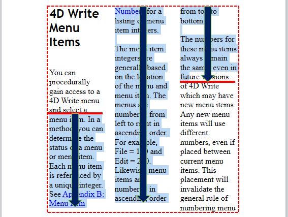

<!--REF #_command_.WP Get position.Syntax-->**WP Get position** ( *targetObj* {; *layout*} ) -> 戻り値<!-- END REF-->
<!--REF #_command_.WP Get position.Params-->
| 引数 | 型 |  | 説明 |
| --- | --- | --- | --- |
| targetObj | Object | &#8594;  | 4D Write Pro ドキュメント、レンジ または 要素 |
| layout | Integer | &#8594;  | 評価の際に使用される4D Write Pro ドキュメントのレイアウト: 0(デフォルト)=4D Write Pro レイアウト、 1=HTML WYSIWYG |
| 戻り値 | Object | &#8592; | 位置情報 |

<!-- END REF-->

#### 説明 

<!--REF #_command_.WP Get position.Summary-->**WP Get position** コマンドは、*targetObj* 引数で指定したターゲットのカレントの位置を説明するオブジェクトを返します。<!-- END REF-->

*targetObj* 引数には、以下のものを渡すことができます:

* レンジ
* 要素(表 / 行 / 段落 / 本文 / ヘッダー / フッター / ピクチャー/セクション/サブセクション / テキストボックス)
* 4D Write Pro ドキュメント

このコマンドは位置の情報を、以下のプロパティを持つオブジェクトとして返します:

| **プロパティ名**  | **型**  | **詳細**                                                                                                                   |
| ----------- | ------ | ------------------------------------------------------------------------------------------------------------------------ |
| section     | 数値     | *targetObj* 引数と交錯する最初のセクションの番号                                                                                           |
| page        | 数値     | *targetObj* 引数と交錯する最初のページの番号                                                                                             |
| column      | 数値     | *targetObj* 引数と交錯する最初のカラムのインデックス(1-based)                                                                                |
| line        | 数値     | *targetObj* 引数と交錯する最初の行のインデックス(カラム(あるいはカラムがない場合にはページ)に対して相対的 - 1-based)                                                  |
| position    | 数値     | *targetObj* 引数の最初の文字の、行の中での位置(1-based)                                                                                   |
| bounds      | オブジェクト | *targetObj* 引数の境界線の四角形の座標。*page* の左上端を起点として、カレントのドキュメント単位で相対的に表現されます。パディングとボーダーのサイズは(あれば)考慮に入れられます。マージンとルーラーは考慮に入れられません。 |
| top         | 数値     | 四角形の上端の座標                                                                                                                |
| left        | 数値     | 四角形の左端の座標                                                                                                                |
| bottom      | 数値     | 四角形の下端の座標                                                                                                                |
| right       | 数値     | 四角形の右端の座標                                                                                                                |
| rangeHeight | 数値     | *targetObj* 引数の境界線の四角形の高さ。この値は、*targetObj* が複数のカラムにまたがっている場合には、*bounds.bottom-bounds.top* の値と異なる可能性があります(例題4参照)          |

*targetObj* 引数が空レンジの場合、**WP Get position** はレンジの開始位置情報を返します。デフォルト型(テキスト)の空のレンジであった場合、レンジの高さ(*rangeHeight* あるいは *bounds.bottom*\-*bounds.top*) はカーソルの高さで、レンジの幅(*bounds.right*\-*bounds.left*) は1ピクセルとなる点に注意して下さい。   
*targetObj* 引数がヘッダーあるいはフッター内のテキストである場合、**WP Get position** はヘッダー/フッターが最初のセクション/ページ内にて表示されている位置情報を返します。  
*targetObj* 引数が(複数のページに複製可能な)アンカーされた画像である場合、**WP Get position** は画像が最初のセクション/ページ内にてアンカーされている位置情報を返します。  
*targetObj* 引数がサブセクションである場合、**WP Get position** は親セクションの最初のページの位置情報を返します。

任意の*layout* 引数を使用すると、*targetObj* の評価にHTML wysiwyg ビューを設定することができます。"4D Write Pro"テーマ内にある、以下の定数のいづれか1つを渡すことができます:

| 定数                     | 型    | 値 | コメント                                                       |
| ---------------------- | ---- | - | ---------------------------------------------------------- |
| wk 4D Write Pro layout | 倍長整数 | 0 | 標準の4D Write Proレイアウト。いくつかの特定のスタイル属性を含める事ができます。             |
| wk html wysiwyg        | 倍長整数 | 1 | このレイアウトでは、4D Write Proの高度な属性のうち、全てのブラウザで互換性があるもの以外は除去されます。 |

*layout* 引数が省略された場合、デフォルトでは4D Write Pro レイアウトが使用されます。

**パフォーマンスに関する注意**

* **WP Get position** では、[WP PRINT](wp-print.md) コマンドと同じビュー設定が使用されます:  
   * ヘッダー: 表示  
   * フッター: 表示  
   * 式: 計算されて表示  
   * ページモード: ページあるいは下書き(HTML wysiwyg ビューはコマンドによって定義された通りです)  
*targetObj* が4D Write Pro フォームエリアに表示されている場合、必ずエリアのビュー設定とコマンドのビュー設定が同じ情報を返すように設定が一致しているようにしてください。また、これらの情報がエリア内で異なっていた場合、4D Write Pro はコマンドを呼び出すたびにレイアウトを計算するためにドキュメントを"クローン"しなければならず、そのため時間がかかる可能性があることに注意してください。パフォーマンス上の理由から、こういった場合にはドキュメントをオフラインでビルドし、ビルドが完成したあとにドキュメントをフォームオブジェクトにコピーすることが推奨されます。
* このコマンドは、頻繁に生成されるようなイベント内(例えばOn After Edit など)内から呼び出されるべきではありません。何故なら例えば*result.rangeHeight* などは、毎回イベントごとに時間のかかるレンダリング計算をする必要があるからです。

#### 例題 1 

レンジのページ番号を調べたい場合を考えます:

```4d
 var $range;$rangePosition : Object
 $range:=WP Text range(WParea) //ユーザーセレクションからレンジを取得
 $rangePosition:=WP Get position($range;wk 4D Write Pro layout)
 ALERT("First page number in selection is "+String($rangePosition.page))
```

#### 例題 2 

ドキュメントの最初のページと最後のページにおいて、テキストカラーを青に設定したい場合を考えます:

```4d
 var $nbPages : Integer
 var $body : Object
 var $_paragraphs : Collection
 
 $nbPages:=WP Get page count([DOC]Sample)
 $body:=WP Get body([DOC]Sample)
 $_paragraphs:=WP Get elements($body;wk type paragraph)
 For each($paragraph;$_paragraphs)
    $info:=WP Get position($paragraph)
    If($info.page=1)|($info.page=$nbPages) //最初のページと最後のページのテキストカラーは青に
       WP SET ATTRIBUTES($paragraph;wk text color;"blue")
    Else //他のページはテキストカラーは黒に
       WP SET ATTRIBUTES($paragraph;wk text color;"black")
    End if
 End for each
```

#### 例題 3 

ドキュメントをビルドする際、段落がページで分割されることを避けたい場合を考えます:

```4d
 var WParea;$body : Object
 var $_paragraphs : Collection
 WParea:=WP New
 
 $body:=WP Get body([DOC]Sample)
 $_paragraphs:=WP Get elements($body;wk type paragraph)
 
 For each($paragraph;$_paragraphs)
    $insert:=WP New($paragraph)
 
  //カレントのレンジとページ番号を記憶
    $rangeBefore:=WP Text range(WParea;wk end text;wk end text)
    $info:=WP Get position($rangeBefore)
    $memoPage:=$info.page
 
  //コンテンツを挿入、レンジには含めない
    WP INSERT DOCUMENT($rangeBefore;$insert;wk append;wk exclude from range)
 
  //挿入後の位置をチェック
    $rangeAfter:=WP Text range(WParea;wk end text;wk end text)
    $info:=WP Get position($rangeAfter)
 
    If($memoPage#$info.page) // ページが変化していた場合、改ページを追加
       WP INSERT BREAK($rangeBefore;wk page break;wk replace)
    End if
 
 End for each
```

#### 例題 4 

以下の例題では、*targetObj* 引数に応じて返される、境界線の四角形の座標について説明しています。

```4d
 $default:=WP Text range(WPArea) //デフォルト(テキスト)のレンジ
 $textCoordinates:=WP Get position($default) //赤の破線
 
 $paragraph:=WP Create paragraph range($default) //段落のレンジ
 $paraCoordinates:=WP Get position($paragraph) // 緑の破線
```


*赤の破線:* *$textCoordinates オブジェクトの値* 
*緑の破線: $* *paraCoordinates オブジェクトの値* 

**注:** 複数のカラムを表示していた場合、*rangeHeight* プロパティ(太線)は、*bounds.bottom*\-*bounds.top* プロパティ(破線)より大きくなる可能性があります:



#### 参照 

[WP PRINT](wp-print.md)  