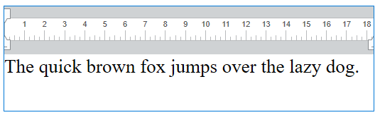

<!--REF #_command_.WP SET TEXT.Syntax-->**WP SET TEXT** ( *targetObj* ; *newText* ; *textPosition* {; *rangeUpdate*} )<!-- END REF-->
<!--REF #_command_.WP SET TEXT.Params-->
| 引数 | 型 |  | 説明 |
| --- | --- | --- | --- |
| targetObj | Object | &#8594;  | レンジオブジェクト |
| newText | Text | &#8594;  | 挿入するテキスト |
| textPosition | Number | &#8594;  | 挿入位置(置き換え、前、後) |
| rangeUpdate | Number | &#8594;  | 挿入されたコンテンツをレンジに含める、あるいは含めない |

<!-- END REF-->

#### 説明 

<!--REF #_command_.WP SET TEXT.Summary-->**WP SET TEXT** コマンドは、*newText* 引数に渡されたテキストを、*targetObj* 引数で指定したターゲット内の、*textPosition* 引数で指定された位置に標準テキストとして挿入します。<!-- END REF-->

*targetObj* 引数には、テキストが挿入される位置を指定するオブジェクトを渡します。レンジは4D Write Pro ドキュメント内の明示的な位置も取れますし、ユーザーの選択に基づいた位置も選択できます。以下のものを渡すことができます:

* レンジ
* 要素(表 / 行 / 段落 / 本文 / ヘッダー / フッター / インライン画像 / セクション / サブセクション)
* 4D Write Pro ドキュメント

*newText* 引数には*targetObj* 引数で指定したレンジ内に挿入されるテキストを渡します。**WP SET TEXT** は標準テキストのみを挿入します。書かれた通りにテキストを挿入しますが、スタイルタグは除外されます。

*textPosition* 引数には、挿入されるテキストの位置を指定する、以下のセレクターのいずれかを渡すことができます:

| 定数         | コメント                 |
| ---------- | -------------------- |
| wk append  | コンテンツをターゲットの終わりに挿入する |
| wk prepend | コンテンツをターゲットの始めに挿入する  |
| wk replace | ターゲットのコンテンツを置き換える    |

* *targetObj* がレンジの場合、任意の*rangeUpdate* 引数を使用して以下の定数のいづれかを渡すことで、挿入されたコンテンツが返されるレンジ内に含まれるかどうかを指定することができます:  
    
| 定数                    | コメント                      |  
| --------------------- | ------------------------- |  
| wk exclude from range | 更新されたレンジには、以前のコンテンツのみを含める |  
| wk include in range   | 更新されたレンジに挿入コンテンツを含める      |  
    
*rangeUpdate* 引数を省略した場合、デフォルトでは挿入された小運転つは返されるレンジ内に含まれます。
* *targetObj* 引数がレンジじゃない場合、*rangeUpdate* 引数は無視されます。

#### 例題 

以下のドキュメントにテキストを追加したい場合を考えます:



*targetObj* が4D Write Pro ドキュメントの場合:

```4d
 WP SET TEXT(myDoc;" Hello world!";wk append)
  //実行すると "The quick brown fox jumps over the lazy dog. Hello world!"
```

*targetObj* がレンジの場合:

既存のテキストの前に挿入:

```4d
 $range:=WP Text range(myDoc;wk start text;wk end text)
 WP SET TEXT($range;" Hello world!";wk prepend)
  //書き換えたあとは " Hello world! The quick brown fox jumps over the lazy dog."となる
```

既存のテキストの後に挿入:  

```4d
 $range:=WP Text range(myDoc;wk start text;wk end text)
 WP SET TEXT($range;" Hello world!";wk append)
  //書き換えたあとは "The quick brown fox jumps over the lazy dog. Hello world!"となる
```

既存のテキストを置き換える:  

```4d
 $range:=WP Text range(myDoc;wk start text;wk end text)
 WP SET TEXT($range;" Hello world!";wk replace)
  //書き換えたあとは" Hello world!"となる
```

#### 参照 

[WP Get text](wp-get-text.md)  