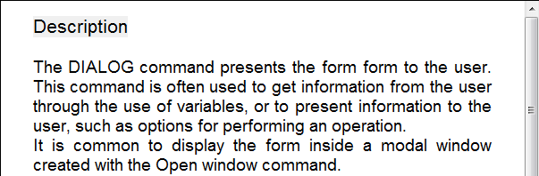

<!--REF #_command_.WP Text range.Syntax-->**WP Text range** ( *targetObj* ; *startRange* ; *endRange* ) -> 戻り値<!-- END REF-->
<!--REF #_command_.WP Text range.Params-->
| 引数 | 型 |  | 説明 |
| --- | --- | --- | --- |
| targetObj | Object | &#8594;  | 4D Write Pro ドキュメント、レンジ または 要素 |
| startRange | Integer | &#8594;  | エリア内でのレンジの開始のオフセット |
| endRange | Integer | &#8594;  | エリア内でのレンジの終わりのオフセット |
| 戻り値 | Object | &#8592; | レンジオブジェクト |

<!-- END REF-->

#### 互換性に関する注意 

<!--REF #_command_.WP Text range.Summary-->**WP Text range** は、以前のバージョンの4D Write Proでは**WP Create range** という名前でした。<!-- END REF-->分かりやすさのために名前が変更されています。

#### 説明 

**WP Text range**コマンドは*targetObj* 引数の4D Write Proエリア内から、*startRange* と*endRange* の間に含まれるセレクションを新しいレンジオブジェクトを返します。

**4D Write Pro レンジオブジェクト**を使用するとテキストのセレクションの属性を管理することができます(具体的には[WP GET ATTRIBUTES](../commands/wp-get-attributes.md) and [WP SET ATTRIBUTES](../commands/wp-set-attributes.md) コマンドを使用します)。詳細な情報については、*セレクションレンジコマンド* の段落を参照してください。

*targetObj* 引数には以下のものを渡すことができます:

* レンジ
* 要素 (テーブル / 行 / 段落 / インラインピクチャー / 本文 / ヘッダー / フッター / セクション / サブセクション )
* 4D Write Pro ドキュメント

*targetObj* 引数に有効なオブジェクトが渡されなかった場合、空のレンジが返されます。

*startRange* と*endRange* 引数には、ドキュメント内で選択したい文字の最初の位置と最後の位置に対応する値を渡します。*startRange* 引数にwk start text 定数を渡す事でドキュメントの最初を、*endRange* 引数にwk end text 定数を渡す事でドキュメントの最後を指定する事ができます。4D Write Proドキュメントは表示されているテキストだけではなく範囲内に含まれるフォーマットタグもあるという点に注意して下さい。

**注:* targetObj* 引数に、テーブル、行、段落、インライン画像、本文、ヘッダー、フッター、セクションまたはサブセクションの要素参照を渡した場合、*startRange* と*endRange* 引数は、レンジの要素の開始・終了インデックスに相対的なものになります。例えば、ヘッダーが渡された場合、wk start text はヘッダーの最初の文字を指定し、wk end text はヘッダーの最後の文字を指定します。テーブル要素参照が渡された場合、コマンドは、*targetObj* 引数で参照されているテーブルに相対的なテキストレンジを返します。セクションが渡された場合、*startRange* および *endRange* 引数はドキュメント本文(セクションから作成されたレンジの親エリア)に対して相対的なものになります。詳細は例題2を参照してください。

#### 例題 1 

4D Write Proフィールドの、最初から数えて12文字のレンジを選択したい場合を考えます。フィールドはフォームオブジェクト内に表示されているとします:


以下のコードを実行した場合:

```4d
 $range2:=WP Get range([SAMPLE]WP;wk start text;12)
 WP SELECT(*;"WParea";$range2)
```

...結果は以下の画像のようになります:



#### 例題 2 

セクションからレンジを作成したい場合を考えます:

```4d
 var $wpRange : Object
 $wpRange:=WP Text range(wpSection;1;11) //セクションの最初の10文字からなるレンジを返す
  //セクションがドキュメントの100文字目から始まる場合:
  //$wpRange.start = 100
  //$wpRange.end = 111
```

#### 参照 

[WP Bookmark range](wp-bookmark-range.md)  
[WP Get body](wp-get-body.md)  
[WP Get header](wp-get-header.md)  
[WP Paragraph range](wp-paragraph-range.md)  
[WP Picture range](wp-picture-range.md)  
[WP SELECT](wp-select.md)  
[WP Selection range](wp-selection-range.md)  
[WP Table range](wp-table-range.md)  