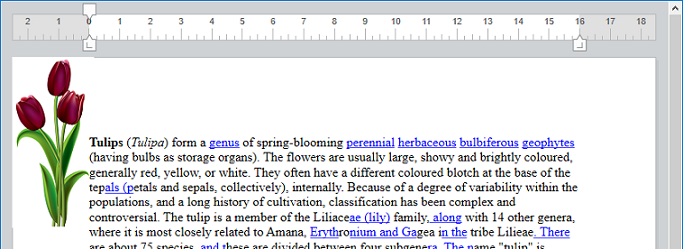

<!--REF #_command_.WP Add picture.Syntax-->**WP Add picture** ( *wpDoc* {; *picture*} ) : Object<br/>**WP Add picture** ( *wpDoc* {; *picturePath*} ) : Object<br/>**WP Add picture** ( *wpDoc* {; *pictureFileObj*} ) : Object<!-- END REF-->

<!--REF #_command_.WP Add picture.Params-->

| 引数             | 型                       |                             | 説明                                         |
| -------------- | ----------------------- | --------------------------- | ------------------------------------------ |
| wpDoc          | Object                  | &#8594; | 4D Write Pro ドキュメント                        |
| picture        | Picture                 | &#8594; | ピクチャー                                      |
| picturePath    | Text                    | &#8594; | ピクチャーパス                                    |
| pictureFileObj | 4D.File | &#8594; | ピクチャーファイルを表す4D.File オブジェクト |
| 戻り値            | Object                  | &#8592; | ピクチャーを参照しているオブジェクト                         |

<!-- END REF-->

#### 説明

**WP Add picture** コマンドは、<!--REF #_command_.WP Add picture.Summary--> 引数として渡されたピクチャーを*wpDoc* 引数で指定したドキュメント内での固定された場所にアンカーし、その参照を返します。<!-- END REF--> 返された参照は、[WP SET ATTRIBUTES](wp-set-attributes.md) コマンドへと渡すことで*wpDoc* 引数で指定したドキュメント内の(ページ、セクション、ヘッダー、フッター等の)任意の位置へと移動させることができます。 レイヤーやサイズなども指定可能です。 レイヤーやサイズなども指定可能です。 レイヤーやサイズなども指定可能です。 レイヤーやサイズなども指定可能です。

*wpDoc* 引数には、4D Write Pro ドキュメントオブジェクトを渡します。

オプションの第二引数には、次のいずれかを渡すことができます:

- *picture*: 4D ピクチャー
- *picturePath*:  ディスク上に保存されているピクチャーファイルへのパスを格納した文字列(システムのシンタックス) *picturePath*:  ディスク上に保存されているピクチャーファイルへのパスを格納した文字列(システムのシンタックス) You can pass a full pathname, or a pathname relative to the database structure file. *picturePath*:  ディスク上に保存されているピクチャーファイルへのパスを格納した文字列(システムのシンタックス) You can pass a full pathname, or a pathname relative to the database structure file. またファイル名を渡すこともでき、その場合、ファイルはデータベースのストラクチャーファイルと同じ階層に置かれている必要があります。 ファイル名を渡す場合には、ファイルの拡張子も指定する必要があります。 ファイル名を渡す場合には、ファイルの拡張子も指定する必要があります。 ファイル名を渡す場合には、ファイルの拡張子も指定する必要があります。
- *PictureFileObj*: ピクチャーファイルを表す`4D.File` オブジェクト

:::note

[4D でサポートされているフォーマット](../../FormEditor/pictures.md#native-formats-supported) であれば、どんなピクチャーフォーマットでも使用することができます。 [PICTURE CODEC LIST](../../commands-legacy/picture-codec-list.md) コマンドを使用することで、利用可能なピクチャーフォーマットの一覧を取得することができます。 ピクチャーに複数のフォーマット(コーデック)が格納されている場合、4D Write Pro はドキュメント内に表示用に1種類、印刷用に1種類(異なる場合)のフォーマットのみを保管します。その際、「最適」なフォーマットが自動的に選択されます。 [PICTURE CODEC LIST](../../commands-legacy/picture-codec-list.md) コマンドを使用することで、利用可能なピクチャーフォーマットの一覧を取得することができます。 ピクチャーに複数のフォーマット(コーデック)が格納されている場合、4D Write Pro はドキュメント内に表示用に1種類、印刷用に1種類(異なる場合)のフォーマットのみを保管します。その際、「最適」なフォーマットが自動的に選択されます。 [PICTURE CODEC LIST](../../commands-legacy/picture-codec-list.md) コマンドを使用することで、利用可能なピクチャーフォーマットの一覧を取得することができます。 ピクチャーに複数のフォーマット(コーデック)が格納されている場合、4D Write Pro はドキュメント内に表示用に1種類、印刷用に1種類(異なる場合)のフォーマットのみを保管します。その際、「最適」なフォーマットが自動的に選択されます。

:::

- *picture* 引数が省略された場合でも、有効なピクチャー参照は返され、空の画像が追加されます。 *picture* 引数が省略された場合でも、有効なピクチャー参照は返され、空の画像が追加されます。 この場合、その後に[WP SET ATTRIBUTES](wp-set-attributes.md) コマンドをwk image expression セレクターで呼び出すことでその画像に4D 式を入れることができます。 式が評価できない、あるいは有効なピクチャーが返されない場合、空の画像(デフォルトの黒枠の画像)が表示されます。 式が評価できない、あるいは有効なピクチャーが返されない場合、空の画像(デフォルトの黒枠の画像)が表示されます。

デフォルトでは、追加されたピクチャーは以下のように表示されます:

- テキストの後ろに埋め込み
- ペーパーボックスの左上隅に表示
- 全てのページに表示

位置、レイヤー(インライン、テキストの前/後)、表示状態、その他ピクチャーのあらゆるプロパティは[WP SET ATTRIBUTES](wp-set-attributes.md) コマンド、または標準アクションを使用して変更することができます(*4D Write Pro 標準アクションを使用*を参照してください)。

**注意:** [WP Selection range](../commands-legacy/wp-selection-range.md) コマンドは、アンカーされたピクチャーが選択されていた場合には*ピクチャー参照* を、インラインピクチャーが選択されていた場合には*レンジオブジェクト* を返します。 選択されたオブジェクトがピクチャーオブジェクトであるかどうかは、`wk type` 属性をチェックすることで確認できます。 選択されたオブジェクトがピクチャーオブジェクトであるかどうかは、`wk type` 属性をチェックすることで確認できます。 選択されたオブジェクトがピクチャーオブジェクトであるかどうかは、`wk type` 属性をチェックすることで確認できます。

- **Value = 2**: 選択されたオブジェクトはピクチャーオブジェクトです。
- **Value = 0**: 選択されたオブジェクトはレンジオブジェクトです。

#### 例題 1

ファイルパスを使用して、デフォルトの設定でピクチャーを追加したい場合を考えます。

```4d
 var $obPict : Object
 $obPict:=WP Add picture(myDoc;"/PACKAGE/Pictures/Saved Pictures/Sunrise.jpg")
```

結果は以下のようになります:


#### 例題 2

リサイズされたピクチャーを、ヘッダーの中央にアンカーして追加したい場合を考えます:

```4d
 var $obImage : Object
 var $myPictureFile : 4D.File

 $myPictureFile:=File("/PACKAGE/Pictures/Saved Pictures/Sunrise.jpg")
 $obImage:=WP Add picture(myDoc;$myPictureFile)
 WP SET ATTRIBUTES($obImage;wk anchor origin;wk header box)
 WP SET ATTRIBUTES($obImage;wk anchor horizontal align;wk center)
 WP SET ATTRIBUTES($obImage;wk anchor vertical align;wk center)
 WP SET ATTRIBUTES($obImage;wk width;"650px";wk height;"120px")
```

結果は以下のようになります:


#### 例題 3

フィールド式を使用して、アンカーされた画像を、データベースからのテキストを表示するドキュメントに追加したい場合を考えます:

```4d
 QUERY([Flowers];[Flowers]Common_Name="tulip")
 WP SET TEXT(myDoc;[Flowers]Description;wk append) //テキストを挿入する
 var $obImage : Object
 $obImage:=WP Add picture(myDoc)
 WP SET ATTRIBUTES($obImage;wk image formula;Formula([Flowers]Image))
```



#### 参照

[WP DELETE PICTURE](../commands-legacy/wp-delete-picture.md)</br>
[WP Picture range](../commands-legacy/wp-picture-range.md)