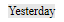

## 概要

4D Write Pro ドキュメントには、変数、フィールド、式、プロジェクトメソッドあるいは4D コマンドなどの4Dフォーミュラへの参照を含めることができます。 ページ番号などの特定の情報もフォーミュラを通して参照することができます(以下の[ドキュメントとページ式を挿入](#inserting-date-and-time-formulas) を参照してください)。

4D Write Pro エリアへのフォーミュラの挿入には[**WP INSERT FORMULA**](commands/wp-insert-formula.md) コマンドを使用し、フォーミュラの読み出しには[**WP Get formulas**](commands-legacy/wp-get-formulas.md) コマンドを使用します。 また、[**WP Get text**](commands-legacy/wp-get-text.md) コマンドを使用することでも返されます。

フォーミュラは以下のタイミングで評価されます:

- 計算された値を表示するフォームオブジェクト内に挿入されたとき
- 計算された値を表示するフォームオブジェクト内に4D Write Pro オブジェクトが読み込まれたとき
- [**WP COMPUTE FORMULAS**](commands-legacy/wp-compute-formulas.md) コマンドが呼び出された時
- [**WP FREEZE FORMULAS**](commands-legacy/wp-freeze-formulas.md) コマンドを使用して値が"固定化"(計算)されたとき(ただしまだ計算されていない場合)
- 印刷の前(ただしまだ計算されていない場合)
- .docx 形式に書き出される前(ただしフォーミュラがMS Word フォーミュラにマップすることができない場合)
- (値の)固定化、印刷、フォーミュラの計算の標準アクションが呼び出された時。 詳細は*標準アクション* を参照してください。

フォーミュラはドキュメントが([**WP New**](commands-legacy/wp-new.md) 、[**WP Insert document body**](commands/wp-insert-document-body.md) を使用して、あるいは`wpArea:=[table]field` などで)読み込まれたときでも、以下の場合には評価されません:

- ドキュメントが画面外のみにある場合
- ドキュメントが画面上に表示されているが、フォームオブジェクトが参照しか表示しない場合

フォーミュラは[**WP FREEZE FORMULAS**](commands-legacy/wp-freeze-formulas.md) コマンドを呼び出すと、静的な値になります(ただしページ番号とページ数は除く、以下参照)。

**互換性に関する注意**: [**ST INSERT EXPRESSION**](../commands-legacy/st-insert-expression.md)、 [**ST Get expression**](../commands-legacy/st-get-expression.md)、 [**ST COMPUTE EXPRESSIONS**](../commands-legacy/st-compute-expressions.md)、および [**ST FREEZE EXPRESSIONS**](../commands-legacy/st-freeze-expressions.md) コマンドを使用して式を管理するのは、廃止予定となっていますが、互換性のために4D Write Pro では引き続きサポートされています。

### 例題

4D Write Pro エリアの選択範囲を、変数の中身で置き換えたい場合を考えます:

```4d
 var fullName: Text
 var $sel: Object
 fullName:="John Smith"
 $sel:=WP Selection range(4DWPArea)
 Case of
    :(Form event code=On Clicked)
       WP INSERT FORMULA($sel;Formula(fullName);wk replace)
 End case
```

## フォーミュラコンテキストオブジェクト

[WP Insert formula](commands/wp-insert-formula.md) コマンドを使用することで、あらゆるドキュメントエリア(本文、ヘッダー、フッター)にドキュメント属性に関連した特殊な式を挿入することができます。 フォーミュラ内ではフォーミュラコンテキストオブジェクトが自動的に公開されます。 [**This**](../commands/this.md) を通してこのオブジェクトのプロパティを使用することができます:

| プロパティ                                                                          | 型      | 説明                                                                                                                                                                                                                                                                                                                                                                |
| ------------------------------------------------------------------------------ | ------ | ----------------------------------------------------------------------------------------------------------------------------------------------------------------------------------------------------------------------------------------------------------------------------------------------------------------------------------------------------------------- |
| [This](../commands/this.md).title                              | Text   | wk title 属性で定義されているタイトル                                                                                                                                                                                                                                                                                                                                           |
| [This](../commands/this.md).author                             | Text   | wk author 属性で定義されている作者                                                                                                                                                                                                                                                                                                                                            |
| [This](../commands/this.md).subject                            | Text   | wk subject 属性で定義されている主題                                                                                                                                                                                                                                                                                                                                           |
| [This](../commands/this.md).company                            | Text   | wk company 属性で定義されている会社                                                                                                                                                                                                                                                                                                                                           |
| [This](../commands/this.md).notes                              | Text   | wk notes 属性で定義されている注記                                                                                                                                                                                                                                                                                                                                             |
| [This](../commands/this.md).dateCreation                       | Date   | wk date creation 属性で定義されている作成日                                                                                                                                                                                                                                                                                                                                    |
| [This](../commands/this.md).dateModified                       | Date   | wk date modified 属性で定義されている変更日                                                                                                                                                                                                                                                                                                                                    |
| [This](../commands/this.md).pageNumber (\*) | Number | Page number as it is defined:<li>- From the document start (default) or </li><li>- From the section page start if it is defined by section page start.</li> This formula is always dynamic; it is not affected by the [**WP FREEZE FORMULAS**](commands-legacy/wp-freeze-formulas.md) command. |
| [This](../commands/this.md).pageCount (\*)  | Number | Page count: total count of pages.<br/> This formula is always dynamic; it is not affected by the [**WP FREEZE FORMULAS**](commands-legacy/wp-freeze-formulas.md) command.                                                                                                                                         |
| [This](../commands/this.md).document                           | Object | 4D Write Pro ドキュメント                                                                                                                                                                                                                                                                                                                                               |
| [This](../commands/this.md).data                               | Object | Data context of the 4D Write Pro document set by [**WP SET DATA CONTEXT**](commands-legacy/wp-set-data-context.md)                                                                                                                                                                                                                                                |
| [This](../commands/this.md).sectionIndex                       | Number | The Index of the section in the 4D Write Pro document starting from 1                                                                                                                                                                                                                                                                                             |
| [This](../commands/this.md).pageIndex                          | Number | The actual page number in the 4D Write Pro document starting from 1 (regardless of the section page numbers)                                                                                                                                                                                                                                   |
| [This](../commands/this.md).sectionName                        | 文字列    | The name that the user gives to the section                                                                                                                                                                                                                                                                                                                       |

:::note

Additional context properties are available when you work with tables. See *Handling tables* for more information.

:::

(\*) **Important**: **This.pageNumber**, **This.pageIndex** and **This.pageCount** must be used only directly in a 4D Write Pro formula (they must be present in the *formula.source* string). They will return incorrect values if they are used by the 4D language within a method called by the formula. However, they can be passed as parameters to a method called directly by the formula:

- This will work: « *formatNumber(This.pageNumber)* »
- This will NOT work: « *formatNumber* » with *formatNumber* method processing *This.pageNumber*.

For example, to insert the page number in the footer area:

```4d
 $footer:=WP Get footer(4DWP;1)
 WP INSERT FORMULA($footer;Formula(This.pageNumber);wk append)
  //Using Formula(myMethod) with myMethod processing This.pageNumber
  //would not work correctly
```

## 日付と時間フォーミュラを挿入

**Date**

When the [**Current date**](../commands-legacy/current-date.md) command, a date variable, or a method returning a date is inserted in a formula, it will automatically be transformed into text using the system date short format.

**Time**

When the [**Current time**](../commands-legacy/current-time.md) command, a time variable, or a method returning a time is inserted in a formula, it must be enclosed within a [**String**](../commands-legacy/string.md) command because time type is not supported in JSON. Consider the following examples of formulas:

```4d
  // This code is the best practice
 $formula1:=Formula(String(Current time)) //OK 
 
  // This code will work but is usually not recommended, except after "Edit formula"
 $formula2:=Formula from string("String(Current time)") //OK
 
  // Wrong code because time values would be displayed as a longint for seconds (or milliseconds), not as a time
 $formula3:=Formula from string("Current time") //NOT valid
 $formula4:=Formula(Current time) //NOT valid
 
```

## Support of virtual structure

Table and field expressions inserted in 4D Write Pro documents support the virtual structure definition of the database. The virtual structure exposed to formulas is defined through [**SET FIELD TITLES**](../commands-legacy/set-field-titles.md)(...;\*) and [**SET TABLE TITLES**](../commands-legacy/set-table-titles.md)(...;\*) commands.

When a virtual structure is defined:

- references to expressions containing fields display virtual names when the 4D Write Pro document shows references and not values.
- [**WP Get text**](commands-legacy/wp-get-text.md) returns virtual structure names if `wk expressions as source` option is set in expressions parameter.
- [WP Insert formula](commands/wp-insert-formula.md) ignores the virtual structure and always expects real table/field names

:::note

When a document is displayed in "display expressions" mode, references to tables or fields that do not belong to the virtual structure are displayed with "`?`" characters, for example `[VirtualTableName]?` when the field is not defined in the virtual structure.

:::

## Displaying formulas

You can control how formulas are displayed in your documents:

- as *values* or as *references*
- when shown as references, display source text, symbol, or name.

### References or Values

By default, 4D formulas are displayed as values. When you insert a 4D formula, 4D Write Pro computes and displays its current value.  If you wish to know which formula is used or what is its name, you need to display it as a reference.

To display formulas as references, you can:

- check the **Show references** option in the Property list (see *Configuring View properties*), or
- use the visibleReferences standard action (see *Dynamic expressions*), or
- use the [**WP SET VIEW PROPERTIES**](commands-legacy/wp-set-view-properties.md) command with the `wk visible references` selector to **True**.

Formula references can be displayed as:

- source texts (default)
- symbols
- names

### References as source texts (default)

When formulas are displayed as references, by default the source text of the formula appear in your document, with a default gray background (can be customized using the `wk formula highlight` selector).

たとえば、フォーマットを指定したカレント日付を挿入していると、デフォルトでは次の表示になります:


When you display formulas as references, the **source** of the formula is displayed:


### References as symbols

When formula source texts are displayed in a document, the design could be confusing if you work on sophisticated templates using tables for example, and when formulas are complex:


In this case, you can display formula references as  symbols, so that the document is more compact:


To display formula references as symbols, you can:

- check the **Display formula source as symbol option** in the Property list (see *Configuring View properties*), or
- use the displayFormulaAsSymbol standard action (see *Using 4D Write Pro standard actions*), or
- use the [**WP SET VIEW PROPERTIES**](commands-legacy/wp-set-view-properties.md) command with the `wk display formula as symbol` selector to **True**.

### References as names

You can assign names to formulas, making 4D Write Pro template documents easier to read and understand for end-users. When formulas are displayed as references (and not displayed as symbols) and you have defined a name for a formula, the formula name is displayed.

For example, the following formula references are displayed as source text by default:


If you assign formula names, they are displayed instead of texts:


To assign a name to a formula, you need to use the [WP Insert formula](commands/wp-insert-formula.md) command with an object parameter. 例:

```4d
  //inserts the previous day in the document
 $o:=New object("formula";Formula(Current date-1);"name";"Yesterday")
 $range:=WP Text range(WPArea;wk start text;wk end text)
 WP INSERT FORMULA($range;$o;wk append)
 
```



:::note

Only inline formulas can have a name (formulas for anchored images, break rows, and table datasource formulas cannot have names).

:::

### Formula tips

Whatever the formula display mode, you can get additional information on formulas through **tips** that are displayed when you hover on formulas.

- When formulas do not have names, tips provide the source text of formulas:

  

- When formulas have names but are displayed as values or as symbols, the tip provides the name of formulas:

  

In this context, you can display the source text of the formula by pressing **Ctrl** (Windows) or **Cmd** (macOS) while hovering on the formula.

- When formulas have names and are displayed as names, no tip is displayed by default.
  You can display the source text of the formula by pressing **Ctrl** (Windows) or **Cmd** (macOS) while hovering on the formula:
  [
  

#### 参照

[Download HDI database](http://download.4d.com/Demos/4D_v16/HDI_4DWP_Filter4DExpressions.zip)</br>
*Using commands from the Styled Text theme*
