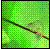
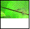
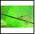

<!--REF #_command_.CREATE THUMBNAIL.Syntax-->**CREATE THUMBNAIL** ( *source* ; *dest* {; *width* {; *height* {; *mode* {; *depth*}}}} )<!-- END REF-->
<!--REF #_command_.CREATE THUMBNAIL.Params-->
| 引数 | 型 |  | 説明 |
| --- | --- | --- | --- |
| source | Picture | &#8594;  | サムネイルに変換する4Dピクチャフィールド または変数 |
| dest | Picture | &#8592; | 結果のサムネイル |
| width | Integer | &#8594;  | サムネイル幅 (ピクセル), デフォルト値 = 48 |
| height | Integer | &#8594;  | サムネイル高 (ピクセル), デフォルト値 = 48 |
| mode | Integer | &#8594;  | サムネイル作成モード デフォルト値 = Scaled to fit prop centered (6) |
| depth | Integer | &#8594;  | 廃止。使用しないでください |

<!-- END REF-->

#### 説明 

<!--REF #_command_.CREATE THUMBNAIL.Summary-->**CREATE THUMBNAIL**コマンドは、指定した元のピクチャのサムネールを返します。<!-- END REF-->通常、サムネールはマルチメディアソフトウェアやWebサイトにおいてピクチャプレビューのために使用されます。

*source*引数にはサムネールに縮小するピクチャが入った4Dの変数またはフィールドを渡します。*dest*引数には結果のサムネイルを受け取る4Dのピクチャフィールドまたはピクチャ変数を渡します。

オプションの引数*width*および*height*を使用し、必要とするサムネールのサイズ（ピクセル単位）を指定できます。この2つの引数を省略すると、サムネールのデフォルトサイズは48 x 48ピクセルになります。

オプションの引数*mode*には、サムネールの作成モード、例えばリサイズモードを指定できます。3種類のモードが使用できます。以下の定義済み定数が、定数テーマ*Picture Display Formats*で提供されています:

| 定数                          | 型    | 値 |
| --------------------------- | ---- | - |
| Scaled to fit               | 倍長整数 | 2 |
| Scaled to fit prop centered | 倍長整数 | 6 |
| Scaled to fit proportional  | 倍長整数 | 5 |

**注**: **CREATE THUMBNAIL**ではこれら3つの定数のみが使用できます。このテーマの他の定数はこのコマンドに適用できません。

この引数を指定しない場合、“Scaled to fit prop centered” モード (6) がデフォルトで適用されます。モードごとの結果を以下に示します:

ソースピクチャ   

結果のサムネイル (48x48)

* Scaled to fit = 2  

* Scaled to fit proportional = 5  

* Scaled to fit prop centered = 6 (デフォルトモード)  

**注:** Scaled to fit proportional および Scaled to fit prop centeredを使用すると、空いたスペースが白く表示されます。しかし、これらのモードが4Dフォームのピクチャフィールドまたはピクチャ変数に適用されると、この空きスペースは透明になります。

*depth* 引数は無視され、省略されなければなりません。コマンドは常に現在のスクリーン深度 (色数) を使用します。

#### プロパティ

|  |  |
| --- | --- |
| コマンド番号 | 679 |
| スレッドセーフである | &check; |

