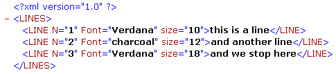

<!--REF #_command_.DOM Count XML attributes.Syntax-->**DOM Count XML attributes** ( *elementRef* ) : Integer<!-- END REF-->
<!--REF #_command_.DOM Count XML attributes.Params-->
| 引数 | 型 |  | 説明 |
| --- | --- | --- | --- |
| elementRef | Text | &#8594;  | XML要素参照 |
| 戻り値 | Integer | &#8592; | 属性数 |

<!-- END REF-->

#### 説明 

<!--REF #_command_.DOM Count XML attributes.Summary-->DOM Count XML attributes コマンドは、*elementRef*で指定したXML要素中に現れるXML属性数を返します。<!-- END REF-->XML属性に関する詳細はの節を参照してください。

#### 例題 

要素の属性値を配列に受け取る前に、XML要素の属性数を取得します:



```4d
 var myBlobVar : Blob
 var $xml_Parent_Ref;$xml_Child_Ref : Text
 var myResult : Text
 var $numAttributes : Integer
 
 $xml_Parent_Ref:=DOM Parse XML variable(myBlobVar)
 $xml_Child_Ref:=DOM Get first child XML element($xml_Parent_Ref)
 
 $numAttributes:=DOM Count XML attributes($xml_Child_Ref)
 ARRAY TEXT(tAttrib;$numAttributes)
 ARRAY TEXT(tValAttrib;$numAttributes)
 For($i;1;$numAttributes)
    DOM GET XML ATTRIBUTE BY INDEX($xml_Child_Ref;$i;tAttrib{$i};tValAttrib{$i})
 End for
```

上の例題で、*$numAttributes*は3になり、*tAttrib{1}*は“Font”、*tAttrib{2}*は“N”、*tAttrib{3}*は“size”、そして*tValAttrib*は"Verdana","1","10"になります。

**注:** 配列のインデックス番号はXMLファイル中に表示される属性の順番通りではありません。XML中、属性のインデックスはnameのアルファベット順に並びかえられた属性の位置を示します。

#### システム変数およびセット 

コマンドが正しく実行されるとシステム変数OKに1が設定され、エラーが発生すると0が設定されます。

#### 参照 

[DOM Count XML elements](dom-count-xml-elements.md)  

#### プロパティ

|  |  |
| --- | --- |
| コマンド番号 | 727 |
| スレッドセーフである | &check; |
| システム変数を更新する | OK |


