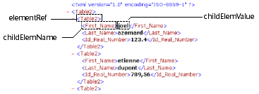

<!--REF #_command_.DOM Get first child XML element.Syntax-->**DOM Get first child XML element** ( *elementRef* {; *childElemName* {; *childElemValue*}} ) : Text<!-- END REF-->
<!--REF #_command_.DOM Get first child XML element.Params-->
| 引数 | 型 |  | 説明 |
| --- | --- | --- | --- |
| elementRef | Text | &#8594;  | XML要素参照 |
| childElemName | Text | &#8592; | 子要素名 |
| childElemValue | Text | &#8592; | 子要素値 |
| 戻り値 | Text | &#8592; | 子要素参照 |

<!-- END REF-->

#### 説明 

<!--REF #_command_.DOM Get first child XML element.Summary-->DOM Get first child XML element コマンドは*elementRef*に渡した要素の最初の子要素への参照を返します。<!-- END REF-->この参照は他のXML解析コマンドで使用できます。

*childElemName* と *childElemValue* 引数が渡されると、子要素の名前と値がそれぞれ返されます。 



#### 例題 1 

ルートの最初の子要素の参照を取得します。XML構造 (C:\\\\import.xml) はまずBLOBにロードされます: 

```4d
 var myBlobVar : Blob
 var $xml_Parent_Ref;$xml_Child_Ref : Text
 
 DOCUMENT TO BLOB("c:\\import.xml";myBlobVar)
 $xml_Parent_Ref:=DOM Parse XML variable(myBlobVar)
 $xml_Child_Ref:=DOM Get first child XML element($xml_Parent_Ref)
```

#### 例題 2 

ルートの最初の子要素の参照、名前および値を取得します。XML構造 (C:\\\\import.xml) はまずBLOBにロードされます: 

```4d
 var myBlobVar : Blob
 var $xml_Parent_Ref;$xml_Child_Ref : Text
 var $childName;$childValue : Text
 
 DOCUMENT TO BLOB("c:\\import.xml";myBlobVar)
 $xml_Parent_Ref:=DOM Parse XML variable(myBlobVar)
 $xml_Child_Ref:=DOM Get first child XML element($xml_Parent_Ref;$childName;$childValue)
```

#### システム変数およびセット 

コマンドが正しく実行されるとシステム変数OKに1が設定され、エラーが発生すると0が設定されます。

#### 参照 

[DOM Get next sibling XML element](dom-get-next-sibling-xml-element.md)  

#### プロパティ

|  |  |
| --- | --- |
| コマンド番号 | 723 |
| スレッドセーフである | &check; |
| システム変数を更新する | OK |


