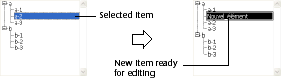
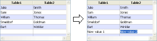

<!--REF #_command_.EDIT ITEM.Syntax-->**EDIT ITEM** ( {* ;} *object* {; *item*} )<!-- END REF-->
<!--REF #_command_.EDIT ITEM.Params-->
| 引数 | 型 |  | 説明 |
| --- | --- | --- | --- |
| * | 演算子 | &#8594;  | 指定した場合オブジェクト名（文字列） 省略するとテーブルまたは変数 |
| object | any | &#8594;  | オブジェクト名 (*が指定されている場合) または テーブルまたは変数 (*が省略された場合) |
| item | Integer | &#8594;  | 項目番号 |

<!-- END REF-->

#### 説明 

<!--REF #_command_.EDIT ITEM.Summary-->**EDIT ITEM** コマンドは*object* 引数で指定された項目、または指定された配列やリスト中*item* で指定された項目を編集状態にします。<!-- END REF-->

これは選択された項目を編集したり、内容を入れ替える新しい文字を入力できるようになるということを意味します。

オプションの*\** 引数を渡すと、*object* 引数がオブジェクト名であることを指定したことになります。この場合*object*には文字列を渡します。この引数を渡さない場合、*object* 引数にはテーブルまたは変数を渡します。この場合文字列ではなくテーブルまたは変数参照を渡します。

このコマンドは以下の入力可能オブジェクトに適用されます:

* 階層リスト
* リストボックスカラム
* サブフォーム (この場合*object*にはサブフォームオブジェクト名を渡します)
* [DISPLAY SELECTION](display-selection.md) または [MODIFY SELECTION](modify-selection.md) で表示されたリストフォーム

コマンドがリストでない入力可オブジェクトに使用された場合、[GOTO OBJECT](goto-object.md) コマンドと同様に動作します。   
このコマンドはリストや配列が空、あるいは非表示の際には何も行いません。またリストや配列が入力不可の場合、このコマンドは単に指定された項目を選択し、入力状態にはしません。リストボックスについては、列が入力を許可しない場合 (チェックボックスやドロップダウンリストの入力のみ許可される場合)、指定された要素がフォーカスを得ます。

オプションの*item* 引数には編集モードにする、階層リストの場合項目位置を、複数選択モードでのリストボックスカラムやリストフォームやサブフォームでは行番号を指定します。この引数を渡さない場合、このコマンドは*object*のカレント項目に適用されます。カレントの項目がない場合、*object* の最初の項目が編集モードになります。

**Note:**

* サブフォームとリストフォームでは、コマンドは指定された行の、最初の入力順のフィールドを編集モードにします。
* 階層表示モードのリストボックスでは、ターゲットの項目が折りたたまれた階層レベルに属する場合、このレベル (およびすべての親レベル) は自動で展開され、項目が表示されます。

#### 例題 1 

このコマンドは特に階層リストに新規項目を作成する際に有用です。このコマンドが呼び出されると、最後に追加あるいは挿入された項目が自動で編集モードになります。   
以下のコードは既存のリストに新規項目を挿入するボタンメソッドです。デフォルトの“New\_item”テキストが自動で編集可能状態になります:

```4d
 vlUniqueRef:=vlUniqueRef+1
 INSERT IN LIST(hList;*;"New_item";vlUniqueRef)
 EDIT ITEM(*;"MyList")
```



#### 例題 2 

変数名“Array1” と “Array2”が指定された2つの列を持つリストボックスがあります。以下の例題では2つの配列に新規項目を挿入し、Array2を編集モードにします: 

```4d
 $vlRowNum:=Size of array(Array1)+1
 LISTBOX INSERT ROWS(*;"MyListBox";$vlRowNum)
 Array1{$vlRowNum}:="New value 1"
 Array2{$vlRowNum}:="New value 2"
 EDIT ITEM(Array2;$vlRowNum)
```



#### 参照 

[GOTO OBJECT](goto-object.md)  
[INSERT IN LIST](insert-in-list.md)  
[SET LIST ITEM](set-list-item.md)  

#### プロパティ

|  |  |
| --- | --- |
| コマンド番号 | 870 |
| スレッドセーフである | &cross; |


