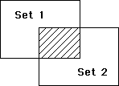

<!--REF #_command_.INTERSECTION.Syntax-->**INTERSECTION** ( *set1* ; *set2* ; *resultSet* )<!-- END REF-->
<!--REF #_command_.INTERSECTION.Params-->
| 引数 | 型 |  | 説明 |
| --- | --- | --- | --- |
| set1 | Text | &#8594;  | 最初のセット |
| set2 | Text | &#8594;  | 2番目のセット |
| resultSet | Text | &#8594;  | 結果のセット |

<!-- END REF-->

#### 説明 

<!--REF #_command_.INTERSECTION.Summary-->INTERSECTIONコマンドは、*set1*と*set2*を比較し、*set1*と*set2*の両方に存在するレコードだけを選択します。<!-- END REF-->下表に、INTERSECTIONコマンドの処理で考えられるすべての組み合わせを示します。

| **Set1** | Set2 | Result Set |
| -------- | ---- | ---------- |
| Yes      | No   | No         |
| Yes      | Yes  | Yes        |
| No       | Yes  | No         |
| No       | No   | No         |

以下の図に、集合交差演算の処理結果を図で示します。塗りつぶした部分が結果のセットです。



*resultSet*はINTERSECTIONコマンドで作成されます。 *resultSet*と同じ名前のセット (*set1*と*set2*も含めて) が既に存在する場合は*resultSet*に置き換わります。*set1*と*set2*は同じテーブルに属していなければなりません。*resultSet*も*set1*と*set2*と同じテーブルに属します。*set1*と*set2*両方に同じカレントレコードが設定されている場合、そのカレントレコードは*resultSet*に保持されます。カレントレコードが異なる場合、*resultSet*はカレントレコードを保持しません。  

**4D Server:** クライアント/サーバモードにおいて、セットはタイプ (インタープロセス、プロセスおよびローカル) およびそれらがどこで作成されたか (サーバまたはクライアント) によって、アクセス可能かどうかが決定されます。INTERSECTIONでは3つのセットが同じマシン上でアクセスできる必要があります。詳細は4D Server Referenceマニュアルの*4D Server: セットと命名セレクション*に関する説明を参照してください。

#### 例題 

以下の例は、“Joe”と“Abby”という2人の販売担当者が重複して担当する顧客を検索します。販売担当者は、各自の顧客を表すセット“Joe”と“Abby”を持っています。

```4d
 INTERSECTION("Joe";"Abby";"Both") // 両方の顧客のセットを作成する
 USE SET("Both") // セットを使う
 CLEAR SET("Both") // セットを消去、ただし他は残す
 DISPLAY SELECTION([Customers]) // 両方が担当する顧客を表示
```

#### 参照 

[DIFFERENCE](difference.md)  
[UNION](union.md)  

#### プロパティ

|  |  |
| --- | --- |
| コマンド番号 | 121 |
| スレッドセーフである | &check; |


