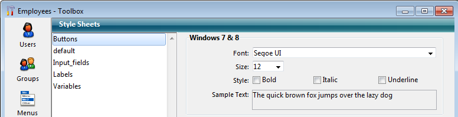

<!--REF #_command_.LIST OF STYLE SHEETS.Syntax-->**LIST OF STYLE SHEETS** ( *arrStyleSheets* )<!-- END REF-->
<!--REF #_command_.LIST OF STYLE SHEETS.Params-->
| 引数 | 型 |  | 説明 |
| --- | --- | --- | --- |
| arrStyleSheets | Text array | &#8592; | アプリケーション内の定義済みスタイルシート名一覧 |

<!-- END REF-->

#### 説明 

<!--REF #_command_.LIST OF STYLE SHEETS.Summary-->**LIST OF STYLE SHEETS**コマンドは、*arrStyleSheets*配列にアプリケーション内のスタイルシートのリストを返します。<!-- END REF-->.

*arrStyleSheets* テキスト配列が未定義だった場合、この配列はコマンドによって自動的に作成されます。配列のサイズは、定義されているスタイルシートの数に応じて自動的に決められます。

コマンド実行後、配列の各要素にはスタイルシートの名前が格納されます。これらの名前はスタイルシートエディターと同様にアルファベット順にソートされます。配列の第1要素には 自動スタイルシートを意味する "\_\_automatic\_\_"が必ず入ります。

**注:** 互換性の理由から、このコマンドは自動スタイルシート"\_\_automatic\_main\_text\_\_"と"\_\_automatic\_additional\_text\_\_" は返しません。しかしながら、これらのスタイルシートでのフォーム上での利用には問題はありません。

##### 互換性に関する注意 

このコマンドは**バイナリーデータベース**でのみ利用可能です。**プロジェクトアーキテクチャー**においては、空の配列が返されます。

#### 例題 

アプリケーション内に、以下のようにスタイルシートが定義されていたとします:



下のコードを実行すると、戻り値の配列の要素には以下の様に値が格納されています:

```4d
 LIST OF STYLE SHEETS($arrStyles)
  // $arrStyles{1} には "__automatic__"
  // $arrStyles{2} には "Buttons"
  // $arrStyles{3} には "Input_fields"
  // $arrStyles{4} には "Default"
  // $arrStyles{5} には "Labels"
  // $arrStyles{6} には "Variables"
```

#### 参照 

[GET STYLE SHEET INFO](get-style-sheet-info.md)  
[OBJECT SET STYLE SHEET](object-set-style-sheet.md)  

#### プロパティ

|  |  |
| --- | --- |
| コマンド番号 | 1255 |
| スレッドセーフである | &cross; |


