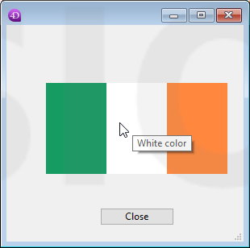
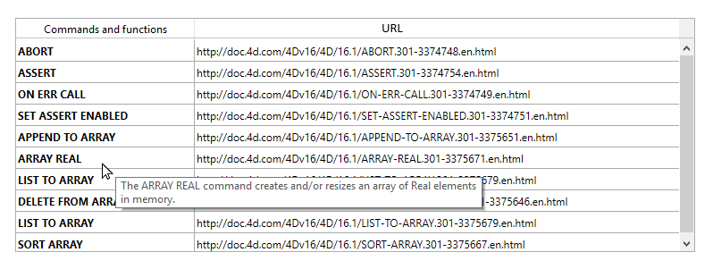

<!--REF #_command_.OBJECT SET HELP TIP.Syntax-->**OBJECT SET HELP TIP** ( {* ;} *object* ; *helpTip* )<!-- END REF-->
<!--REF #_command_.OBJECT SET HELP TIP.Params-->
| 引数 | 型 |  | 説明 |
| --- | --- | --- | --- |
| * | 演算子 | &#8594;  | 指定時objectはオブジェクト名 (文字列)省略時objectは変数 |
| object | any | &#8594;  | オブジェクト名 (* 指定時)または変数 (* 省略時) |
| helpTip | Text | &#8594;  | ヘルプメッセージの内容 |

<!-- END REF-->

#### 説明 

<!--REF #_command_.OBJECT SET HELP TIP.Summary-->**OBJECT SET HELP TIP**コマンドは*object* と*\** 引数で指定したオブジェクトに割り当てられたヘルプをカレントプロセス内で動的に変更します。<!-- END REF-->

オプションの *\** 引数を渡すと、*object* 引数はフォームオブジェクト名 (文字列) です。この引数を渡さない場合、*object* は変数であり、文字列ではなく変数参照を渡します。

*helpTip* 引数にはメッセージの内容の文字列を渡します。空の文字列 ("")を渡すと、そのヘルプTipは削除されます。

フォームが実行されると、マウスカーソルがフィールドやオブジェクト上に移動したとき、ヘルプTipを表示させることができます。Tips表示までの時差と、最大表示時間は、[SET DATABASE PARAMETER](set-database-parameter.md) コマンドのTips delay および Tips duration セレクターを使用することによってコントロールすることが可能です。

リストボックスオブジェクトに対してこのコマンドを使用することで、リストボックスの行とセルに対してヘルプTipsを追加することができます。例えば、リストボックスオブジェクトは各行ごとに異なるヘルプTipsを持つことができます。この場合、事前にカーソルの位置を[LISTBOX GET CELL POSITION](listbox-get-cell-position.md) コマンドで調べる必要があります。このやり方は以下の例題で示しています。

ヘルプTipsがすでに表示されている時、**OBJECT SET HELP TIP** コマンドを呼び出すとそのTipsは閉じられ、マウスの位置に新しいTipsを開くと同時にTips duration カウンターをリスタートさせます。これにより、Tipsの動的な管理が可能になります。

**注:** 

* ヘルプTipsの中身はデザインモードのフォームエディター(*データ入力の制御と補助*参照)およびストラクチャーエディター(*フィールドプロパティ*参照)を使用しても設定することができます。
* ヘルプTipsは、[SET DATABASE PARAMETER](set-database-parameter.md) コマンドのTips enabled セレクターを使用することで、アプリケーション全体に対して有効化あるいは無効化することができます。

#### 例題 1 

フォーム内に、ヘルプTipsが表示され、マウスがピクチャーボタンの異なる部分をホバーすると内容が動的に変わるようにしたい場合を考えます:



```4d
  //"myFlag" オブジェクトメソッド
 
 var $x;$y;oldX;oldY : Real
 var $left;$right;$top;$bottom : Real
 var $b : Integer
 var $tip : Text
 var oldTip : Text
 var $doRefresh : Boolean
 
 Case of
    :(Form event code=On Load) //v17 以前ではForm event を使用
       oldTip:=""
       SET DATABASE PARAMETER(Tips enabled;1) //Tipsを確実に有効化する
       SET DATABASE PARAMETER(Tips delay;0) // Tipsはマウスが停止したら即座に表示
       SET DATABASE PARAMETER(Tips duration;60*10) // 最大10秒間表示
    :(Form event code=On Mouse Move) //v17 以前ではForm event を使用
       MOUSE POSITION($x;$y;$b)
       OBJECT GET COORDINATES(*;"myFlag";$left;$top;$right;$bottom)
       $x:=$x-$left
       $y:=$y-$top
       Case of //旗の各部分は76ピクセルずつ
          :($x<76)
             $tip:="Green color"
          :($x<152)
             $tip:="White color"
          Else
             $tip:="Orange color"
       End case
 
       $doRefresh:=($tip#oldtip) //Tipsが異なる場合にはTrue
       If(Not($doRefresh)) //中身が同じ
          $doRefresh:=((Abs($x-oldX)>30)|(Abs($y-oldY)>30)) //カーソルが動いた場合にはTrue
       End if
 
       If($doRefresh) //別のTipsを表示
          OBJECT SET HELP TIP(*;"myFlag";$tip)
          oldX:=$x
          oldY:=$y
          oldTip:=$tip
       End if
 
 End case
```

#### 例題 2 

"Commands List"という名前の一覧を含んだリストボックスがあり、それぞれのリスト項目に対して詳細を表示するヘルプTipを設定したい場合を考えます。詳細の文章は\[Documentation\] テーブルにあるとします。

```4d
 var $mouseX;$mouseY;$mouseZ : Real
 var $col;$row : Integer
 
 Case of
 
    :(Form event code=On Mouse Enter) //v17 以前では Form event を使用
 
       SET DATABASE PARAMETER(Tips delay;1) // Tipが素早く表示されるようにする
 
    :(Form event code=On Mouse Move) //v17 以前では Form event を使用
 
  //#1 : どの行をホバーしているのか探す
 
       MOUSE POSITION($mouseX;$mouseY;$mouseZ)
       LISTBOX GET CELL POSITION(*;"Commands List";$mouseX;$mouseY;$col;$row)
 
  //#2 : 対応するヘルプTipsを設定
 
       If($row#0)
          GOTO SELECTED RECORD([Documentation];$row)
          OBJECT SET HELP TIP(*;"Commands List";[Documentation]Description) // マウスの動きが止まると詳細文が"ヘルプTip"として使用される
       End if
 
    :(Form event code=On Mouse Leave) //v17 以前では Form event を使用
 
       SET DATABASE PARAMETER(Tips delay;3) // Tipの表示までの時間を通常にする
 
 End case
```

結果は以下のようになります。



#### 参照 

[OBJECT Get help tip](object-get-help-tip.md)  
[SET DATABASE PARAMETER](set-database-parameter.md)  

#### プロパティ

|  |  |
| --- | --- |
| コマンド番号 | 1181 |
| スレッドセーフである | &cross; |


