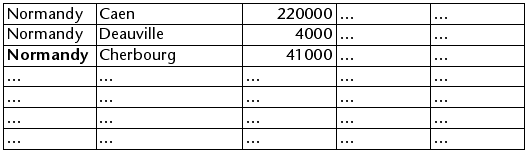
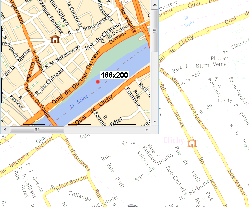

<!--REF #_command_.OBJECT SET SCROLL POSITION.Syntax-->**OBJECT SET SCROLL POSITION** ( * ; *object* {; *vPosition* {; *hPosition*}}{; *} )<!-- END REF-->
<!--REF #_command_.OBJECT SET SCROLL POSITION.Params-->
| 引数 | 型 |  | 説明 |
| --- | --- | --- | --- |
| * | 演算子 | &#8594;  | 指定された場合、オブジェクトがオブジェクト名 (文字列) 省略された場合、オブジェクトがテーブルまたは変数 |
| object | any | &#8594;  | オブジェクト名 ( * が指定された場合) または テーブルまたは変数 ( * が省略された場合) |
| vPosition | Integer | &#8594;  | 表示する行番号、またはピクチャーの場合縦スクロール量 (ピクセル) |
| hPosition | Integer | &#8594;  | リストボックスの場合表示する列番号、またはピクチャーの場合縦スクロール量 (ピクセル) |
| * | 演算子 | &#8594;  | スクロール後の最初の位置に行を表示 (hPositionが渡された場合、列も対象) |

<!-- END REF-->

#### 説明 

<!--REF #_command_.OBJECT SET SCROLL POSITION.Summary-->**OBJECT SET SCROLL POSITION**コマンドを使用して、 ([MODIFY SELECTION](modify-selection.md)または[DISPLAY SELECTION](display-selection.md)コマンドを用いて表示される) リストフォーム、サブフォーム、階層リストなどの行、あるいはリストボックスの列や行、そしてさらにピクチャのピクセルをスクロールすることができます。<!-- END REF--> 

**注**: プログラムによるスクロールは、フォーム上でスクロールバーが隠されていても可能です。

最初のオプション引数 *\** を渡すと、引数 *object* は、サブフォーム、階層リスト、リストボックス、ピクチャーフィールド/変数オブジェクトの名前であることを指示します (この場合、文字列を *object* に渡します) 。この引数に何も渡さないと、引数 *object* は、テーブル (リストフォームテーブルまたはサブフォームテーブル) または変数 (階層リストの[ListRef](# "階層リストへの参照")、リストボックス、またはピクチャ) であることを示します。

*vPosition*引数を使用して、表示する行番号を指定したり、ピクチャーの場合は表示するピクセルの垂直座標を指定できます。  
この引数を渡さないと、コマンドは選択されている最初の行が表示されるように縦スクロールを実行します。この場合、行が選択されていなかったり、選択された行が一つでも表示されていれば、縦スクロールは実行されません。  
この引数を渡すと、コマンドは、設定された行が (ハイライトされているかいないかに関わらず)、指定された行が表示されるようにリストの縦スクロールを行います。行がすでに表示されていると、2番目の *\** 引数が渡されていない限り、コマンドはなにも行いません (後述)。 

* リストフォームとサブフォームにおいて、この番号はカレントセレクション中の行番号 (位置) です。
* 階層リストの場合、コマンドは項目の展開/折りたたみ状態を考慮します。
* リストボックスの場合、この番号は (非表示行を含む) すべてのオブジェクト行中の行番号です。*vPosition* に渡された番号がリストボックスの非表示行に対応する場合、コマンドは続く最初の表示行を表示します。  
**注:** このコマンドは、たとえリストボックスが階層モードで表示されていたとしても、非階層の標準表示に基づいて実行される点に留意してください。リストボックスが階層モードあるいは標準モードどちらで表示されているかによって結果は異なります (例題参照)。
* フォームに表示されているピクチャーの場合、*vPosition* はオブジェクト内に表示するピクチャの垂直座標点を示します。縦スクロールを行わない場合、*vPosition*に0を渡します。  
値はローカルコンテキスト中でピクチャの基点に対し相対的なピクセルで表現しなければなりません。垂直座標点がオブジェクト内に既に表示されている場合、このコマンドは何もしません(ただい二番目の引数に *\** を渡した場合を除く、後述参照)。ピクチャは"トランケート (中央合わせなし)" フォーマットで表示されなければなりません。

*hPosition* 引数はリストボックスとピクチャーのコンテキストで使用できます。

* リストボックスの場合、*hPosition*に列番号を渡すことができます。コマンドを実行するとリストボックスを横スクロールし、指定した列が表示されます。列がすでに表示されている場合、コマンドはなにも行いません。縦スクロールと同様、2番目のオプション引数 *\** を渡すと、コマンドによって表示された列は先頭位置に配置されます (リストボックスが実際にスクロールされた場合。後述)。
* フォームに表示されたピクチャーの場合、*hPosition* はオブジェクトに表示される水平座標点を表します。値はローカルコンテキスト中でピクチャの基点に対し相対的なピクセルで表現しなければなりません。垂直座標点がオブジェクト内に既に表示されている場合、このコマンドは何もしません(二番目の引数に *\** を渡した場合を除く、後述参照)。

二番目のオプション引数 *\** を渡すと:

* このコマンドで表示された行は (リストが実際にスクロールされると)、リスト中の先頭に配置されます。行がリストの最後の行である場合、このオプションは効果を持ちません。
* ピクチャーの場合、リクエストされた座標は、これらの座標点が既にオブジェクト内に表示されていた場合でも、リクエストされた座標がピクチャー変数の原点(0,0)に置かれます。

**注**: [HIGHLIGHT RECORDS](highlight-records.md)コマンドはオプション引数 *\** を使用してスクロール管理を**OBJECT SET SCROLL POSITION**コマンドに委譲することができます。 

#### 例題 1 

この例題ではリストボックスが標準モードで表示されている場合と階層モードで表示されている場合の違いについて説明します:

```4d
 OBJECT SET SCROLL POSITION(*;"mylistbox";4;2;*) // displays 4th row of 2nd column of list box in the first position
```

このステートメントが標準モードで表示されているリストボックスに適用されると:


リストボックスの行と列が実際にスクロールされます:



他方同じステートメントが階層モードのリストボックスに適用されると、行はスクロールされますが、2番目の列は階層の一部なので列はスクロールされません:


#### 例題 2 

フォーム変数に格納されているピクチャーをスクロールしたい場合を考えます。このモンタージュ(合成画像)には、ピクチャーの表示されている部分と、表示すべき点(上から166ピクセル、左から200ピクセルの位置)が示されています:



表示されている部分をスクロールさせて、赤い点がピクチャー変数の原点に表示されるようにするためには、以下のように書きます:

```4d
 OBJECT SET SCROLL POSITION(*;"myVar";166;200;*)
```

すると、以下のような表示になります:


この場合、2つ目の *\** 引数を省略しないように注意してください。省略してしまうと、定義された点は既に表示されているため、ピクチャーはスクロールされません。

#### 参照 

[HIGHLIGHT RECORDS](highlight-records.md)  
[LISTBOX SELECT ROW](listbox-select-row.md)  
[OBJECT GET SCROLL POSITION](object-get-scroll-position.md)  

#### プロパティ

|  |  |
| --- | --- |
| コマンド番号 | 906 |
| スレッドセーフである | &cross; |


