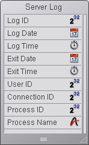
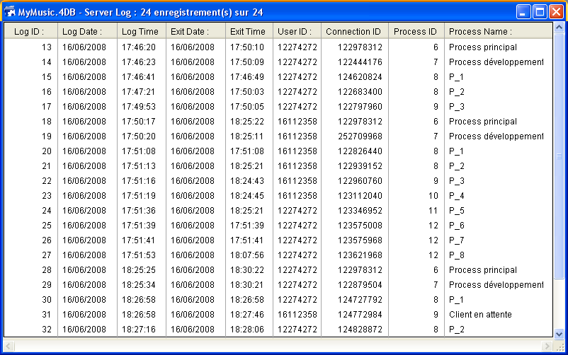

<!--REF #_command_.On Server Open Connection database method.Syntax-->$1, $2, $3 -> On Server Open Connectionデータベースメソッド -> $0<!-- END REF-->
<!--REF #_command_.On Server Open Connection database method.Params-->
| 引数 | 型 |  | 説明 |
| --- | --- | --- | --- |
| $1 | 倍長整数 | &#8592; | ユーザーを識別するために4D Serverが内部的に使用するユーザーID |
| $2 | 倍長整数 | &#8592; | 接続を識別するために4D Serverが内部的に使用する接続ID |
| $3 | 倍長整数 | &#8592; | 廃止: 常に0が返されますが、宣言はしなくてはなりません。 |
| $0 | 倍長整数 | &#8592; | 0または省略時 = 接続を受け入れる、0以外 = 接続を拒否する |

<!-- END REF-->

#### On Server Open Connection データベースメソッドはいつ呼び出されるか 

<!--REF #_command_.On Server Open Connection database method.Summary-->**On Server Open Connectionデータベースメソッド**は、4Dリモートワークステーションが接続プロセスを開始するたびに、サーバーマシン上で一度、呼び出されます。<!-- END REF-->4D Server 以外の4D 環境では**On Server Open Connectionデータベースメソッド**が起動されることはありません。 

**On Server Open Connectionデータベースメソッド**は以下のときに呼び出されます:

* リモート4Dが接続した (アプリケーションプロセスが開始するため)
* リモート4Dがデザインモードを開く (デザインプロセスが開始するため)
* リモート4Dが、サーバー上でコオペラティブプロセスの作成を必要とする**\*** (プロセス名が"$"で始まらない) グローバルプロセスを開始した。このプロセスは[New process](new-process.md)コマンド、メニューコマンド、またはメソッド実行ダイアログボックスを使用して作成されます
リモート4Dでは、いずれの場合にも3つのプロセスが開始されます (クライアントマシン上に1つ、また必要に応じてサーバマシン上に2つ) 。クライアントマシンでは、プロセスでコードが実行され、4D Serverに要求が送られます。サーバマシンでは、**4Dクライアントプロセス**はクライアントプロセスのためのデータベース環境 (ユーザプロセスのためのカレントセレクションやレコードのロック等) を管理し、クライアントマシン上で実行中のプロセスから送られた要求に対して応答を返します。**4Dクライアントデータベースプロセス**は対応する4Dクライアントプロセスのモニタを担当します。  
  
**(\*)** 4D v13より最適化のため、サーバープロセス (データベースエンジンにアクセスするためのプリエンプティブプロセスとランゲージアクセスのためのコオペラティブプロセス) はクライアント側のコードを実行する際必要な時にだけ作成されるようになりました。以下は新規クライアントプロセスを実行する4Dコードの詳細です:  
  
```4d
  // グローバルプロセスが開始されるがこの時点では
  //サーバー上にはプロセスは作成されない
 CREATE RECORD([Table_1])
 [Table_1])field1_1:="Hello world"
 SAVE RECORD([Table_1]) // この時点でサーバーにプリエンプティブプロセスが作成される
 $serverTime:=Current time(*) // ここでサーバー上にコオペラティブプロセスが作成され
  // On Server Open Connectionが呼び出される
```

  
**重要**: Web接続およびSQL接続は**On Server Open Connectionデータベースメソッド**を起動しません。Webブラウザーが4D Server に接続する場合は *On Web Authenticationデータベースメソッド* (あれば) と[On Web Connectionデータベースメソッド](on-web-connection-database-method.md)が起動されます。4D ServerがSQLクエリを受信すると、[On SQL Authenticationデータベースメソッド](on-sql-authentication-database-method.md)が (あれば) 呼び出されます。詳細については、4D Language Referenceマニュアルのデータベースメソッドに関する説明を参照してください。

**重要**: ストアドプロシージャの開始時には、**On Server Open Connectionデータベースメソッド**は起動されません。 *ストアドプロシージャ* はサーバプロセスであり、4Dクライアントプロセスではありません。ストアドプロシージャはサーバマシン上でコードを実行しますが、 4Dクライアント (または他のクライアント) と4D Server によってやり取りされる要求に対して応答を返すことはありません。

#### On Server Open Connection データベースメソッドはどのように呼び出されるか 

**On Server Open Connectionデータベースメソッド** は4D Serverマシン上で、このメソッドを呼び出しを引き起こした4Dクライアントプロセス内で実行されます。 

例えばリモート4Dが4D Server インタープリタデータベースに接続すると、そのクライアント用のユーザプロセスとデザインプロセス、クライアント登録プロセスが (デフォルトで) 開始されます。したがって On Server Open Connectionデータベースメソッド は3回実行されます。つまり1回目はアプリケーションプロセス内で、2回目はクライアント登録プロセス内で、3回目はデザインプロセス内で実行されます。3つのプロセスがそれぞれサーバマシン上で開始される6番目と7番目と8番目のプロセスである場合に、**On Server Open Connectionデータベースメソッド**内から [Current process](current-process.md) を呼び出すと、 [Current process](current-process.md) は1回目には6を、2回目には7を、3回目に8を返します。

**On Server Open Connectionデータベースメソッド** はサーバマシン上で実行されることに注意してください。このデータベースメソッドは、クライアント 側で実行中のプロセスとは無関係に、サーバマシン上で実行中の4Dクライアントプロセス内で実行されます。また、このメソッドが起動された時点では、4D クライアントプロセスにはまだ名前が付いていません (この時点では、[Process info](../commands/process-info.md)は4Dクライアントプロセスの名前を返しません)。

**On Server Open Connectionデータベースメソッド** は、クライアント側で実行中のプロセスのプロセス変数テーブルにアクセスしません。このテーブルはサーバマシンではなく、クライアントマシンに存在します。

**On Server Open Connectionデータベースメソッド** がプロセス変数にアクセスすると、4Dクライアントプロセス用に動的にプロセス変数テーブルが作成され、プライベートに使用されます。

4D Serverは **On Server Open Connectionデータベースメソッド** に3つの倍長整数タイプの引数を渡し、倍長整数タイプの結果を求めます。したがってこのメソッドでは3つの引数と戻り値を倍長整数として明示的に宣言しなくてはなりません:

```4d
 var $0;$1;$2;$3 : Integer
```

*$0*に値を返さず、その結果変数を未定義のままにするかまたはゼロに初期化した場合、4D Server はデータベースメソッドが接続を受け付けたものとみなします。接続を受け付けない場合、*$0*にヌルではない値を返します。

次の表はこのデータベースメソッドに渡される3つの引数が示す情報を表わしています:

| **引数** | **説明**                               |
| ------ | ------------------------------------ |
| $1     | 4D Serverがユーザを識別するために内部的に使用するユーザID番号 |
| $2     | 4D Serverが接続を識別するために内部的に使用する接続ID番号   |
| $3     | 廃止: 常に0が渡されますが、宣言は必要                 |

これらのID番号は、例えば4Dコマンドに渡す引数のように、情報ソースとして直接使用することはできません。しかしこれらのID番号は**On Server Open Connectionデータベースメソッド**と[On Server Close Connectionデータベースメソッド](on-server-close-connection-database-method.md)との間で、4Dクライアントプロセスを一意に識別するために利用できます。4D Server セッションのどの時点でも、これらの値の組み合わせはユニークです。インタープロセス配列やテーブルにこの情報を格納することによって、2つのデータベー スメソッド間で情報をやり取りできます。この節の最後に示された例では、2つのデータベースメソッドがこの情報を使用して、テーブルの同一レコードに接続 の開始と終了の日付と時間を格納しています。

#### 例題 1 

次の例は**On Server Open Connectionデータベースメソッド**と**On Server Close Connection データベースメソッド**を使用して、データベースへの接続ログを管理する方法を示しています。**\[Server Log\]**テーブル (下図) は接続処理の記録を取るために使用されています: 



このテーブルに格納される情報は、次の**On Server Open Connectionデータベースメソッド**と**On Server Close Connection データベースメソッド**によって管理されます:

```4d
  // On Server Open Connection データベースメソッド
 var $0;$1;$2;$3 : Integer
  // [Server Log] レコード作成
 CREATE RECORD([Server Log])
 [Server Log]Log ID:=Sequence number([Server Log])
  // 接続日付と時間を保存
 [Server Log]Log Date:=Current date
 [Server Log]Log Time:=Current time
  // 接続情報を保存
 [Server Log]User ID:=$1
 [Server Log]Connection ID:=$2
 SAVE RECORD([Server Log])
  // エラーなしを返すと接続が続行される
```
  
  
```4d
 $0:=0 // On Server Close Connection データベースメソッド
 var $1;$2;$3 : Integer
  // [Server Log] レコードを取得
 QUERY([Server Log];[Server Log]User ID=$1;*)
 QUERY([Server Log];&;[Server Log]Connection ID=$2)
  // 終了日付と時間を保存
 [Server Log]Exit Date:=Current date
 [Server Log]Exit Time:=Current time
  // プロセス情報を保存
 [Server Log]Process ID:=Current process
 PROCESS PROPERTIES([Server Log]Process ID;$vsProcName;$vlProcState;$vlProcTime)
 [Server Log]Process Name:=$vsProcName
 SAVE RECORD([Server Log])
```

  
下図は\[Server Log\]に登録されたレコードで、いくつかのリモート接続を示しています:



#### 例題 2 

以下の例題は午前2時から4時の間の接続を拒否します。

```4d
  // On Server Open Connection データベースメソッド
 var $0;$1;$2;$3 : Integer
 
 If((?02:00:00?<=Current time)&(Current time
```


#### プロパティ

|  |  |
| --- | --- |
| コマンド番号 | 16001 |
| スレッドセーフである | &cross; |


