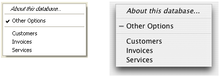

<!--REF #_command_.Pop up menu.Syntax-->**Pop up menu** ( *contents* {; *default* {; *xCoord* ; *yCoord*}} )  : Integer<!-- END REF-->
<!--REF #_command_.Pop up menu.Params-->
| 引数 | 型 |  | 説明 |
| --- | --- | --- | --- |
| contents | Text | &#8594;  | 定義された項目テキスト |
| default | Integer | &#8594;  | デフォルトで選択された項目番号 |
| xCoord | Integer | &#8594;  | 左上角のX座標 |
| yCoord | Integer | &#8594;  | 左上角のY座標 |
| 戻り値 | Integer | &#8592; | 選択された項目番号 |

<!-- END REF-->

#### 説明 

<!--REF #_command_.Pop up menu.Summary-->**Pop up menu** コマンドは、現在マウスが置かれている場所でポップアップメニューを表示します。<!-- END REF-->

ユーザインタフェースの規則に従い、通常マウスボタンが押されて、かつ押されたままのときにこのコマンドを呼び出します。

以下のように、引数*contents*を用いてポップアップメニューの項目を定義します。

* 各項目をセミコロン (*;*) で区切ります。例えば、 "**ItemText1;ItemText2;ItemText3**" のようになります。
* 項目を無効にするには、項目テキスト内に開いたカッコ (**(**) を指定します。
* 区切り線を指定するには、項目テキストとして "**\-**" または "**(-**" を渡します。
* 行のフォントスタイルを指定するには、項目テキスト内に (**<**) を指定し、続けて以下の文字の1つを記述します。  
| <B | 太字                   |  
| -- | -------------------- |  
| <I | 斜体                   |  
| <U | アンダーライン              |  
| <O | アウトライン (Macintoshのみ) |  
| <S | シャドウ (Macintoshのみ)   |
* 項目にチェックマークをを付けるには、項目テキスト内に疑問符 (*!*) を指定し、続けてチェックマークとして表示したい文字を記述します。  
   * Macintoshでは、文字は直接表示されます。システムバージョンおよびランゲージにおいて、標準チェックマークを表示するには、次のステートメントを使用します: Char**(18)**  
   * Windowsでは、いかなる文字を渡してもチェックマークが表示されます。
* 項目にアイコンを付けるには、項目テキスト内にアクセント (^) を置き、続けてMac OSベースのアイコンリソースのリソースIDであるコード +208 を持つ文字を指定します。
* 項目にショートカットを付けるには、項目テキスト内にスラッシュを (*/*) 設定し、続けて項目のためのショートカット文字を指定します。この最後のオプションは、純粋に情報提供のためのものであることに注意してください。ショートカットがポップアップメニューをアクティブにすることはありません。ただし、アプリケーションのメインメニューバーにそのポップアップメニュー項目に相当するのものがある場合にショートカットを情報として含めることができるということです。

**Tip:** 特殊文字 (!, /, など) をポップアップメニューに含めるなどのために、ポップアップメニューでこれらの文字を解釈するためのメカニズムを無効にすることが可能です。これをするためには、*contents* 引数内での項目定義をChar(1) という宣言から始めます(例: **Char*(1)+"1/4 pt"* と記述すると"1/4 pt" という項目を宣言したことになります)。

オプション引数 *default* によって、ポップアップメニューが表示される際にデフォルトで選択されるメニュー項目を指定できます。1からメニュー項目の数までの値を渡します。この引数を省略すると、コマンドはデフォルトで最初のメニュー項目を選択します。

オプション引数 *xCoord* と *yCoord* を用いて、表示されるポップアップメニューの位置を指定できます。 *xCoord* と *yCoord* には、メニューの左上角の水平座標と垂直座標をそれぞれ渡します。これらの座標は、カレントフォームのローカル座標システムにおいてピクセル形式で表示されなければなりません。これら2つの引数は必ず一緒に渡さなければなりません。1つのみが渡された場合、それは無効となります。  
引数 *xCoord* と *yCoord* を使用すると、引数 *default* は無視されます。この場合、マウスは必ずしもポップアップメニューのレベルに置かれてはいません。  
これらの引数は、特に、ポップアップメニューと連動する3Dボタンを扱う際に便利です。

メニュー項目を選択すると、コマンドはその番号を返します。その他の場合はゼロ (0) を返します。

**注意:** 適切な項目数のポップアップメニューを使用してください。50以上もの項目を表示したい場合は、ポップアップメニューではなく、フォーム内のスクロール可能エリアの使用を検討するほうが賢明です。

#### 例題 

プロジェクトメソッドMY SPEED MENUは、ナビゲーションスピードメニューをプルダウンします。

```4d
  // MY SPEED MENU プロジェクトメソッド
 MOUSE POSITION($vlMouseX;$vlMouseY;$vlButton)
 If(Macintosh control down|($vlButton=2))
    $vtItems:="About this database...<I;(-;!-Other Options;(-"
    For($vlTable;1;Get last table number)
       If(Is table number valid($vlTable))
          $vtItems:=$vtItems+";"+Table name($vlTable)
       End if
    End for
    $vlUserChoice:=Pop up menu($vtItems)
    Case of
       :($vlUserChoice=1)
  ` Display Information
       :($vlUserChoice=2)
  `オプションを表示する
       Else
          If($vlUserChoice>0)
  `番号が $vlUserChoice-4 のテーブルに移動する
          End if
    End case
 End if
```

このプロジェクトメソッドは、以下から呼び出せます。

* マウスボタンがリリースされるのを待たずにマウスクリックに反応するフォームオブジェクトのメソッド (透明ボタン)
* イベントを "スパイ" し、他のプロセスと通信するプロセス
* [ON EVENT CALL](on-event-call.md "ON EVENT CALL") を用いてインストールされたイベント処理メソッド

最後の2つの場合では、フォームオブジェクトでクリックが行われる必要はありません。これは、Pop up menu コマンドの1つの利点です。一般的にポップアップメニューを表示するためにフォームオブジェクトを使用します。Pop up menu を使用すると、どこにでもメニューを表示することができます。

Windowsでは、マウスの右ボタンを押すことによってポップアップメニューが表示されます。Macintoshでは、Control+ クリックを押すことによって表示されます。ただし、メソッドはマウスクリックが存在するかどうかを実際にチェックをしませんので注意してください。呼び出し側のメソッドがこのテストを実行します。

Windows上 (左) とMacintosh上 (右)で表示されるポップアップメニューは以下のとおりです。 Windowsバージョンの標準チェックマークに注目してください。



#### 参照 

[Dynamic pop up menu](dynamic-pop-up-menu.md)  
[MOUSE POSITION](mouse-position.md)  

#### プロパティ

|  |  |
| --- | --- |
| コマンド番号 | 542 |
| スレッドセーフである | &cross; |


