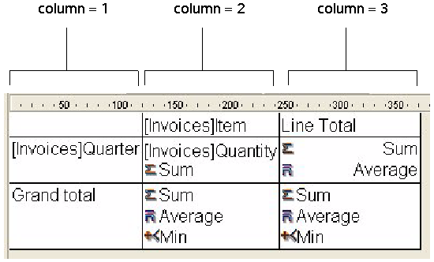
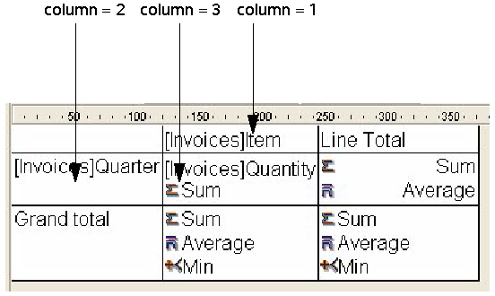

<!--REF #_command_.QR GET INFO COLUMN.Syntax-->**QR GET INFO COLUMN** ( *area* ; *colNum* ; *title* ; *object* ; *hide* ; *size* ; *repeatedValue* ; *displayFormat* {; *resultVar*} )<!-- END REF-->
<!--REF #_command_.QR GET INFO COLUMN.Params-->
| 引数 | 型 |  | 説明 |
| --- | --- | --- | --- |
| area | Integer | &#8594;  | エリア参照 |
| colNum | Integer | &#8594;  | カラム番号 |
| title | Text | &#8592; | カラムタイトル |
| object | Text | &#8592; | カラムに割り当てられたオブジェクト |
| hide | Integer | &#8592; | 0 = 表示, 1 = 非表示 |
| size | Integer | &#8592; | カラムサイズ |
| repeatedValue | Integer | &#8592; | 0 = 繰り返ししない, 1 = 繰り返す |
| displayFormat | Text | &#8592; | データの表示フォーマット |
| resultVar | Text | &#8592; | フォーミュラ変数名 |

<!-- END REF-->

#### 説明 

<!--REF #_command_.QR GET INFO COLUMN.Summary-->##### リストモード 

QR GET INFO COLUMN コマンドを使用して、既存のカラムに関するパラメタを取得することができます。<!-- END REF-->

*area*には、クイックレポートエリアの参照を指定します。

*colNum*には、パラメタを取得するカラムの番号を指定します。

*title*には、カラムのヘッダに表示されるタイトルが返されます。

*object* には、そのカラムの実際のオブジェクト (変数、フィールド名、またはフォーミュラ) が返されます。

**注:** このコマンドは、[SET TABLE TITLES](set-table-titles.md) コマンドと [SET FIELD TITLES](set-field-titles.md) コマンドによって定義されたバーチャルストラクチャーはどれも考慮に入れません。実際のフィールド名は*object* 引数の中に返されます。

*hide*にはカラムが表示されるかされないかが返されます。

* *hide*が1の場合、カラムは非表示です。
* *hide*が0の場合、カラムは表示されます。

*size*には、カラムサイズがピクセル単位で返されます。値が負数の場合、サイズは自動に設定されています。

*repeatedValue*には、同一値印刷の有無が返されます。これはフィールドまたは変数の値が連続するレコード間で同一値であった場合、同じ値を印刷するかしないかを表します。

* *repeatedValue*が0の場合、同一値は印刷されません。
* *repeatedValue*が1の場合、同一値を印刷します。

*format*には表示フォーマットが返されます。この表示フォーマットは、表示されるデータに対応した4Dフォーマットです。

任意の*resultVar* 引数を渡した場合、その引数はクイックレポートエディターによって計算カラムに自動的に割り当てられた変数名が返されます(あれば)。最初の計算カラムには"C1"、2番目には"C2"、といった形です。4Dはレポートを生成する際、このカラムのフォーミュラの最後の計算の実行によって得られた結果をこの変数に保存します。

##### クロステーブルモード 

QR GET INFO COLUMN コマンドを使用して、同様のパラメータを取得できますが、取得しようとするパラメタにより、適用するエリアの参照が異なります。第一に、このコマンドをクロステーブルモードで使用した場合、引数*title*, *hide*, そして *repeatedValue*は意味を持ちません。取得したい値がカラムサイズ、データソース、表示フォーマットのいずれであるかによって、*colNum*に使用する値が変わります。

* カラムサイズ  
これは“視覚的”な属性であり、下図のようにカラムは左から右へと番号が付けられています:



次のコードは、クロステーブルレポートのすべてのカラムに対してサイズを自動に設定し、その他の要素は以前のまま変更しません:

```4d
 For($i;1;3)
    QR GET INFO COLUMN(qr_area;$i;$title;$obj;$hide;$size;$rep;$format)
    QR SET INFO COLUMN(qr_area;$i;$title;$obj;$hide;0;$rep;$format)
 End for
```

お分かりのように、カラムサイズだけを変更したいため、QR GET INFO COLUMNを使用してカラムのプロパティを取得し、それをQR GET INFO COLUMNに渡してカラムサイズ以外の項目は変更していません。

* データソース (オブジェクト) と表示フォーマット  
この場合、カラムの番号は次の図のように付けられます:



無効な*area*番号を渡した場合、エラー番号-9850が生成されます。  
無効な*colNum*引数を渡した場合、エラー番号-9852が生成されます。

#### 例題 

以下のレポートをデザインした場合を考えます:


その場合、以下のように書く事ができます:

```4d
 var $vTitle;$vObject;$vDisplayFormat;$vResultVar : Text
 var $area;$vHide;$vSize;$vRepeatedValue : Integer
 QR GET INFO COLUMN($area;3;$vTitle;$vObject;$vHide;$vSize;$vRepeatedValue;$vDisplayFormat;$vResultVar)
  //$vTitle = "Age"
  //$vObject = "[People]Birthdate-Current date"
  //$vHide = 0
  //$vSize = 57
  //$vRepeatedValue = 1
  //$vDisplayFormat = ""
  //$vResultVar = "C1"
```

#### 参照 

[QR Get info row](qr-get-info-row.md)  
[QR SET INFO COLUMN](qr-set-info-column.md)  
[QR SET INFO ROW](qr-set-info-row.md)  

#### プロパティ

|  |  |
| --- | --- |
| コマンド番号 | 766 |
| スレッドセーフである | &cross; |
| システム変数を更新する | error |


