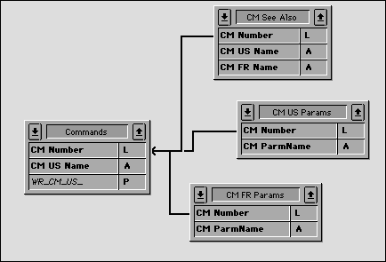

<!--REF #_command_.RECEIVE RECORD.Syntax-->**RECEIVE RECORD** {( *aTable* )}<!-- END REF-->
<!--REF #_command_.RECEIVE RECORD.Params-->
| 引数 | 型 |  | 説明 |
| --- | --- | --- | --- |
| aTable | Table | &#8594;  | レコードを受信するテーブル, または 省略した場合デフォルトテーブル |

<!-- END REF-->

#### 説明 

<!--REF #_command_.RECEIVE RECORD.Summary-->RECEIVE RECORDは、[SET CHANNEL](set-channel.md "SET CHANNEL")コマンドで開いたシリアルポートまたはドキュメントから*table*にレコードを受信します。<!-- END REF-->受信するレコードは[SEND RECORD](send-record.md "SEND RECORD")で送信したものでなければなりません。RECEIVE RECORDを実行すると、*table*に新しいレコードが自動で作成されます。レコードを正しく受信した時点で、[SAVE RECORD](save-record.md "SAVE RECORD")コマンドを使用して新しいレコードを保存します。

完全なレコードを受信します。つまりレコードにあるいはレコードとともに格納されたピクチャやBLOBも受信します。

**重要**: [SEND RECORD](send-record.md "SEND RECORD") と RECEIVE RECORDを使用してレコードが送受信される場合、送信元と送信先のテーブル構造は互換性のあるものでなくてはなりません。互換性がない場合、RECEIVE RECORDコマンドの実行時4Dがテーブル定義に応じて値を変換します。

**Notes:**

1. このコマンドを使用してドキュメントからレコードを受信する場合、ドキュメントは[SET CHANNEL](set-channel.md "SET CHANNEL")コマンドを使用して開かれていなければなりません。[Open document](open-document.md "Open document"), [Append document](append-document.md "Append document") または [Create document](create-document.md "Create document")で開かれたドキュメントに対して、RECEIVE RECORDを使用することはできません。
2. RECEIVE RECORDの実行中、Ctrl-Alt-Shift (Windows) またはCommand-Option-Shift (Macintosh) を押して、受信を中断することができます。中断することにより、エラー-9994が生成されます。[ON ERR CALL](on-err-call.md "ON ERR CALL")を使用してインストールされたエラー処理メソッドにより、このエラーをとらえることができます。通常、シリアルポート経由での通信の場合にのみ、受信の中断処理を実行する必要があります。

#### 例題 

データのアーカイブ作成や、異なる場所で使用されている同じシングルユーザデータベース間でデータをやり取りする際には、[SEND VARIABLE](send-variable.md "SEND VARIABLE"), [SEND RECORD](send-record.md "SEND RECORD"), [RECEIVE VARIABLE](receive-variable.md "RECEIVE VARIABLE") そして RECEIVE RECORDコマンドを組み合わせて使用するとよいでしょう。[EXPORT TEXT](export-text.md "EXPORT TEXT") や [IMPORT TEXT](import-text.md "IMPORT TEXT")等の読み込み/書き出しコマンドを利用して、4Dデータベース間でデータ交換を実行できます。しかしデータ中にグラフィックやリレートテーブルが含まれる場合には、[SEND RECORD](send-record.md "SEND RECORD") と RECEIVE RECORDを使う方がはるかに便利です。 

例えば、4Dと4D Writeを使用して作成されたドキュメントシステムを考えてみます。別々の場所にいる複数の製作者が作業を実行するため、異なるデータベース間でデータをやり取りする簡単な方法が必 要となりました。以下の図はこのデータベースストラクチャを簡単に表わしたものです:



テーブル*\[Commands\]*には、各コマンドやトピックに関する説明が納められます。テーブル*\[CM US Params\]*および*\[CM FR Params\]*にはそれぞれ、英語版またはフランス語版の各コマンドに対する引数のリストが納められます。また、テーブル*\[CM See Also\]*には、各コマンドに対する参照としてリストされるコマンドが納められています。したがって、データベース間でドキュメントのやり取りを実行するには、*\[Commands\]*レコードとそれにリレートするレコードを送信しなければなりません。これを実行するには、[SEND RECORD](send-record.md "SEND RECORD")とRECEIVE RECORDコマンドを使用しています。さらに[SEND VARIABLE](send-variable.md "SEND VARIABLE")と[RECEIVE VARIABLE](receive-variable.md "RECEIVE VARIABLE")コマンドを使い、読み込み／書き出しドキュメントにタグを付けています。

ドキュメントの書き出しを実行する簡略化したプロジェクトメソッドを以下に示します:

```4d
  // CM_EXPORT_SEL プロジェクトメソッド
  // このメソッドは [Commands] テーブルのカレントセレクションを処理対象とする
 
 SET CHANNEL(12;"") // ユーザにドキュメントを作成させ、チャンネルを開く
 If(OK=1)
  // 内容を示すタグを変数でドキュメントに指定する
  // Note: BUILD_LANG プロセス変数は送信するデータの言語、US (English) または FR (French)を示す
    $vsTag:="4DV6COMMAND"+BUILD_LANG
    SEND VARIABLE($vsTag)
  // 書き出す [Commands] レコード数を示す変数を送信
    $vlNbCmd:=Records in selection([Commands])
    SEND VARIABLE($vlNbCmd)
    FIRST RECORD([Commands])
  // コマンドごとに
    For($vlCmd;1;$vlNbCmd)
  // [Commands] レコードを送信
       SEND RECORD([Commands])
  // リレートするレコードを選択
       RELATE MANY([Commands])
  // ランゲージごとに、引数の数をしめす変数を送信
       Case of
          :(BUILD_LANG="US")
             $vlNbParm:=Records in selection([CM US Params])
          :(BUILD_LANG="FR")
             $vlNbParm:=Records in selection([CM FR Params])
       End case
       SEND VARIABLE($vlNbParm)
  // parameter レコードがあれば送信
       For($vlParm;1;$vlNbParm)
          Case of
             :(BUILD_LANG="US")
                SEND RECORD([CM US Params])
                NEXT RECORD([CM US Params])
             :(BUILD_LANG="FR")
                SEND RECORD([CM FR Params])
                NEXT RECORD([CM FR Params])
          End case
       End for
  // "See Also"の数を示す変数を送信
       $vlNbSee:=Records in selection([CM See Also])
       SEND VARIABLE($vlNbSee)
  // [See Also] レコードがあれば送信
       For($vlSee;1;$vlNbSee)
          SEND RECORD([CM See Also])
          NEXT RECORD([CM See Also])
       End for
  // 次の[Commands] レコード
       NEXT RECORD([Commands])
    End for
    SET CHANNEL(11) // Close the document
 End if
```

ドキュメントの読み込みを実行する簡略化したプロジェクトメソッドを以下に示します:

```4d
  // CM_IMPORT_SEL プロジェクトメソッド
 
 SET CHANNEL(10;"") // ユーザに読み込むドキュメントを選択させる
 If(OK=1) // ドキュメントが開かれれば
    RECEIVE VARIABLE($vsTag) // タグ変数を読み込む
    If($vsTag="4DV6COMMAND@") // 正しいタグを読み込んだかチェック
       $CurLang:=Substring($vsTag;Length($vsTag)-1) // タグからランゲージを取り出す
       If(($CurLang="US")&NBSP;|&NBSP;($CurLang="FR")) // 有効なランゲージなら
          RECEIVE VARIABLE($vlNbCmd) // いくつのコマンドが格納されているか
          If($vlNbCmd>0) // 1つ以上存在すれば
             For($vlCmd;1;$vlNbCmd) // アーカイブされた [Commands] レコード毎に
  // レコードを受信
                RECEIVE RECORD([Commands])
  // 新規レコードまたは既存のレコードへの上書きを保存するサブルーチンの呼び出し
                CM_IMP_CMD($CurLang)
  // パラメタ数の読み込み
                RECEIVE VARIABLE($vlNbParm)
                If($vlNbParm>=0)
  // RECEIVE RECORDを使用して新規レコードまたは既存の
  // レコードへの上書きを保存するサブルーチンの呼び出し
                   CM_IMP_PARM($vlNbParm;$CurLang)
                End if
  // "See Also"の数を読み込み
                RECEIVE VARIABLE($vlNbSee)
                If($vlNbSee>0)
  // RECEIVE RECORDを使用して新規レコードまたは
  // 既存のレコードへの上書きを保存するサブルーチンの呼び出し
                   CM_IMP_SEEA($vlNbSee;$CurLang)
                End if
             End for
          Else
             ALERT("この書き出しドキュメント内のコマンド数が無効です。")
          End if
       Else
          ALERT("この書き出しドキュメントの言語が正しくありません。")
       End if
    Else
       ALERT("これはコマンド書き出しドキュメントではありません。")
    End if
    SET CHANNEL(11) // ドキュメントを閉じる
 End if
```

  
デー タ受信中にシステム変数OKの評価も行わず、またエラーの検出も行っていない点に注意してください。しかし、ドキュメントそのものを表わす変数をドキュメ ントに保存するため、これらの変数がいったん受信され意味を持つ場合には、エラーの可能性は低くなります。例えば、ユーザが誤ったドキュメントをオープン した場合、この処理は最初の判定式で即座に中断されます。

#### システム変数およびセット 

レコードを受信するとシステム変数OKは1に、そうでなければ0に設定されます。

#### 参照 

[RECEIVE VARIABLE](receive-variable.md)  
[SEND RECORD](send-record.md)  
[SEND VARIABLE](send-variable.md)  

#### プロパティ

|  |  |
| --- | --- |
| コマンド番号 | 79 |
| スレッドセーフである | &check; |
| システム変数を更新する | OK、error |


