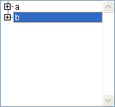
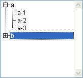
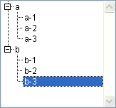
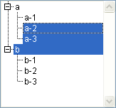
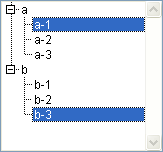

<!--REF #_command_.Selected list items.Syntax-->**Selected list items** ( {* ;} *list* {; *itemsArray* {; *}} )  : Integer<!-- END REF-->
<!--REF #_command_.Selected list items.Params-->
| 引数 | 型 |  | 説明 |
| --- | --- | --- | --- |
| * | 演算子 | &#8594;  | 指定時, listはオブジェクト名 (文字列) 省略時, listはリスト参照番号 |
| list | Integer, Text | &#8594;  | リスト参照番号 (* 省略時), または リストオブジェクト名 (* 指定時) |
| itemsArray | Integer array | &#8592; | 2番目の * 省略時: 配列にはリスト中で選択された 項目の位置配列が返される 2番目の * 指定時: 配列には選択された項目の 参照が返される |
| * | 演算子 | &#8594;  | 省略時: 項目位置 指定時: 項目参照 |
| 戻り値 | Integer | &#8592; | 2番目の * 省略時: 展開/折りたたまれたされたリスト中 現在選択されている項目位置 2番目の * 指定時: 選択されている項目の参照 |

<!-- END REF-->

#### 説明 

<!--REF #_command_.Selected list items.Summary-->**Selected list items** コマンドは、*list*引数に渡された参照番号またはオブジェクト名のリストにおいて、選択された項目の位置または参照番号を返します。<!-- END REF--> 

オプションの第一引数 *\** を渡すと、*list* 引数はフォーム上のリストオブジェクトに対応するオブジェクト名 (文字列) です。この引数を渡さない場合、*list* 引数は階層リスト参照 ([ListRef](# "階層リストへの参照")) です。リストオブジェクトを一つしか使わない場合または2番目の *\** を渡して項目参照番号を扱う場合、両方のシンタックスを使用できます。他方フォーム上に同じ階層リストを参照する複数のオブジェクトがあり、2番目の *\** を省略して項目位置を扱う場合、それぞれのオブジェクトが個別に展開/折りたたみ状態をもつので、オブジェクト名に基づくシンタックスを使用しなければなりません。

**Note:** オブジェクト名に @ 文字を使用することで、フォーム内に名前に対応するオブジェクトが複数検索された場合、[Selected list items](selected-list-items.md) コマンドは最初に見つけたオブジェクトを処理の対象とします。

複数の項目が選択される場合、コマンドは*itemsArray* 配列に選択された項目の参照または位置を返します。ユーザが選択した項目を知るために、フォーム上のリストに対しこのコマンドを適用できます。

2番目の \* 引数は、項目位置を扱うか (省略時)、項目参照を扱うか (指定時) を指定します。

*itemsArray*引数には倍長整数タイプの配列を渡すことができます。必要に応じ、関数は配列の作成やサイズ調整を行います。コマンドの実行後、*itemsArray*には次の要素が代入されます:

* 2番目の引数 *\** を省略した場合、リストの展開/折りたたみ状態に相対的な各選択項目の位置。
* 2番目の引数 *\** を渡した場合、各選択項目の固定参照。

選択された項目が存在しない場合、空の配列が返されます。

**Note:** 選択項目が複数存在する場合、コマンドは、ユーザー(手動のセレクション)あるいは[SELECT LIST ITEMS BY POSITION](select-list-items-by-position.md) または [SELECT LIST ITEMS BY REFERENCE](select-list-items-by-reference.md) コマンド(プログラムされたセレクション)によって*list* のリスト内で選択された、最初の項目の位置または参照を返します。

リストにサブリストがある場合、このコマンドサブリストではなく、メインリスト（フォームで実際に定義されたリスト）に適用します。位置は、リストとそのサブリストの現在の展開または縮小状態を用いて、メインリストの最上位の項目と相対的に表わされます。

いずれの場合でも、選択された項目が存在しない場合、関数は0を返します。

#### 例題 

次は、アプリケーションモードで表示された*hList*という名前のリストです:

  


```4d
 $vlItemPos:=Selected list items(hList) // この時点で$vlItemPos は 2
```



```4d
 $vlItemPos:=Selected list items(hList) // この時点で$vlItemPos は4
 $vlItemRef:=Selected list items(hList;*) // $vlItemRef は200 (例えば)
```



```4d
 $vlItemPos:=Selected list items(hList) // この時点で$vlItemPos は8
 $vlItemRef:=Selected list items(hList;*) // $vlItemRef は203 (例えば)
```



```4d
 $vlItemPos:=Selected list items(hList;$arrPos) // この時点で$vlItemPos は3
  // $arrPos{1} は3, $arrPos{2} は 4 そして $arrPos{3} は 5
```



```4d
 $vlItemRef:=Selected list items(hList;$arrRefs;*) // $vlItemRef は 101 (例えば)
  // $arrRefs{1} は 101, $arrRefs{2} は 203 (例えば)
```

#### 参照 

[SELECT LIST ITEMS BY POSITION](select-list-items-by-position.md)  
[SELECT LIST ITEMS BY REFERENCE](select-list-items-by-reference.md)  

#### プロパティ

|  |  |
| --- | --- |
| コマンド番号 | 379 |
| スレッドセーフである | &cross; |


