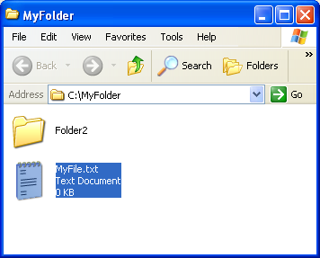
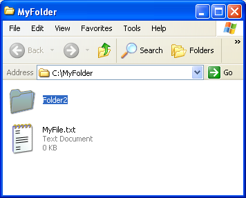
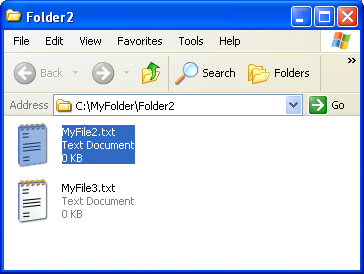

<!--REF #_command_.SHOW ON DISK.Syntax-->**SHOW ON DISK** ( *pathname* {; *} )<!-- END REF-->
<!--REF #_command_.SHOW ON DISK.Params-->
| 引数 | 型 |  | 説明 |
| --- | --- | --- | --- |
| pathname | Text | &#8594;  | 表示するアイテムのパス名 |
| * | 演算子 | &#8594;  | アイテムがフォルダの場合、その内容を表示 |

<!-- END REF-->

#### 説明 

<!--REF #_command_.SHOW ON DISK.Summary-->SHOW ON DISKコマンドは、オペレーティングシステムの標準ウィンドウ上に、引数*pathname* に渡したパス名を持つファイルまたはフォルダを表示します。<!-- END REF-->   
ユーザのインターフェースでは、このコマンドを使用して、特定のファイルやフォルダの場所を指定します。

デフォルトで、*pathname*がフォルダを指定する場合、コマンドはフォルダ自体のレベルを表示します。任意の引数 *\** を渡すと、コマンド はフォルダを開き、その内容をウィンドウで表示します。*pathname* がファイルを指定すると、引数 *\** は無視されます。 

#### 例題 

次の例で、このコマンドの機能を表します。

```4d
 SHOW ON DISK("c:\\MyFolder\\MyFile.txt") //指定されたファイルを表示する。
```



```4d
 SHOW ON DISK("c:\\MyFolder\\Folder2") //指定されたフォルダを表示する。
```



```4d
 SHOW ON DISK("c:\\MyFolder\\Folder2";*) //指定されたフォルダの内容を表示する。
```



#### システム変数およびセット 

コマンドが正しく実行されると、システム変数OKに1が代入されます。


#### プロパティ

|  |  |
| --- | --- |
| コマンド番号 | 922 |
| スレッドセーフである | &check; |
| システム変数を更新する | OK、error |


