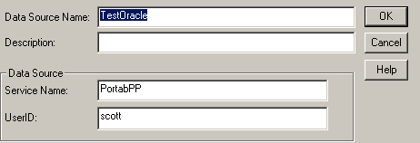

<!--REF #_command_.SQL End selection.Syntax-->**SQL End selection**  : Boolean<!-- END REF-->
<!--REF #_command_.SQL End selection.Params-->
| 引数 | 型 |  | 説明 |
| --- | --- | --- | --- |
| 戻り値 | Boolean | &#8592; | 結果セットの境界に達した |

<!-- END REF-->

#### 説明 

<!--REF #_command_.SQL End selection.Summary-->SQL End selectionコマンドは、結果セットの境界に達したかどうかを判定するために使用します。<!-- END REF-->

#### 例題 

次のコードは、外部データソース（Oracle）へ接続します:



```4d
 var vName : Text
 
 SQL LOGIN("TestOracle";"scott";"tiger")
 If(OK=1)
    SQL EXECUTE("SELECT ename FROM emp";vName)
    While(Not(SQL End selection))
       SQL LOAD RECORD
    End while
    SQL LOGOUT
 End if
```

このコードは4D変数*vName* にempテーブルの ename を返します。


#### プロパティ

|  |  |
| --- | --- |
| コマンド番号 | 821 |
| スレッドセーフである | &cross; |


