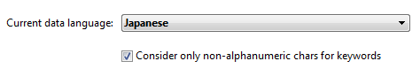
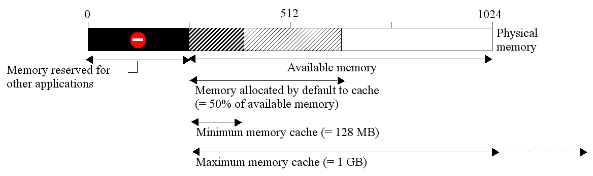

## データストレージページ

このページでは、4Dデータベースが使用するデータストレージに関する設定をおこないます。

### 一般設定

#### 読み込みのみのデータファイルの使用を許可する

このオプションを使用すると、OSレベルでロックされているデータファイルをアプリケーションから開けるようになります。 4Dは、ロックされたデータファイルを開かないようにする自動的なメカニズムを実装しています。 データファイルがロックされていると、4D はデータベースを開かず、以下のような警告メッセージを表示します:

このオプションを選択しないかぎり、ロックされたデータファイルを開くことはできません (4Dデータベースのデフォルト動作)。

#### ロックされたファイルについて

ロックされたファイルは読むことはできても内容を変更することはできません。 たとえば (DVDのような) 編集不可のメディアに格納されたファイルや、このようなメディアからコピーされたファイルは、ロックされていることがあります。 DVDに格納されたプロジェクトを使用するような場合、ロックされたデータファイルを使用できるようアプリケーションを設定することができます。 しかしこの場合、データの追加・編集が保存されないロックされているデータファイルを不注意に使用してしまうリスクがあります。 このような状況にならないよう、4D ではデフォルトでロックされたデータファイルを開くことを禁止しています。

### テンポラリフォルダーの場所

このエリアでは、4D 実行中に作成されるテンポラリーファイルの場所を設定できます。 テンポラリファイルのフォルダーは、一時的にメモリ中のデータをディスクに保存するために必要に応じてアプリケーションが使用します。

現在のフォルダーの場所は "現在:" エリアに表示されます。 このエリアをクリックするとパス名がスクロールダウンリスト形式で表示されます:

3つのオプションから選択できます:

- **システム**: このオプションが選択されると、4D のテンポラリファイルは Windows または macOS が指定する場所に配置されたフォルダーに作成されます。 システムが指定する場所は [`Temporary folder`](https://doc.4d.com/4dv19R/help/command/ja/page486.html) コマンドで知ることができます。 ファイルは、データベース名とユニークな識別子からなるサブフォルダーに置かれます。
- **データファイルフォルダー** (デフォルト): このオプションが選択されると、4D のテンポラリファイルはデータベースのデータファイルと同階層に配置される "temporary files" フォルダーに作成されます。
- **ユーザー指定**: このオプションは、場所をカスタマイズするのに使用します。 場所のオプションを変更した場合、新しい設定を反映するにはデータベースを再起動する必要があります。 4D は選択されたフォルダーに書き込みアクセス権があるかを確認します。 アクセス権がなければ、使用できるフォルダーが見つかるまで 4D は他のオプションを試します。

> このオプションは、ストラクチャー定義がXML形式で書き出されたとき、ストラクチャーの "extra properties" に格納されます ([ストラクチャー定義の書き出しと読み込み](https://doc.4d.com/4Dv19/4D/19/Exporting-and-importing-structure-definitions.300-5416829.ja.html) 参照)。

### テキスト比較

> これらのオプションのいずれかを変更した場合、新しい設定を反映するにはアプリケーションを終了し、再起動しなければなりません。 データベースが再び開かれると、すべてのインデックスが自動で再作成されます。

- **文字列の途中に含まれる＠はワイルドカードとして扱わない**: クエリ条件や文字列比較の際に "@" をどのように解釈するかを設定します。
  このオプションが選択されていない場合 (デフォルト設定)、"@" はワイルドカードとして扱われ、あらゆる文字の代わりとみなされます ([ワイルドカード記号 (@)](https://doc.4d.com/4Dv19/4D/19/Query-editor.300-5416813.ja.html#463876) 参照)。

  このオプションが選択されている場合、単語内にある "@" は普通の文字として扱われます。 この設定は、"@" が文字列内で使用される電子メールアドレスの検索などに有効です。 このオプションは検索、並び替え、文字列比較、およびテーブルに格納されるデータや配列などメモリ中のデータに影響を与えます。 (インデックス付きか否かにかかわらず) 文字型やテキスト型のフィールドおよび変数が、検索や並び替え時に "@" 文字がどのように解釈されるかの影響を受けます。

  **注:**

  - 検索において、"@" が検索条件の先頭か最後にある場合、"@" はワイルドカードとして扱われます。 単語の中に "@" 文字がある場合のみ (例: bill@cgi.com)、4D は異なった扱いをします。
  - このオプションは object引数に "@" ワイルドキャラクターを受け入れる [オブジェクト(フォーム)](https://doc.4d.com/4Dv19/4D/19/Objects-Forms.201-5391558.ja.html) テーマのコマンドの動作にも影響を与えます。
  - セキュリティの理由で、データベースの Administrator または Designer のみがこのパラメーターを変更できます。

- **現在のデータ言語**: 文字列の処理と比較に使用する言語を設定します。 言語の選択は、テキストの並べ替えや検索、文字の大小などの比較ルール等に直接影響を与えます。ただし、テキストの翻訳や日付・時刻・通貨のフォーマットはシステムの言語設定が使用され、この設定には影響されません。 デフォルトで 4D はシステム言語を使用します。

  つまり、4Dプロジェクトはシステム言語とは異なる言語で動作することができます。 プロジェクトが開かれるとき、4Dエンジンはデータファイルに使用されている言語を検知し、(インタープリターやコンパイルモードの) ランゲージに提供します。 データベースエンジン、あるいはランゲージのいずれがテキスト比較をおこなうかに関わらず、同じ言語が使用されます。

  > 4D環境設定でも言語を設定できます ([一般ページ](../Preferences/general.md) 参照)。 この場合、その設定は新規に作成されるデータベースに適用されます。

- **非文字・非数字のみをキーワード区切り文字とする**: 4D が使用するキーワード区切り文字の設定を変更し、その結果、作成されるキーワードインデックスに影響を与えます。 このオプションが選択されていない場合、4D は言語上の特質を考慮する洗練されたアルゴリズムを使用します。

  このアルゴリズムは、文字列中をダブルクリックしたときに選択範囲を決定するためワープロソフトが使用するものと同じです。 このアルゴリズムに関する詳細は以下の Webページを参照ください: `http://userguide.icu-project.org/boundaryanalysis`。

  このオプションが選択されている場合、4D は簡易的なアルゴリズムを使用します。 この設定では、文字でも数字でもない文字がキーワード区切り文字として扱われます。 この設定は日本語など特定の言語の要求に沿うものです。

- **テキスト検索用の文字列比較を使用する**: このオプションは日本語が選択されている場合にのみ表示されます。 このオプションは "カタカナ-ひらがなでの長音記号" および、"ゝ" または "ゞ" などの繰り返し記号 (踊り字) などの文字の解釈を変更します。 一般的には、この設定が有効化されている方が日本語話者にとって望ましい結果が得られます。

#### MeCab のサポート (日本語版)

日本語版の 4D では、 _MeCab_ ライブラリーがサポートされており、日本語用に調整されたキーワードのインデックスアルゴリズムを兼ね備えています。

日本語版の 4D ではこのアルゴリズムがデフォルトで使用されています。 必要であれば _MeCab_ アルゴリズムを無効にして、以前と同じ _ICU_ ライブラリーを使用することもできます。

_MeCab_ を無効化するには、**非文字・非数字のみをキーワード区切り文字とする** のオプションにチェックを入れます:

## メモリページ

このページでは、データベースのキャッシュメモリに関する設定をおこないます。

### データベースキャッシュ設定

- **起動時にキャッシュサイズを計算**: このオプションが選択されている場合、キャッシュメモリの管理は、設定された制限に基づき、4D起動時にキャッシュサイズが計算されます。 これにより、ほとんどのケースで高パフォーマンスのメモリ設定がおこなわれます。 キャッシュメモリのサイズは設定されたパラメーターに基づき動的に計算されます。 デフォルトで提案される値は標準の 4D の使用状況に対応します。

  - **他のアプリケーションとシステムのために予約するメモリ**: システムや他のアプリケーションが使用するために取り置く RAMメモリ量。 4D が実行されるマシン上で他のアプリケーションも実行する場合、必要に応じてこの値を増やします。
  - **利用可能なメモリからキャッシュに使用する率**: 残りのメモリからキャッシュに割り当てる量の率。\     デフォルトでキャッシュに割り当てるサイズを取得するためには、以下の計算式を適用します: (物理メモリ – 予約したメモリ) X キャッシュに使用するメモリのパーセンテージ。 動的に計算するモードの場合、キャッシュメモリのサイズはアプリケーションやシステムのニーズに応じて動的に変化します。 以下のオプションを使用して上限と下限を設定できます:
  - **最小サイズ**: キャッシュ用に予約するメモリの最小量。 この値は 100MB以上でなければなりません。
  - **最大サイズ**: キャッシュが使用することのできるメモリの最大量。 この値は実質的には無制限です。\     制限の設定は、メモリ搭載量が不明であるマシン用にアプリケーションを配布する際に便利です。 この場合、制限を設定することで最低限のパフォーマンスを保証できます。 この動作を図示すると以下のようになります:

  キャッシュメモリの計算例:  _予約するメモリ量 = 256 MB  キャッシュに利用するパーセンテージ = 50%  最大サイズ = 1 GB 最小サイズ = 128 MB_

  

- **起動時にキャッシュサイズを計算オプションがチェックされていない場合**: このモードでは、データベースのキャッシュメモリサイズを開発者が決定します。 4D はキャッシュメモリを設定する入力エリアと、物理メモリに関する情報 (マシンに実装されたRAM)、現在のキャッシュ、そして再起動後のキャッシュサイズを表示します。

  入力されたキャッシュサイズは、マシンのリソース状況にかかわらず、4Dデータベース用に予約されます。 この設定は、メモリ搭載量が分かっているなど、特定の状況で使用できます。 ほとんどのケースで起動時計算モードのキャッシュで良いパフォーマンスが提供されます。

- **キャッシュをディスクに保存 ...  秒/分**: キャッシュ中のデータを自動的に保存する間隔を設定します。
  4D はキャッシュ中のデータを定期的に保存します。 この間隔を 1秒から 500分の範囲で設定できます。 デフォルトの設定値は 20秒です。 この保存は、キャッシュがいっぱいになった場合や、アプリケーションを終了する際にもおこなわれます。 また [FLUSH CACHE](https://doc.4d.com/4dv19R/help/command/ja/page297.html) コマンドを使って、いつでもフラッシュをトリガーできます。

  大量のデータ入力が予期される場合は、この間隔を短くすることを検討してください。 停電などの理由でマシンが停止すると、前回の保存以降に入力されたデータが失われてしまいます (データログファイルをとっていれば復旧可能です)。

  キャッシュがフラッシュされるたびにデータベースの動作が遅くなる場合、周期を調整する必要があります。 動作が遅くなるのは、大量のレコードがディスクにフラッシュされるためです。 フラッシュ周期を短くすることで、各フラッシュ時に保存されるレコード数を減らすことができ、動作も速くなります。

  デフォルトで 4D はキャッシュがフラッシュされていることを示す小さなウィンドウを表示します。 このウィンドウを表示したくない場合、[インターフェースページ](./interface.md) の **フラッシュの進捗状況** オプションの選択を解除します。
