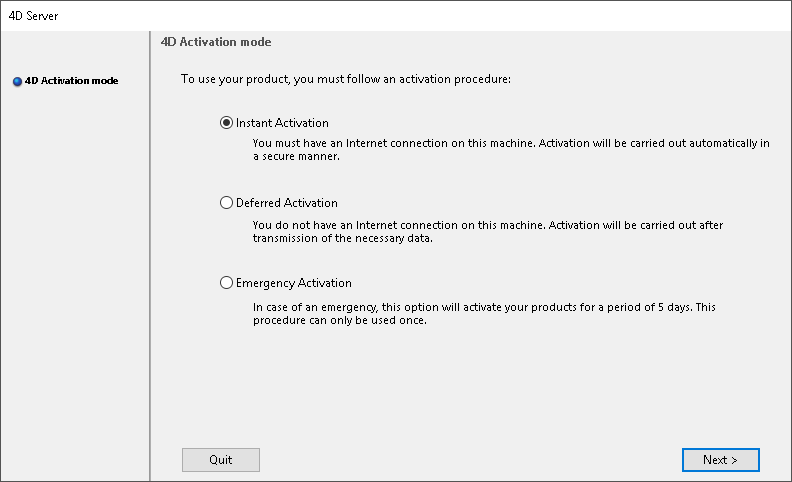
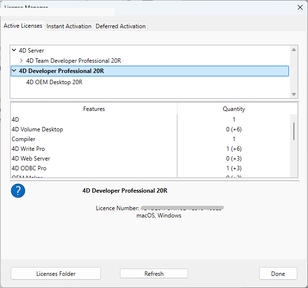

## 4Dライセンスの概要

4D の製品と機能を使用するには、コンピューターに適切なライセンスをインストールする必要があります。 4D は2種類のライセンスを提供します:

- **開発ライセンス** は、4D および4D Server のIDE (統合開発環境)で作業するために必要です。
- **運用ライセンス** は、4D でビルドしたあなたのカスタムアプリケーションを配布・運用するために必要です。

### 開発ライセンス

開発ライセンスは、4D のデザインモードや機能にアクセスするために必要です。 例えば、*4D Developer Pro* はシングルユーザー向け開発ライセンスです。 登録された開発ライセンスはウェルカムウィザードから[ログイン](GettingStarted/Installation.md) すれば自動的にインストールされます。またそれ以外にも[オンラインアクティベーション](#オンラインアクティベーション) ダイアログボックスを使用して追加することもできます。

### 運用ライセンス

運用ライセンスは、以下の表で説明されているように、開発者によって開発段階で埋め込むか、あるいは初回起動時にエンドユーザーによって入力される必要があります:

| 運用ライセンス                  | 説明                                              | 入力する場所                                                    |
| ------------------------ | ----------------------------------------------- | --------------------------------------------------------- |
| *4D OEM Desktop*         | 埋め込まれたカスタムのライセンス。詳細は 4D 営業部にお取り合わせ下さい。          | ビルドアプリケーションダイアログの[ライセンスページ](../Desktop/building.md#ライセンス) |
| *4D Unlimited Desktop*   | **販売終了** - 埋め込まれたカスタムのライセンス                     | ビルドアプリケーションダイアログの[ライセンスページ](../Desktop/building.md#ライセンス) |
| *4D Desktop*             | ユーザーごとのライセンスで、スタンドアロンの4D アプリケーションを使用するのに必要です。   | ユーザーマシン上での[初回起動時](#初回のアクティベーション) のダイアログボックス               |
| *4D Server OEM*          | 埋め込まれたカスタムのライセンス。詳細は 4D 営業部にお取り合わせ下さい。          | ビルドアプリケーションダイアログの[ライセンスページ](../Desktop/building.md#ライセンス) |
| *4D XML Keys Activation* | 4D Server OEM ライセンスの有効化に使用                      | ビルドアプリケーションダイアログの[ライセンスページ](../Desktop/building.md#ライセンス) |
| *4D Server*              | 各ユーザーごとに必要なライセンスで、4D Server とクライアントを使用するのに必要です。 | ユーザーマシン上での[初回起動時](#初回のアクティベーション) のダイアログボックス               |

### 期限切れ

一部の4D ライセンスには有効期限があり、それを過ぎた場合には更新する必要があります。 ライセンスのサブスクリプションが4D ストア上で更新されると、ウェルカムウィザードから[ログイン](GettingStarted/Installation.md)すると、お使いの4D アプリケーション内のライセンスは自動的に更新されます。

一部のケースにおいては、ライセンスマネージャダイアログボックス内の[**更新** ボタン](#更新) をクリックする必要があるものもあります。

## ライセンスの有効化

ディスクへのインストール終了後、4D 製品を利用するためにはアクティベーションをおこないます。 通常、[4D アカウントでサインイン](GettingStarted/Installation.md) した場合、アクティベーションは自動的におこなわれます。

しかし、場合によってはライセンスを手動でアクティベーションする必要があります。たとえば:

- 自動アクティベーションが可能でない場合
- 追加の開発ライセンスを購入した場合

以下の利用モードの場合には、アクティベーションは必要はありません:

- リモートモードで利用される 4D (4D Serverへの接続)
- インタープリターモードのアプリケーションプロジェクトを開く場合で、デザインモードへはアクセスしないローカルモードの4D

### 初回のアクティベーション

4D でおこなう場合は、**ヘルプ** メニューから **ライセンスマネージャー...** を選択します。 4D Server でおこなう場合は、4D Server アプリケーションを起動します。 アクティベーションモードを選択するダイアログボックスが表示されます。

4D は 3つのアクティベーションモードを用意しています。 推奨されるのは **オンラインアクティベーション** です。

### オンラインアクティベーション

ユーザーID (メールアドレスまたは 4Dアカウント) とパスワードを入力します。 既存のユーザーアカウントが無い場合、まず以下のアドレスから作成する必要があります:

[https://account.4d.com/us/login.shtml](https://account.4d.com/us/login.shtml/ja)

その後、アクティベーションする製品のプロダクト番号を入力します。 このプロダクト番号は製品購入後にメールまたは郵送で提供されています。

### オフラインアクティベーション

コンピューターからインターネットへのアクセスがないために [オンラインアクティベーション](#オンラインアクティベーション) が出来ない場合、以下の手順を踏んでオフラインアクティベーションへと進んで下さい。

1. **ヘルプ** メニューから "ライセンスマネージャー" を開き、**オフラインアクティベーション** タブを選択します。
2. ライセンス番号とメールアドレスを入力し、**ファイルを生成** をクリックして IDファイル (*reg.txt*) を作成します。

3. 生成された *reg.txt* ファイルを USBドライブへと保存し、インターネット環境があるコンピューターへと移動させます。
4. インターネット環境のあるマシンから、[https://store.4d.com/jp/activation.shtml](https://store.4d.com/jp/activation.shtml) にログインします。
5. Web ページ上にて、**ファイルを選択...** ボタンをクリックし、手順3と4で生成した *reg.txt* ファイルを選択し、**Activate** ボタンをクリックします。
6. シリアルファイルをダウンロードします。

7. *license4d* ファイルを、何らかの共有メディアに保存し、手順1で使用している4Dマシンへと移動させます。
8. **"オフラインアクティベーション"** 画面のままになっている、4D をインストールしたマシン上にて、画面上の **次へ** をクリックし、次に **読み込み...** ボタンをクリックして、手順7の共有メディアにある *license4d* ファイルを選択します。

ライセンスファイルが読み込まれた状態で、**次へ** をクリックします。

9. 他のライセンスを追加するためには **番号追加** ボタンをクリックします。 これらの手順を、手順6のライセンスがすべて追加されるまで繰り返します。

これで、お使いの4Dアプリケーションのアクティベーションが完了しました。

### 緊急アクティベーション

このモードは、特別に一時的な4Dのアクティベーションをおこなうために使用します。このアクティベーションを行うと、4Dインターネットサイトに接続せずに、最大5日間4Dを利用できます。 このアクティベーションは一回のみ使用することができます。

## 更新

ライセンスは通常、4d アプリケーションの起動時に自動的に更新されます。

**更新** ボタンは、以下のような場合に使用します:

- 追加のエクスパンションを購入したとき、またはそれをアクティベートしたいとき。
- パートナーなどの失効した番号を更新する必要があるとき。

4D または 4D Server アプリケーションの **ヘルプ** メニューから **ライセンスマネージャー...** を選択し、**更新** ボタンをクリックしてください:

このボタンを押すと 4D カスタマーデータベースに接続し、利用中のライセンスに紐付いている新しい、あるいは更新されたライセンスの自動アクティベーションがおこなわれます (利用中のライセンスは "有効なライセンス" 一覧内で **太字** で表示されているものです)。 その際、4D アカウントとパスワードの入力が必要です。

- 4D Server に追加のエクスパンションを購入した場合、ライセンス番号は一切入力する必要がありません。**更新** ボタンをクリックすれば、すべて完了します。
- 4D Server の初回アクティベーション時のみ、サーバーのライセンス番号を入力すれば、購入した他のエクスパンションもすべて自動的に有効化されます。

## 4D オンラインストア

4D ストアでは、4D製品の注文、アップグレード、延長、管理等をおこなうことができます。 ストアは以下のアドレスからアクセス可能です: [https://store.4d.com/jp/](https://store.4d.com/jp/)

既存アカウントで **ログイン** するか、または **新規アカウント** を作成し、画面上の指示に従ってください。  
**注:** パスワードを忘れてしまった場合、"パスワードをお忘れの方" をクリックして下さい (ログイン画面右側のヘルプメニューにあります)。数分後に指定されたアドレスへ、パスワードリセット用の自動メールが送信されます。

### ライセンス管理

ログイン後、ページ右側のマイ・ライセンスメニューから **ライセンスの一覧** をクリックします:

ここでは、ライセンスをプロジェクト単位でグループ化して管理することができます。

一覧から任意のライセンスを選択し、**プロジェクトにリンク... >**:

既存プロジェクトを選択、または新規プロジェクトを作成します:

プロジェクトを利用することで、必要に応じてライセンスを整理することができます:

## トラブルシューティング

インストールやアクティベーションに失敗する場合は以下の表を参照してください。ほとんどの問題はこれらのケースに当てはまります:

| 症状                                                     | 考えられる原因                              | 解決法                                                                                                                           |
| ------------------------------------------------------ | ------------------------------------ | ----------------------------------------------------------------------------------------------------------------------------- |
| 4D社のサイトからインストーラーをダウンロードできません。                          | サイトがダウンしている、またはアンチウィルスやファイアウォールなどの影響 | 1- 時間を空けて再度試してください または  2- 一時的にアンチウィルスソフトやファイアウォールを無効にしてください。                                                       |
| ディスクに製品をインストールできません (インストールが拒否される)。 | アプリケーションのインストール権限がない                 | アプリケーションをインストールする権限を持ったセッションを開いてください (管理者アクセス)。                                                            |
| オンラインアクティベーションに失敗します。                                  | アンチウィルス、ファイアーウォール、プロキシ               | 1- 一時的にアンチウィルスソフトやファイアウォールを無効にしてください または  2- オフラインアクティベーションを試してください。(ただし "R" バージョン用のライセンスでは利用不可) |

この情報で問題が解決しない場合は、お問い合わせください。

## 連絡先

お買い求めいただきました製品のインストールやアクティベーションに関するご質問はフォーディー・ジャパン社、またはお住まいの地域の代理店までお寄せください。

日本にお住まいの方:

- Web: [https://jp.4d.com/technical-support](https://jp.4d.com/technical-support)
- Tel: 03-4400-1789

-
-
