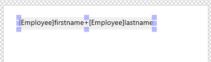

4Dのラベルエディターにより、さまざまなラベルを容易に印刷することができます。 ラベルエディターを使用し、次の操作を行うことができます:

- 宛名やファイルフォルダー、ファイルカードなど、その他数々のニーズに対応するラベルをデザインする。
- 装飾用のオブジェクトを作成し、ラベルテンプレートに挿入する。
- ラベルに使用するフォント、フォントサイズ、書体を指定する。
- 各ページの縦と横に印刷するラベル数を指定する。
- 各レコードにつき印刷するラベル数を指定する。
- ラベルページのマージンを指定する。
- 各ラベルまたは各レコードを印刷する際に実行するメソッドを指定する。
- プレビューを作成し、ラベルを印刷する。

:::note

ラベルは、[フォームエディター](../FormEditor/formEditor.md) を使用して作成することもできます。 変数を含むラベルや、フォームエディターの描画用ツールを利用する特殊なラベルを作成しそれらをラベルエディターや [`PRINT LABEL`](../commands-legacy/print-label.md) コマンドを使用して印刷したい場合には、フォームエディターを使用してください。

:::

ラベルエディターを使用して、ラベルの作成やフォーマット、印刷を行います。 ラベルエディター には、ラベルを設計したり、ラベル用紙上でのラベル位置を決めるための各種設定が用意されています。 例えば、宛名ラベルを作成する場合、1行目に相手先の 名字と名前、2行目にその人の住所を納めたラベルを設計することができます。 ラベルエディターでは、ページ上のラベル数を指定したり、ラベル用紙のマージ ンを指定することで、ラベルテキストがラベルの中央に配置されるようデザインを調整することができます。
ラベルデザインが完成したら、いつでも再利用できるようにディスクに保存することができます。

ラベルエディターは、次のように開きます:

- デザインモードでは、**ツール**メニュー、あるいは4Dツールバーにあるツールボタンのメニューから\*\*ラベル...\*\*を選択します。
 OR
- アプリケーションモードでは、 [`PRINT LABEL`](../commands-legacy/print-label.md) コマンドを使用します。


ラベルページはラベルの内容を指定するために使用し、レイアウトページはページ上のラベルサイズや位置を指定するために使用します。


## ラベルページ

ラベルページには、ラベルのデザインやフォーマットを行うための設定があります。

### フィールドのリスト

カレントテーブルのフィールド名が階層リスト形式で表示されます。 そのテーブルが別のテーブルにリレートしている場合は、外部キーフィー ルドにプラス記号 (Windows) または矢印 (Macintosh) が表示されます。 リレートフィールドを展開すると、リレートテーブルのフィールドを表示することができます。 リレートテーブルのフィールドはインデント (字下げ) されます。 リストから右のラベルプレビューエリアにドラッグすると、フィールドをラベルテンプレートに追加できます。

:::note 注記

- クイックレポートエディターのフィールドリストには、非表示属性が設定されていないテーブルとフィールドだけが表示されます。
- [オブジェクト型](../Concepts/dt_object.md) のフィールドは、ラベルエディターではサポートされていません。

:::

この検索エリアでは入力した文字列を含むフィールドのみに表示を限定することができます:


### ラベルプレビューエリア

このエリアを使用して、ラベルに表示させるすべてのオブジェクトの配置を調整し、ラベルを設計します。 白い長方形は一つのラベルを表します(ラベルの大きさは [レイアウトページ](#レイアウトページ)) を指定できます)。ラベルにはフィールドをドラッグすることができます。

- ラベルにはフィールドをドラッグすることができます。
- 一つ目のフィールドの上に他のフィールをドロップする事で二つのフィールドを結合する事もできます。 これらは自動的にスペースで区切られます。<br/>
 <br/>
 **Shift** キーを押しながらドロップすると、改行で区切られます。 これによって、住所などの複数のフィールドにまたがるラベル(住所1、住所2など)を、住所が一行で済む場合にも無駄な余白行を作らずに作成する事ができることができます。
- **フォーミュラ** ツール  (あるいはコンテキストメニュー内の **ツール>フォーミュラ**) を選択しながらエリアを描画することで、ラベルにフォーミュラを追加することができます。 すると **フォーミュラエディター** が表示されます:
 <br/>
 例えば、 [`String`](../commands-legacy/string.md) コマンドを使用してフィールドにフォーマットを適用することができます:<br/>

<br/>

:::note

フォーミュラエディター内では、データベースにおいて"許可された"メソッドしか入力できないという点に注意して下さい。 許可されたメソッドは [プロジェクト設定](../settings/security.md#オプション) と [`SET ALLOWED METHODS`](../commands/set-allowed-methods.md) コマンドによります。

:::

- OS のデスクトップからピクチャーファイル、またはラベルファイル(".4lbp" ファイル) をドラッグ&ドロップすることができます。

- エリアを変更するには、中身をダブルクリックして編集モードにスイッチして下さい。 フィールドやフォーミュラをダブルクリックすると、 **フォーミュラエディター** が表示され、これにより項目を削除や変更することができます:
 

### 使用するフォーム

このドロップダウンリストを使用すると選択したテーブルフォームをラベルテンプレートとして定義できるようになります。 選択されたフォームはラベルの作成に特化している必要があります。
この場合、ラベルエディターは部分的に無効化される事になります：[レイアウトページ](#layout-page) の機能のみが使用可能です。これによりフォームに基づいたページの設定が可能です。 選択されたフォームのイメージは、ラベルプレビューエリアに表示されます。
フォームを使用する場合、4Dはそれに関連づけられたあらゆるフォームメソッド・オブジェクトメソッドを実行します。 このオプションを使用する場合、各レコードあるいは各ラベルに対して実行するプロジェクトメソッドを指定し、変数を割り当てることができます(以下の [この例題](#フォームとメソッドを使用してラベルを印刷する) を参照して下さい)。 エディター自身を使用してラベルを作成したい場合、**フォームなし** オプションを選ぶ必要があります。

:::note 注記

- このメニューに表示されるフォームは、[特定のJSON ファイル](#controlling-available-forms-and-methods) を使用する事によって制限する事ができます。
- データベースにテーブルフォームが何も含まれていない場合には、このメニューは表示されません。

:::

### グラフィックエリアコマンド

エディターのグラフィックエリアではツールバーとコンテキストメニューの両方が使え、これを使ってラベリテンプレートをデザインするすることができます。

ツールバーの左側にはオブジェクトの選択と挿入のためのコマンドを含めるためのツールバーがあります。 これらのツールはエリアのコンテキストメニュー内の**ツール >** コマンドによってもアクセスする事ができます。

| アイコン                                      | ツール名        | 説明                                                                                                                       |
| ----------------------------------------- | ----------- | ------------------------------------------------------------------------------------------------------------------------ |
|  | セレクション      | 選択ツール。単一のオブジェクトをクリックするか、複数のオブジェクトを指定する選択範囲を選んでください。 隣り合っていない複数のオブジェクトを選択するためには、 **Shift** キーを押しながら選択したオブジェクトを一つずつ選んで下さい。 |
|  | 線作成ツール      |                                                                                                                          |
|  | 四角作成ツール     | 四角または角の丸い四角を作成できます。                                                                                                      |
|  | 円作成ツール      |                                                                                                                          |
|  | テキスト挿入ツール   | 四角形を描画して内部にテキストを入力して下さい。 テキストエリアであればどのようなものでも編集可能です。フィールド参照を含んでいるものも編集可能で、これらに対してはダブルクリックして下さい。                          |
|  | フォーミュラ挿入ツール | 四角形を描画して **フォーミュラエディター** を表示して下さい。これを使用して動的なラベルコンテンツ(フィールドやフォーミュラ)を定義することができます。                       |

以下のショートカットを使用する事で、キーボードの矢印キーを使用してより細かくオブジェクトを移動・リサイズすることができます:

- キーボードの矢印キーを押すと、選択されたオブジェクトを1ピクセルずつ移動させます。
- **Shift** + 矢印キーは、選択されたオブジェクトを10ピクセルずつ移動させます。
- **Ctrl** + 矢印キーは、オブジェクトの選択範囲を1ピクセルずつ拡大または縮小させます。
- **Ctrl** + **Shift** + 矢印キーは、オブジェクトの選択範囲を10ピクセルずつ拡大または縮小します。

右側のツールバーにはラベルテンプレートの項目を変更するのに使用するコマンドが含まれます:

| アイコン                                       | ツール名      | 説明                                                                                                                                                          |
| ------------------------------------------ | --------- | ----------------------------------------------------------------------------------------------------------------------------------------------------------- |
|   | 塗りカラー     | 全てのカラーアイコンは選択されたカラーを表示します                                                                                                                                   |
|   | 線カラー      |                                                                                                                                                             |
|   | 線の太さ      |                                                                                                                                                             |
|  | フォントメニュー  | フォントとそのサイズに加え、テキストスタイル、選択されたテキストのブロックのカラーと行揃えを設定します。                                                                                                        |
|  | 揃えと間隔ツール  | 揃えオプションを利用するためには二つ以上のオブジェクトを選択する必要があります。 "間隔"ツールは三つ以上のオブジェクトに対して水平あるいは垂直方向の間隔を自動的に同じ幅に揃えることを意味します。 最終的な間隔は選択範囲内にある既存の幅(または高さ)全ての平均になります。 |
|  | オブジェクトレベル | オブジェクトを最前面に、あるいは複数のオブジェクトを一つレベルを上げるか下げるかします。                                                                                                                |

## レイアウトページ

レイアウトページには、現在の印刷条件に基づいたラベル印刷用の各種設定が用意されています。


- **ラベル順**: ラベルが行ごとに印刷されるべきかあるいは列ごとに印刷されるべきかを指定します。
- **ラベル列数** と**ラベル行数** : ラベル用紙に印刷されるラベル"列数"と"行数"を指定します。 "自動サイズ調整"オプションが有効化されている場合、この設定を使用してラベルのサイズが決定されます。
- **ラベル数／レコード**: レコード毎に印刷するラベルの枚数を指定することができます(指定された数だけ連続して印刷されます)。
- **印刷設定...**: ラベルが印刷される用紙のページ設定を設定します。 このボタンをクリックすると、システムで選択されているプリンターの設定ダイアログボックスが表示されます。 デフォルトでは、ラベルの用紙はA4 サイズの縦向きモードをベースに生成されています。
 **注意:** エディターを使用して作成された用紙はプリンターの理論上のページサイズに基づいています。つまり物理的なページサイズ(例: A4など)と比べて、使用不可なマージンの分だけサイズが(両面とも)小さくなります。 ページの物理的なマージンは、プレビューエリア内にて青い線で表示されます。
- **単位**: ラベルとラベルページのサイズ指定に使用する単位を変更することができます。 ピクセル、ミリメートル、センチメートル、またはインチを使用することができます。
- **自動サイズ調整**: このオプションを設定すると、他のパラメーターを変更する度にラベルのサイズ(幅および高さパラメーター)の値が4D によって自動的に計算されます。 このオプションがチェックされていると、ページのパラメーターを変更するたびにラベルのサイズが調整されます。 幅と高さのパラメーターは手動で設定することはできなくなります。
- **幅** および **高さ**: それぞれのラベルの高さと幅を手動で設定します。 これらは、**自動サイズ調整** オプションがチェックされている場合には変更することはできません。
- **マージン** (上、右、左、下): 用紙のマージンを設定します。 これらのマージンはプレビューエリア内にて青い線で表示されています。 **プリンターのマージンを使用** をクリックすると、選択されたプリンターから提供されたマージン情報がプレビューエリアに再現されます(これらの値は変更可能です)。
- **間隔**: ラベルの行と列の間の垂直方向/水平方向の間隔の量を設定します。
- **メソッド**: 印刷時に実行されるメソッドを選択することができます。 例えば、各ラベルが印刷された日付と時間をポストするメソッドを実行することができます。 この機能は専用のテーブルフォームを使用してラベルを印刷するときにも有用です。この場合にはメソッドからの変数を使用することもできます。
 ラベル処理に適用するためにはプロジェクトメソッドは以下の設定に適合している必要があります:
 - メソッドはデータベース内において"許可されている"必要があります(許可されているメソッドは[プロジェクト設定](../settings/security.md#オプション) および [`SET ALLOWED METHODS`](../commands/set-allowed-methods.md) コマンドによります)。許可されていない場合には**メソッド**メニュー内には表示されません。
 - [コンポーネントとホストデータベース間で共有](../Project/code-overview.md#コンポーネントとホストプロジェクト間で共有) オプションがチェックされている必要があります。
  以下の [こちらの例題](#フォームとメソッドを使用したラベルの印刷-例題) も参照して下さい。

:::note

高度な使用法として、 [特定のjson ファイル](#利用可能なフォームとメソッドを管理する) を使用して利用可能なメソッドの一覧を制限することができます。
**実行頻度: レコードあるいはラベル** オプションを使用すると、メソッドの実行をラベル毎またはレコード毎のいずれに行うかを指定します。 この項目は、各ラベルを複数印刷し、かつ印刷時にメソッドを実行する場合にのみ意味があります。

:::

- **レイアウトプレビューエリア**: このエリアには、ラベルエディターで入力したサイズに基づき、ラベルページ全体の状態が縮小表示されます。 また、ページのプレビューでは、用紙設定ダイア ログボックスで選択した用紙サイズが反映されます。 ページ上で最初に印刷されるラベルを選択することも可能です(このオプションは複数ページの印刷の場合には最初のページにのみ影響します)。 これは、例えば一部が使用済みのラベルシールに印刷したいような場合に有用です。 またラベルをクリックすることでページ上で印刷される最初のラベルを選択することもできます:


## フォームとメソッドを使用したラベルの印刷(例題)

専用のテーブルフォームとプロジェクトメソッドを使用することで、計算された変数を含むラベルを印刷することができます。 この単純な例題では、異なる要素の設定の仕方を紹介していきます。

1. 専用のテーブルフォームの中に、自分のラベルフィールドや変数を追加していきます。
 ここでは、"label" という名前のテーブルフォームに、 *myVar* という名前の変数を追加します:
 

2. 以下のコードを持つ `setMyVar` という名前のプロジェクトメソッドを作成します:

```4d
 var myVar+=1
```

3. プロジェクトメソッドに対して["コンポーネントとホストデータベース間で共有"](../Project/code-overview.md#コンポーネントとホストデータベース間で共有) オプションを設定します。

4. ラベルエディターを表示する前に、以下のコードを実行してプロジェクトメソッドが確実に許可されているようにします:

```4d
 ARRAY TEXT($methods;1)
 $methods{1}:="setMyVar"
 SET ALLOWED METHODS($methods)
```

5. ラベルエディターを開き、使用したいフォームを使用します:
 

6. レイアウトページにて、実行するメソッドを選択します:
 

そしてラベルを印刷します:


## 利用可能なフォームとメソッドを管理する

ラベルエディターでは、ダイアログボックスで選択可能なフォームとメソッドを("許可されたメソッド"の中から)制限する高度な機能が含まれます:

- "ラベル" ページの **使用するフォーム** メニュー、または
- "レイアウト" ページの **適用(メソッド)** メニュー

1. **labels.json** という名前の JSON ファイルを作成し、プロジェクトの [Resources フォルダー](../Project/architecture.md#resources) 内におきます。
2. このファイル内に、ラベルエディターのメニュー内にて選択可能にしたいフォームまたはメソッド名を追加します。

**labels.json** ファイルの中身は、以下のようにしてください:

```json
[ 
    {"tableId":2,"forms":[],"methods":["myMethod1","myMethod2"]},
    {"tableId":1,"forms":["Sample Label 1","Sample Label 2"],"methods":[]}
]
```

**labels.json** ファイルを設定しない場合には、メニューの選択項目は制限されません。

## ラベルファイルの管理

4D のラベルデザインはそれぞれファイルとして保存することができ、保存したデザインはウィザード内で呼び出すことができます。 ラベルデザインを保存すれば、必要に応じたラベルライブラリを作ることができます。 各ラベルデザインにはラベルおよびレイアウトページで定義された設定が格納されます。

なお、ラベルファイルはデスクトップ上からラベルデザインエリアにドラッグ & ドロップすることもできます。

ラベルデザインは、ツールバーの **読み込み** および **保存** ボタンを使って管理します:

- ラベルデザインを呼び出すには、 **読み込み** ボタンをクリックし、ファイル選択ダイアログを使って任意のラベルファイルを指定します(ウィザード内で別のラベルデザインが開かれている場合、そのデザインは読み込まれたデザインで置き換えられます)。
- ラベルデザインを保存するには、 **保存** ボタンをクリックし、ファイル名と保存先を指定します。

### ファイル形式

ウィザードが保存する 4D ラベルファイルの拡張子は ".4lbp" です。 このファイルは内部的には XML で書かれているため、編集することができます。

### ラベルファイルのプリロード

ラベルウィザードではラベルファイルをアプリケーション内に保存することができるため、ユーザーは **読み込み** ボタンを使って直接ラベルデザインを選択し開くことができます。

このためには、プロジェクトの [Resources フォルダー](../Project/architecture.md#resources) 内に `Labels` フォルダーを作成し、そこにラベルファイルをコピーするだけです:


:::note

標準の ".4lbp" ファイルと旧式のウィザードから生成されたファイル(".4lb") の両方がサポートされます。

:::

ラベルウィザードが起動するとこのフォルダーが検知され、中に有効なラベルファイルがあった場合には、**読み込み** ボタンにポップアップアイコンが追加されます。 このポップアップメニューの行からラベルデザインを選択することが可能になります:


