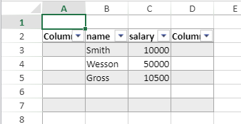

<details><summary>履歴</summary>

| リリース  | 内容 |
| ----- | -- |
| 19 R7 | 追加 |

</details>

<!-- REF #_method_.VP RESIZE TABLE.Syntax -->

**VP RESIZE TABLE** ( *rangeObj* : Object; *tableName* : Text )<!-- END REF -->

<!-- REF #_method_.VP RESIZE TABLE.Params -->

| 引数        | 型      |    | 説明         |                  |
| --------- | ------ | -- | ---------- | ---------------- |
| rangeObj  | Object | -> | 表組みの新しいレンジ |                  |
| tableName | Text   | -> | テーブル名      | <!-- END REF --> |

## 説明

`VP RESIZE TABLE` コマンドは、<!-- REF #_method_.VP RESIZE TABLE.Summary -->*rangeObj* で指定したレンジの大きさに *tableName* で指定した表組みをリサイズします<!-- END REF -->。

次のルールが適用されます:

- ヘッダーは同じ行のまま残り、結果の表範囲は元の表範囲と重なっている必要があります。
- リサイズされた表組みの行数がリサイズ前より少ない場合、切り取られた行や列内の値は、それらが [データコンテキスト](vp-set-data-context.md) にバインドされていなければ保持され、そうでなければ削除されます。
- 表組みを拡張した先にデータを含むセルが存在する場合には:
     - 行が追加された場合、データは削除されます。
     - 列が追加された場合、データは保持され、新しい列に表示されます。

*tableName* の表組みが存在しない場合には、何も起こりません。

## 例題

データコンテキストを使用した表組みを作成します:

```4d
var $context : Object
$context:=New object()

$context.col:=New collection
$context.col.push(New object("name"; "Smith"; "salary"; 10000))
$context.col.push(New object("name"; "Wesson"; "salary"; 50000))
$context.col.push(New object("name"; "Gross"; "salary"; 10500))

VP SET DATA CONTEXT("ViewProArea"; $context)

VP CREATE TABLE(VP Cells("ViewProArea"; 1; 1; 3; 3); "PeopleTable"; "col")
```


表組みの前後に 1列ずつと、空行を 2行を追加します。 以下のように書くことができます:

```4d
VP RESIZE TABLE(VP Cells("ViewProArea"; 0; 1; 4; 6); "PeopleTable")
```



## 参照

[VP CREATE TABLE](vp-create-table.md)<br/>
[VP Get table range](vp-get-table-range.md)
