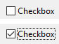
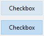

チェックボックスはボタンの一種で、バイナリ (true-false) データの入力や表示をおこないます。 基本的に、チェックボックスの状態は選択または未選択のいずれかになりますが、[3つめの状態](#スリーステートチェックボックス) を定義することもできます。


チェックボックスは、メソッドまたは [標準アクション](#標準アクションの使用) を使って管理します。 チェックボックスが選択されると、チェックボックスに割り当てられたメソッドが実行されます。 他のボタンと同じように、フォームが初めて開かれると、チェックボックスの変数は 0 に初期化されます。

チェックボックスは小さな四角形の右側にテキストを表示します。 このテキストはチェックボックスの [タイトル](properties_Object.md#title) プロパティで設定します。 タイトルには、XLIFF参照を入れることもできます ([付録 B: XLIFFアーキテクチャー](https://doc.4d.com/4Dv18/4D/18/Appendix-B-XLIFF-architecture.300-4575737.ja.html) 参照)。


## チェックボックスの使用

チェックボックスには整数型またはブール型の [変数あるいは式](properties_Object.md#変数あるいは式) を設定することができます。

- **整数型:** チェックボックスが選択されると、変数の値は 1 になります。 チェックボックスが選択されていない場合の値は 0 です。 チェックボックスが 3番目の状態 (後述参照) のとき、変数値は 2 になります。
- **ブール型:** チェックボックスが選択されると、変数の値は `true` になります。 チェックボックスが選択されていない場合の値は `False` です。

フォーム上のすべてのチェックボックスは選択/未選択のいずれかの状態にすることができます。 チェックボックスを複数使用することで、複数の候補を同時に選択できるようになります。


### スリーステートチェックボックス

[ボタンスタイル](properties_TextAndPicture.md#ボタンスタイル) が [通常](checkbox_overview.md#通常) および [フラット](checkbox_overview.md#フラット) タイプのチェックボックスは 3番目の状態を受け入れます。 この 3番目の状態は中間的な状態であり、一般的には表示のために用いられます。 たとえば、選択されたオブジェクトが複数あるうち、一部のオブジェクトにのみ特定のプロパティが存在することを表すのに使用されます。


この 3番目の状態を有効にするには [スリーステート](properties_Display.md#スリーステート) プロパティを選択します。

このプロパティは、数値型の [変数あるいは式](properties_Object.md#変数あるいは式) に関連付けられた通常およびフラットスタイルのチェックボックスに対してのみ使用できます。ブール型のチェックボックスは [スリーステート](properties_Display.md#スリーステート) プロパティを利用することができません (ブール式には中間状態が存在しません)。

チェックボックスが 3番目の状態になると、チェックボックスに関連付けられた変数は値2を返します。
> スリーステートチェックボックスは入力モードにおいて、チェックなし / チェック / 中間状態 / チェックなし、という順に状態表示を切り替えます。 一般的にこの中間状態は入力モードではあまり役に立たないため、2という値になった場合は、コード上で変数の値を強制的に 0 に設定し、チェックされた状態からチェックなしの状態へ直接移行します。


## 標準アクションの使用

チェックボックスに [標準アクション](properties_Action.md#標準アクション) を割り当てることで、テキストエリアの属性を管理することができます。 たとえば、`fontBold` 標準アクションを選択すると、ランタイムにおいてそのチェックボックスは、カレントエリア内で選択されたテキストの "bold" 属性を管理します。

true/false ステータスで表すことのできるアクション ("checkable" アクション) のみがサポートされます:

| サポートされるアクション                        | 使用条件 (あれば)        |
| ----------------------------------- | ----------------- |
| avoidPageBreakInsideEnabled         | 4D Write Proエリアのみ |
| fontItalic                          |                   |
| fontBold                            |                   |
| fontLinethrough                     |                   |
| fontSubscript                       | 4D Write Proエリアのみ |
| fontSuperscript                     | 4D Write Proエリアのみ |
| fontUnderline                       |                   |
| font/showDialog                     | macOS のみ          |
| htmlWYSIWIGEnabled                  | 4D Write Proエリアのみ |
| section/differentFirstPage          | 4D Write Proエリアのみ |
| section/differentLeftRightPages     | 4D Write Proエリアのみ |
| spell/autoCorrectionEnabled         |                   |
| spell/autoDashSubstitutionsEnabled  | macOS のみ          |
| spell/autoLanguageEnabled           | macOS のみ          |
| spell/autoQuoteSubstitutionsEnabled | macOS のみ          |
| spell/autoSubstitutionsEnabled      |                   |
| spell/enabled                       |                   |
| spell/grammarEnabled                | macOS のみ          |
| spell/showDialog                    | macOS のみ          |
| spell/visibleSubstitutions          |                   |
| visibleBackground                   | 4D Write Proエリアのみ |
| visibleFooters                      | 4D Write Proエリアのみ |
| visibleHeaders                      | 4D Write Proエリアのみ |
| visibleHiddenChars                  | 4D Write Proエリアのみ |
| visibleHorizontalRuler              | 4D Write Proエリアのみ |
| visiblePageFrames                   | 4D Write Proエリアのみ |
| visibleReferences                   |                   |
| widowAndOrphanControlEnabled        | 4D Write Proエリアのみ |

これらのアクションについての詳細は、[標準アクション](properties_Action.md#標準アクション) の章を参照してください。

## チェックボックスのボタンスタイル

チェックボックスの [ボタンスタイル](properties_TextAndPicture.md#ボタンスタイル)は、チェックボックスの外観を制御すると同時に、提供されるプロパティをも決定します。 チェックボックスには、あらかじめ定義されたスタイルを割り当てることができます。 これらのプロパティや動作を組み合わせることで、多数のバリエーションが得られます。

スタイルによって [提供されるプロパティ](#プロパティ一覧) は異なりますが、大多数のチェックボックスは *構造上* 同じです。 違いは、関連づけられた変数の処理にあります。

次の既定スタイルが提供されています:

### 通常

通常スタイルのチェックボックスは、標準的なシステムチェックボックス (四角形にタイトルが付いたもの) です。



#### JSON 例:

```
    "myCheckBox": {
        "type": "checkbox", 
        "style":"regular",
        "text": "Cancel",   
        "action": "Cancel",     
        "left": 60,         
        "top": 160,     
        "width": 100,           
        "height": 20        
        "dataSourceTypeHint":"boolean"
        }
```


### フラット

フラットスタイルのチェックボックスでは、装飾が最小限に抑えられています。 このグラフィック的特性により、フラットスタイルは印刷フォームでの使用に適しています。


#### JSON 例:

```
    "myCheckBox": {
            "type": "checkbox", 
            "style":"flat",
            "text": "Cancel",   
            "action": "cancel", 
            "left": 60,     
            "top": 160, 
            "width": 100,           
            "height": 20            
            }
```


### ツールバーボタン

チェックボックスのツールバーボタンスタイルは、主としてツールバーで使用するためのものです。

ツールバーボタンスタイルは、透明の背景にラベルが付いています。 また、通常は [4つの状態を持つ画像](properties_TextAndPicture.md#状態の数) が関連付けられます。

チェックなし / チェック / ハイライト状態の例です:


#### JSON 例:

```
    "myCheckBox": {
                "type": "checkbox",
                "style":"toolbar",  
                "text": "Checkbox",
                "icon": "/RESOURCES/File.png", 
                "iconFrames": 4 
                "left": 60, 
                "top": 160, 
                "width": 100,                   
                "height": 20                    
                }
```


### ベベル

ベベルスタイルはデフォルトでは、通常ボタンのような外観に、チェックボックスの [ツールバーボタン](#ツールバーボタン) スタイルの機能を組み合わせたものです。

ベベルスタイルは、明るいグレーの背景にラベルが付いています。 また、通常は [4つの状態を持つ画像](properties_TextAndPicture.md#状態の数) が関連付けられます。

チェックなし / チェック / ハイライト状態の例です:


#### JSON 例:

```
    "myCheckBox": {
                "type": "checkbox", 
                "style":"bevel",
                "text": "Checkbox",  
                "icon": "/RESOURCES/File.png", 
                "iconFrames": 4 
                "left": 60, 
                "top": 160, 
                "width": 100,               
                "height": 20                
                }
```


### 角の丸いベベル

角の丸いベベルスタイルは [ベベル](#ベベル) スタイルとほぼ同一ですが、OSによっては角が丸く表示されます。 ベベルスタイルと同様に、角の丸いベベルスタイルは通常ボタンような外観に、チェックボックスの [ツールバーボタン](#ツールバーボタン) スタイルの機能を組み合わせたものです。

角の丸いベベルスタイルは、明るいグレーの背景にラベルが付いています。 また、通常は [4つの状態を持つ画像](properties_TextAndPicture.md#状態の数) が関連付けられます。

macOS の例:

  

> Windows 上では、角の丸いベベルスタイルは [ベベル](#ベベル) スタイルと同じです。


#### JSON 例:

```4d
    "myCheckBox": {
                "type": "checkbox", 
                "style":"roundedBevel",  
                "text": "Checkbox", 
                "icon": "/RESOURCES/File.png", 
                "iconFrames": 4 
                "left": 60, 
                "top": 160, 
                "width": 100,           
                "height": 20            
                }
```


### OS Xグラデーション

OS Xグラデーションスタイルは [ベベル](#ベベル) スタイルとほぼ同一です。 ベベルスタイルと同様に、OS Xグラデーションスタイルは通常ボタンような外観に、チェックボックスの [ツールバーボタン](#ツールバーボタン) スタイルの機能を組み合わせたものです。

OS X グラデーションスタイルは明るいグレーの背景にラベルが付いています。macOS 上では2トーンのシステムボタンとして表示されることがあります。 また、通常は [4つの状態を持つ画像](properties_TextAndPicture.md#状態の数) が関連付けられます。

  

> Windows 上では、このスタイルは [ベベル](#ベベル) スタイルと同じです。


#### JSON 例:

```
    "myCheckBox": {
            "type": "checkbox", 
            "style":"gradientBevel", 
            "text": "Checkbox", 
            "icon": "/RESOURCES/File.png",
            "iconFrames": 4
            "left": 60,     
            "top": 160,     
            "width": 100,               
            "height": 20                
           }
```


### OS Xテクスチャー

OS Xテクスチャースタイルは [ベベル](#ベベル) スタイルと似ていますが、サイズがより小さいです (最大サイズは macOS の標準的なシステムボタンのサイズです)。 ベベルスタイルと同様に、OS Xテクスチャースタイルは通常ボタンような外観に、チェックボックスの [ツールバーボタン](#ツールバーボタン) スタイルの機能を組み合わせたものです。

デフォルトで、OS Xテクスチャースタイルの外観は次の通りです:

 - *Windows* - 明るいブルーの背景に中央配置のラベルが付いた標準のシステムボタンです。

  

 - *macOS* - 標準のシステムボタンです。 高さは定義済みで、変更できません。

  

#### JSON 例:

```
    "myCheckBox": {
            "type": "checkbox", 
            "style":"texturedBevel", 
            "text": "Checkbox", 
            "left": 60, 
            "top": 160, 
            "width": 100,                   
            "height": 20                    
            }
```


### Office XP

Office XPスタイルは通常ボタンような外観に、[ツールバーボタン](#ツールバーボタン) スタイルの動作を組み合わせたものです。

Office XP スタイルのチェックボックスの反転表示と背景のカラーはシステムカラーに基づいています。 チェックボックスにマウスオーバーしたときの表示は OS によって異なります:

 - *Windows* - マウスオーバー時にのみ背景が表示されます。 チェックなし / チェック / ハイライト状態の例です:

  

 - *macOS* - 背景は常に表示されます。 チェックなし / チェック状態の例です:

  

#### JSON 例:

```
    "myCheckBox": {
                "type": "checkbox", 
                "style":"office",
                "text": "Checkbox",  
                "action": "fontBold",
                "icon": "/RESOURCES/File.png", 
                "iconFrames": 4     
               "left": 60,  
                "top": 160,     
                "width": 100,           
                "height": 20            
                }
```


### 折りたたみ/展開

このチェックボックススタイルは標準の折りたたみ/展開アイコンを表示するのに使用します。 これらは階層リストで使用されます。

 - *Windows* - [+] または [-] のように表示されます。

  

 - *macOS* - 右や下を指す三角として表示されます。

  

:::info

折りたたみ/展開 スタイルは、[ボタンスタイル JSON 文法](properties_TextAndPicture.md#ボタンスタイル)では "disclosure" という名称です。

:::


#### JSON 例:

```
    "myCheckBox": {
                "type": "checkbox", 
                "style":"disclosure",
                "method": "m_collapse",
                "left": 60, 
                "top": 160, 
                "width": 100,           
                "height": 20            
                }
```


### 開示ボタン

開示ボタンスタイルが適用されたチェックボックスは macOS および Windowsにおいて、詳細情報の表示/非表示にするのに使われる標準的な開示ボタンとして描画されます。 値が 0 のときにはボタンの矢印が下向き、値が 1 のときは上向きになります。

 - *Windows*

    

 - *macOS*

    

:::info

開示ボタンスタイルは、[ボタンスタイル JSON 文法](properties_TextAndPicture.md#ボタンスタイル)では "roundedDisclosure" という名称です。

:::


#### JSON 例:

```
    "myCheckBox": {
                "type": "checkbox",     
                "style":"roundedDisclosure",    
                "method": "m_disclose",
                "left": 60,     
                "top": 160, 
                "width": 100,           
                "height": 20            
                }
```


### カスタム

カスタムスタイルのチェックボックスは、背景ピクチャーを使用できるほか、さまざまな追加パラメーターを管理することができます:

- [背景パス名](properties_TextAndPicture.md#背景パス名)
- [アイコンオフセット](properties_TextAndPicture.md#アイコンオフセット)
- [横方向マージン](properties_TextAndPicture.md#横方向マージン) と [縦方向マージン](properties_TextAndPicture.md#縦方向マージン)

カスタムチェックボックスには通常、[4つの状態を持つ画像](properties_TextAndPicture.md#状態の数) が関連付けられ、これは同じく [4つの状態を持つ](properties_TextAndPicture.md#状態の数) [背景ピクチャー](properties_TextAndPicture.md#背景パス名) と同時に使用することができます。

#### JSON 例:

```
    "myCheckbox": {
        "type": "checkbox",
        "style":"custom",
        "text": "OK", 
        "icon": "/RESOURCES/smiley.jpg", 
        "iconFrame": 4, 
        "customBackgroundPicture": "/RESOURCES/paper.jpg", 
        "iconOffset": 5, // クリック時のアイコンオフセット
        "left": 60, 
        "top": 160, 
        "width": 100,       
        "height": 20,
        "customBorderX": 20,
        "customBorderY": 5
        }
```


## プロパティ一覧

すべてのチェックボックスは次の基本プロパティを共有します:


[タイプ](properties_Object.md#タイプ) - [オブジェクト名](properties_Object.md#オブジェクト名) - [変数あるいは式](properties_Object.md#変数あるいは式) - [式の型](properties_Object.md#式の型式タイプ) - [タイトル](properties_Object.md#タイトル) - [値を記憶](properties_Object.md#値を記憶) - [CSSクラス](properties_Object.md#cssクラス) - [ボタンスタイル](properties_TextAndPicture.md#ボタンスタイル) - [ピクチャーパス名](properties_TextAndPicture.md#ピクチャーパス名)(2) - [状態の数](properties_TextAndPicture.md#状態の数)(2) - [タイトル/ピクチャー位置](properties_TextAndPicture.md#タイトルピクチャー位置)(2) - [タイトルと画像を隣接させる](properties_TextAndPicture.md#タイトルと画像を隣接させる)(2) - [左](properties_CoordinatesAndSizing.md#左) - [上](properties_CoordinatesAndSizing.md#上) - [右](properties_CoordinatesAndSizing.md#右) - [下](properties_CoordinatesAndSizing.md#下) - [幅](properties_CoordinatesAndSizing.md#幅) - [高さ](properties_CoordinatesAndSizing.md#高さ) - [横方向サイズ変更](properties_ResizingOptions.md#横方向サイズ変更) - [縦方向サイズ変更](properties_ResizingOptions.md#縦方向サイズ変更) - [入力可](properties_Entry.md#入力可) - [フォーカス可](properties_Entry.md#フォーカス可) - [ショートカット](properties_Entry.md#ショートカット) - [表示状態](properties_Display.md#表示状態) - [フォント](properties_Text.md#フォント) - [フォントサイズ](properties_Text.md#フォントサイズ) - [太字](properties_Text.md#太字) - [イタリック](properties_Text.md#イタリック) - [下線](properties_Text.md#下線) - [フォントカラー](properties_Text.md#フォントカラー) - [横揃え](properties_Text.md#横揃え)(1) - [ヘルプTips](properties_Help.md#ヘルプtips) - [標準アクション](properties_Action.md#標準アクション)

> (1) [通常](#通常) および [フラット](#フラット) スタイルではサポートされていません。<br/> (2) [通常](#通常)、[フラット](#フラット)、[開示ボタン](#開示ボタン) および [折りたたみ/展開](#折りたたみ展開) スタイルではサポートされていません。

[ボタンスタイル](#チェックボックスのボタンスタイル) に応じて、次の追加プロパティが使用できます:

- カスタム: [背景パス名](properties_TextAndPicture.md#背景パス名) - [アイコンオフセット](properties_TextAndPicture.md#アイコンオフセット) - [横方向マージン](properties_TextAndPicture.md#横方向マージン) - [縦方向マージン](properties_TextAndPicture.md#縦方向マージン)
- 通常、フラット: [スリーステート](properties_Display.md#スリーステート)