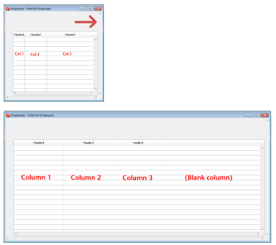
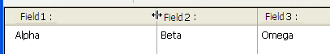

## カラム自動リサイズ

このプロパティがチェックされているとき (JSON の値は `rightToLeft`)、リストボックス列は定義された [最大幅](properties_CoordinatesAndSizing.md#maximum-width) と [最小幅](properties_CoordinatesAndSizing.md#minimum-width) の範囲の中でリストボックスと共に自動的にリサイズされます。

このプロパティがチェックされていないときには (JSON の値は `legacy`)、リストボックス内で最も右のカラムのみが (定義された最大幅を超えたとしても) リサイズされます。

### カラムの自動リサイズの仕組み

* リストボックスの幅を拡大すると、その列も一つずつ、右から左へと順に、[最大幅](properties_CoordinatesAndSizing.md#最大幅) に達するまで拡大されていきます。 [サイズ変更可](#サイズ変更可) プロパティがチェックされている列だけがリサイズされます

* リストボックスの幅を縮小するときも同じ手順が適用されますが、順番が逆になります (左から右へと列がリサイズされていきます)。 列の幅がそれぞれ [最小幅](properties_CoordinatesAndSizing.md#最小幅) に達すると、水平スクロールバーがアクティブになります。

* カラムは水平スクロールバーが "アクティブ" でない場合にのみリサイズされます。つまり、現サイズでリストボックスのすべての列が完全に表示されている場合のみです。 **注**: 水平スクロールバーの表示/非表示は、アクティブ/非アクティブとは関係ありません。スクロールバーは、非表示かつアクティブであることが可能です。

* すべての列が最大幅に到達すると、これらはそれ以上拡大されず、余分な空白を埋める形で空の列が右に追加されます。 この余白カラムがあるときにリストボックスの幅を縮小させた場合、余白カラムから先に縮小されていきます。

#### 余白カラムについて

余白カラムの見た目は既存の列と同じになります。既存のリストボックスカラムにヘッダー/フッターがある場合には余白カラムにもこれらの要素があり、同じ背景色が適用されます。

余白カラムのヘッダー/フッターはクリック可能ですが、他のカラムには何の影響も及ぼしません (つまり並び替えなどはおこなわれません)。しかしながら、`On Clicked`、`On Header Click` そして `On Footer Click` イベントはそれぞれ生成されます。

余白カラム内のセルがクリックされた場合、[LISTBOX GET CELL POSITION](https://doc.4d.com/4Dv18/4D/18/LISTBOX-GET-CELL-POSITION.301-4505216.ja.html) コマンドは列番号として "X+1" を返します (X は既存の列数です)。

#### JSON 文法

| 名称           | データタイプ | とりうる値                   |
| ------------ | ------ | ----------------------- |
| resizingMode | string | "rightToLeft", "legacy" |

#### 対象オブジェクト

[リストボックス](listbox_overview.md)

---

## 横方向サイズ変更

このプロパティは、ユーザーがフォームの幅をサイズ変更したときの、当該オブジェクトの挙動を指定します。 このプロパティは `OBJECT SET RESIZING OPTIONS` ランゲージコマンドによっても設定することができます。

次の値が提供されています:

| オプション | JSON 値  | 戻り値                                            |
| ----- | ------- | ---------------------------------------------- |
| 拡大    | "grow"  | ユーザーがウィンドウの幅を変更すると、オブジェクトの幅にも同じ割合を適用します。       |
| 移動    | "move"  | ユーザーがウィンドウの幅を変更すると、幅の増加分と同じだけオブジェクトを左か右に移動します。 |
| なし    | "fixed" | フォームサイズが変更されても、オブジェクトは固定されたままです。               |
> このプロパティは [縦方向サイズ変更](#縦方向サイズ変更) プロパティと連携して機能します。

#### JSON 文法

| 名称      | データタイプ | とりうる値                   |
| ------- | ------ | ----------------------- |
| sizingX | string | "grow", "move", "fixed" |

#### 対象オブジェクト

[4D View Pro エリア](viewProArea_overview.md) - [4D Write Pro エリア](writeProArea_overview.md) - [ボタン](button_overview.md) - [ボタングリッド](buttonGrid_overview.md) - [チェックボックス](checkbox_overview.md) - [コンボボックス](comboBox_overview.md) - [ドロップダウンリスト](dropdownList_Overview.md) - [グループボックス](groupBox.md) - [階層リスト](list_overview.md) - [入力](input_overview.md) - [リストボックス](listbox_overview.md) - [線](shapes_overview.md#線) - [リストボックス列](listbox_overview.md#リストボックス列) - [楕円](shapes_overview.md#楕円) - [ピクチャーボタン](pictureButton_overview.md) - [ピクチャーポップアップメニュー](picturePopupMenu_overview.md) - [プラグインエリア](pluginArea_overview.md) - [進捗インジケーター](progressIndicator.md) - [ラジオボタン](radio_overview.md) - [ルーラー](ruler.md) - [四角](shapes_overview.md#四角) - [スピナー](spinner.md) - [スプリッター](splitters.md) - [スタティックピクチャー](staticPicture.md) - [ステッパー](stepper.md) - [サブフォーム](subform_overview.md) - [タブコントロール](tabControl.md) - [Web エリア](webArea_overview.md)

---

## 縦方向サイズ変更

このプロパティは、ユーザーがフォームの高さをサイズ変更したときの、当該オブジェクトの挙動を指定します。 このプロパティは `OBJECT SET RESIZING OPTIONS` ランゲージコマンドによっても設定することができます。

次の値が提供されています:

| オプション | JSON 値  | 戻り値                                              |
| ----- | ------- | ------------------------------------------------ |
| 拡大    | "grow"  | ユーザーがウィンドウの高さを変更すると、オブジェクトの高さにも同じ割合を適用します。       |
| 移動    | "move"  | ユーザーがウィンドウの高さを変更すると、高さの変更分と同じだけオブジェクトを上か下に移動します。 |
| なし    | "fixed" | フォームサイズが変更されても、オブジェクトは固定されたままです。                 |
> このプロパティは [横方向サイズ変更](#横方向サイズ変更) プロパティと連携して機能します。

#### JSON 文法

| 名称      | データタイプ | とりうる値                   |
| ------- | ------ | ----------------------- |
| sizingY | string | "grow", "move", "fixed" |

#### 対象オブジェクト

[4D View Pro エリア](viewProArea_overview.md) - [4D Write Pro エリア](writeProArea_overview.md) - [ボタン](button_overview.md) - [ボタングリッド](buttonGrid_overview.md) - [チェックボックス](checkbox_overview.md) - [コンボボックス](comboBox_overview.md) - [ドロップダウンリスト](dropdownList_Overview.md) - [グループボックス](groupBox.md) - [階層リスト](list_overview.md) - [入力](input_overview.md) - [リストボックス](listbox_overview.md) - [線](shapes_overview.md#線) - [リストボックス列](listbox_overview.md#リストボックス列) - [楕円](shapes_overview.md#楕円) - [ピクチャーボタン](pictureButton_overview.md) - [ピクチャーポップアップメニュー](picturePopupMenu_overview.md) - [プラグインエリア](pluginArea_overview.md) - [進捗インジケーター](progressIndicator.md) - [ラジオボタン](radio_overview.md) - [ルーラー](ruler.md) - [四角](shapes_overview.md#四角) - [スピナー](spinner.md) - [スプリッター](splitters.md) - [スタティックピクチャー](staticPicture.md) - [ステッパー](stepper.md) - [サブフォーム](subform_overview.md) - [タブコントロール](tabControl.md) - [Web エリア](webArea_overview.md)

---

## 以降のオブジェクトを移動する

プロパティを適用するとスプリッターオブジェクトは "プッシャー" になり、そのオブジェクトの右側 (垂直スプリッター) または下側 (水平スプリッター) にある他のオブジェクトは、スプリッターと一緒に押し出されて移動します。

"プッシャー" スプリッターを移動した場合の結果を次に示します: 

スプリッターに対してこのプロパティを指定しない場合、結果は次のようになります:

#### JSON 文法

| 名称           | データタイプ |             とりうる値             |
|:------------ |:------:|:-----------------------------:|
| splitterMode | string | "move" (プッシャー), "resize" (標準) |

#### 対象オブジェクト

[スプリッター](splitters.md)

---

## サイズ変更可

このオプションが選択されていると、ユーザーはヘッダーエリアの右側をドラッグすることで列のサイズを変更できます。

#### JSON 文法

| 名称        | データタイプ |      とりうる値      |
|:--------- |:------:|:---------------:|
| resizable |  ブール   | "true", "false" |

#### 対象オブジェクト

[リストボックス列](listbox_overview.md#リストボックス列)
